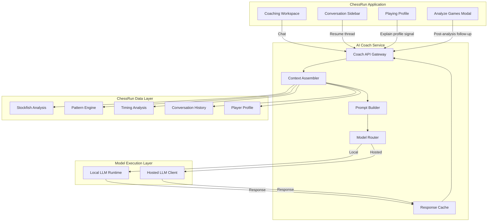
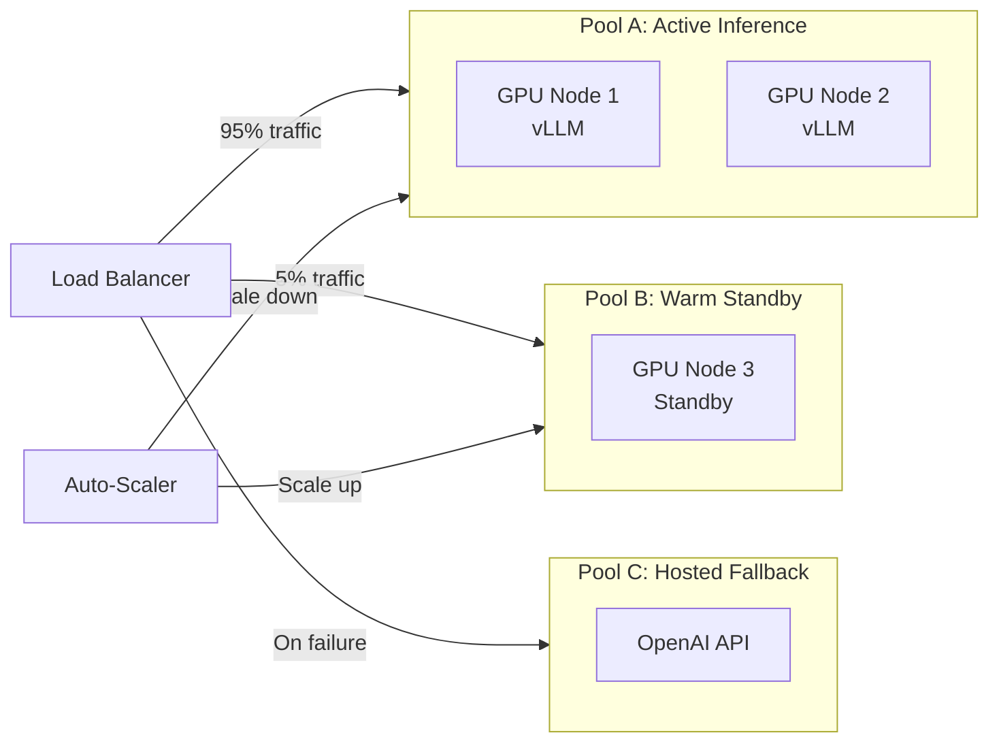
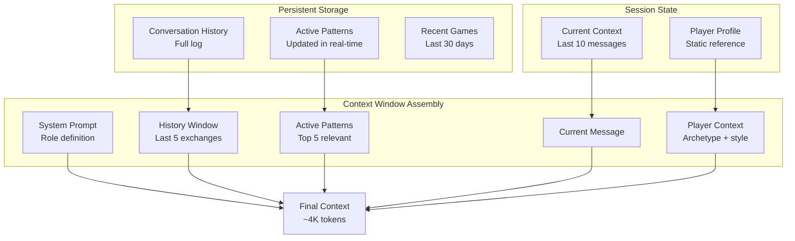

# ChessRun - AI Model Strategy, Conversational AI Architecture & LLM Infrastructure

**Version:** 1.0  
**Status:** Draft / Architecture Definition  
**Audience:** Engineering Leadership, AI/ML Engineers, Infrastructure Architects, Investors  

---

## Executive Summary

ChessRun implements a **hybrid AI architecture** that prioritizes **local LLM inference** for core coaching workloads while maintaining **hosted LLM fallbacks** for premium escalations and edge cases. This strategy is economically essential: API costs for hosted LLMs become unsustainable at conversational scale, while Stockfish already handles all chess-specific reasoning.

> **MVP UX authority:** [`../product/CHESSRUN_MVP_UX.md`](../product/CHESSRUN_MVP_UX.md) defines the current launch experience. The LLM should optimize for persistent coaching conversations, not report generation or dashboard narration. The temporary local testing LLM remains an implementation provider behind the local-first abstraction and can later be replaced by a hosted local runtime.

**Core Thesis:** The LLM's role is not to "play chess" but to translate structured chess intelligence (Stockfish analysis, behavioral patterns, timing data) into personalized, conversational coaching.

**Economic Impact:** Local inference reduces per-user coaching costs from ~$0.05-0.15 per conversation (hosted) to ~$0.0005-0.002 (local), enabling sustainable unit economics at scale.

---

## 1. Core Strategic Decision: Local-First AI Architecture

### 1.1 The Cost Problem

Hosted LLM costs for conversational chess coaching are economically prohibitive at scale:

| Metric | Hosted LLM (GPT-4) | Local LLM (7B/13B) |
|--------|-------------------|-------------------|
| Cost per 1K tokens | $0.03 input / $0.06 output | $0.0001-0.0005 (GPU amortized) |
| Avg coaching session | 2K input / 1K output tokens | 2K input / 1K output tokens |
| Cost per session | $0.12-0.18 | $0.001-0.003 |
| 100K monthly sessions | $12K-18K | $100-300 |
| Annual projection | $144K-216K | $1.2K-3.6K |

**Critical Insight:** Chess coaching requires:
- Heavy conversational usage (users ask 5-15 questions per session)
- Large context windows (game positions, FEN strings, pattern history)
- Repeated interactions (daily/weekly coaching check-ins)
- Stateful conversations (context carries across sessions)

At 10K+ active users, hosted-only architecture becomes a business viability issue.

### 1.2 Why Local Models Are Viable for ChessRun

Unlike general reasoning systems, ChessRun's AI workload is **constrained and structured**:

**What Stockfish Handles (Not the LLM):**
- Position evaluation (centipawn loss calculation)
- Move quality assessment (best move identification)
- Tactical pattern detection (forks, pins, skewers)
- Endgame tablebase queries
- Opening theory validation

**What the Backend Derives (Deterministic Processing — Before LLM):**

Prior to any LLM involvement, the backend pipeline extracts structured coaching context from raw chess data using `python-chess`, PGN replay, and Stockfish output:
- `move_number`, `side_to_move`, `fen_before` — from PGN replay
- `eval_before`, `eval_after`, `eval_drop` — from Stockfish evaluations
- `move_classification` (blunder/mistake/inaccuracy/good) — deterministic centipawn thresholds
- `game_phase` (opening/middlegame/endgame) — move-count and material heuristics
- `opening_name`, `opening_eco` — ECO database lookup
- `time_spent`, `clock_remaining`, `time_pressure_flag` — from PGN clock annotations
- `tactical_theme` (fork/pin/skewer) — deterministic pattern matching

This structured context package is assembled **before** the LLM is invoked. The LLM receives a pre-processed, machine-readable coaching context — not raw PGNs or unstructured Stockfish output.

**Architecture note:** This pipeline must NOT introduce an additional "LLM-before-LLM" interpretation step. All context extraction uses deterministic algorithms, keeping the architecture simple, verifiable, and free from compounding inference costs.

**What the LLM Handles (Coaching Layer — Explanation Only):**
- Translating pre-computed Stockfish context into human explanations
- Conversational context management
- Pattern explanation and recommendation generation
- Coaching tone and motivational framing
- Summarization of longitudinal patterns

**Why This Matters:**
The LLM never needs to calculate "Nf3 is +0.8 better than Bc4" — Stockfish provides that. The LLM explains: *"Developing your knight to f3 controls the center and prepares for kingside castling, which is why the engine prefers it here."*

This is a **translation and explanation** task, not a **chess reasoning** task. Modern 7B-13B instruct models are fully capable of this workload.

### 1.3 Architectural Principle: Model Agnosticism

ChessRun is **never tightly coupled** to any single model provider:

| Layer | Abstraction |
|-------|-------------|
| **Application** | AI Coach Service (internal API) |
| **Routing** | Model Router (local vs. hosted decision) |
| **Execution** | Local Runtime (Ollama/vLLM) OR Hosted Client (OpenAI/Anthropic) |
| **Models** | Swappable backends (Llama 3, Mistral, Qwen, GPT-4, Claude) |

**Benefits:**
- Vendor independence (no OpenAI lock-in)
- Model upgrade flexibility (swap Llama 3 → Llama 4 transparently)
- A/B testing capability (route 10% to new model)
- Fallback resilience (local → hosted on failure)
- Geographic flexibility (EU data stays in EU deployments)

---

## 2. AI Coach Service Architecture

### 2.1 Service Overview

The AI Coach Service is the **central abstraction layer** between ChessRun application logic and underlying LLM infrastructure. All conversational AI flows through this service.



### 2.2 Service Components

#### 2.2.1 Context Assembler

Retrieves and structures all relevant chess intelligence for the LLM:

```python
class ContextAssembler:
    def assemble(self, request: CoachRequest) -> CoachContext:
        context = CoachContext()

        # 1. Player Profile (archetype, style, strengths/weaknesses)
        context.profile = self.profile_store.get(request.user_id)

        # 2. Relevant Patterns (filtered by query intent)
        all_patterns = self.pattern_store.get_patterns(request.user_id)
        context.patterns = self.pattern_filter.filter(
            patterns=all_patterns,
            query=request.message,
            limit=5
        )

        # 3. Recent Games (if game-specific query)
        if self.intent_classifier.is_game_query(request.message):
            context.recent_games = self.game_store.get_recent(
                request.user_id, limit=5
            )

        # 4. Timing Insights (if behavioral question)
        if self.intent_classifier.is_behavioral(request.message):
            context.timing = self.timing_store.get_profile(request.user_id)

        # 5. Conversation History (last 10 messages for continuity)
        context.history = self.history_store.get_session(
            request.user_id,
            request.session_id,
            limit=10
        )

        # 6. Opening Context (if opening question)
        if self.intent_classifier.is_opening_query(request.message):
            context.opening_stats = self.opening_store.get_repertoire(
                request.user_id
            )

        return context
```

#### 2.2.2 Prompt Builder

Constructs model-agnostic prompts with structured chess context:

```python
class PromptBuilder:
    def build(self, context: CoachContext) -> Prompt:
        sections = []

        # System persona
        sections.append(self.system_prompt())

        # Player archetype context
        sections.append(f"""
## Player Profile
- Archetype: {context.profile.archetype}
- Rating Range: {context.profile.rating_range}
- Primary Strengths: {', '.join(context.profile.strengths[:3])}
- Critical Weaknesses: {', '.join(context.profile.weaknesses[:3])}
- Coaching Style Preference: {context.profile.coaching_style}
""")

        # Pattern context (most relevant)
        if context.patterns:
            sections.append("## Detected Patterns\n")
            for pattern in context.patterns:
                sections.append(f"""
- {pattern.name} (Severity: {pattern.severity}, Confidence: {pattern.confidence}%)
  {pattern.description}
  Seen in {pattern.occurrence_count} games, first observed {pattern.first_seen}
""")

        # Example positions (if available)
        if context.patterns and context.patterns[0].examples:
            sections.append("## Example Position\n")
            sections.append(f"""
FEN: {context.patterns[0].examples[0].fen}
Context: {context.patterns[0].examples[0].explanation}
""")

        # Conversation history
        if context.history:
            sections.append("## Conversation History\n")
            for msg in context.history[-5:]:
                role = "Player" if msg.role == "user" else "Coach"
                sections.append(f"{role}: {msg.content}")

        # Current question
        sections.append(f"\n## Current Question\nPlayer: {context.current_message}")
        sections.append("\nCoach: ")

        return Prompt(content="\n\n".join(sections), estimated_tokens=self.estimate_tokens(sections))
```

#### 2.2.3 Model Router

Intelligent routing decision engine:

```python
class ModelRouter:
    def __init__(self, config: RoutingConfig):
        self.local_client = LocalLLMClient(config.local_endpoint)
        self.hosted_client = HostedLLMClient(config.hosted_api_key)
        self.fallback_tracker = FallbackTracker()

    async def route(self, prompt: Prompt, request: CoachRequest) -> RoutingDecision:
        # 1. Check for premium escalation flags
        if request.flags.get("premium_reasoning"):
            return RoutingDecision(model="hosted", reason="premium_request")

        # 2. Check local model health
        if not await self.local_client.health_check():
            self.fallback_tracker.record_fallback("local_unhealthy")
            return RoutingDecision(model="hosted", reason="local_unavailable")

        # 3. Check context length vs. local model capacity
        if prompt.estimated_tokens > self.local_client.max_context:
            if prompt.estimated_tokens <= self.hosted_client.max_context:
                return RoutingDecision(model="hosted", reason="context_overflow")

        # 4. Check for complex reasoning patterns
        complexity_score = self.assess_complexity(prompt)
        if complexity_score > 0.8 and request.user_tier == "premium":
            return RoutingDecision(model="hosted", reason="high_complexity_premium")

        # 5. Default: route to local
        return RoutingDecision(model="local", reason="default_routing")

    def assess_complexity(self, prompt: Prompt) -> float:
        # Heuristics for complexity assessment
        indicators = [
            len(prompt.content) > 4000,  # Long context
            "analyze" in prompt.content.lower(),  # Analysis request
            "compare" in prompt.content.lower(),  # Comparison task
            "explain why" in prompt.content.lower(),  # Deep explanation
        ]
        return sum(indicators) / len(indicators)
```

---

## 3. Local Model Strategy

### 3.1 Why Local Models Work for ChessRun

**Task Characteristics (Favorable for Local LLMs):**

| Characteristic | ChessRun Workload | General LLM Workload |
|----------------|------------------|---------------------|
| Domain | Constrained (chess) | Open-ended |
| Reasoning | Stockfish handles chess logic | LLM handles all reasoning |
| Context | Structured (FEN, patterns, metrics) | Unstructured (any text) |
| Output | Guided (explanations, recommendations) | Open generation |
| Creativity | Low (factual coaching) | High (creative writing) |
| Hallucination Risk | Low (Stockfish ground truth) | High (no ground truth) |

**Implication:** ChessRun's LLM workload is essentially **structured-to-conversational translation** — a task where 7B-13B instruct models perform comparably to 70B+ models.

### 3.2 Local Runtime Options

#### 3.2.1 Ollama (Development & Light Production)

```yaml
# docker-compose.ollama.yml
version: '3.8'
services:
  ollama:
    image: ollama/ollama:latest
    volumes:
      - ollama_data:/root/.ollama
    ports:
      - "11434:11434"
    environment:
      - OLLAMA_KEEP_ALIVE=24h
      - OLLAMA_NUM_PARALLEL=4
    deploy:
      resources:
        reservations:
          devices:
            - driver: nvidia
              count: 1
              capabilities: [gpu]

  # Model preload on startup
  ollama-init:
    image: ollama/ollama:latest
    depends_on:
      - ollama
    entrypoint: >
      sh -c "
        sleep 10 &&
        ollama pull llama3:8b-instruct-q5_K_M &&
        ollama pull mistral:7b-instruct-v0.3-q5_K_M
      "
```

**Evaluation:**
- **Pros:** Extremely simple setup, broad model support, easy model switching
- **Cons:** Single-node only, limited concurrency scaling, no request queuing
- **Best For:** Development, MVP, <100 concurrent users

#### 3.2.2 vLLM (Production Scale)

```python
# vllm_deployment_config.py
from vllm import LLM, SamplingParams

class VLLMProductionRuntime:
    def __init__(self):
        self.llm = LLM(
            model="meta-llama/Meta-Llama-3-8B-Instruct",
            tensor_parallel_size=2,  # Multi-GPU
            gpu_memory_utilization=0.85,
            max_num_seqs=256,  # Concurrent requests
            max_model_len=8192,
            quantization="awq",  # 4-bit for efficiency
        )

        self.sampling_params = SamplingParams(
            temperature=0.7,
            top_p=0.9,
            max_tokens=1024,
            presence_penalty=0.1,  # Reduce repetition in coaching
        )

    async def generate(self, prompt: str) -> str:
        outputs = self.llm.generate([prompt], self.sampling_params)
        return outputs[0].outputs[0].text
```

**Evaluation:**
- **Pros:** High throughput (10x+ vs. Ollama), PagedAttention for memory efficiency, OpenAI-compatible API
- **Cons:** More complex setup, requires GPU optimization knowledge
- **Best For:** Production, 100-10K+ concurrent users, cost-sensitive scale

#### 3.2.3 TensorRT-LLM (Maximum Performance)

For ultimate inference efficiency on NVIDIA hardware:

```python
# trt_llm_config.py
# Requires pre-conversion of models to TensorRT engines
TRT_LLM_CONFIG = {
    "models": {
        "llama3-8b": {
            "engine_path": "/models/llama3-8b-instruct-awq.trt",
            "max_batch_size": 32,
            "max_input_len": 4096,
            "max_output_len": 1024,
        }
    },
    "runtime": {
        "enable_chunked_context": True,
        "enable_context_fmha_fp32": True,
    }
}
```

**When to Use:** >5K concurrent users, sub-100ms latency requirements, dedicated GPU clusters

### 3.3 Model Selection Criteria

| Model | Size | Quantization | VRAM | Throughput | Quality Score |
|-------|------|--------------|------|------------|---------------|
| Llama 3 Instruct | 8B | Q5_K_M | 6GB | High | 8.5/10 |
| Mistral Instruct | 7B | Q5_K_M | 5GB | High | 8.2/10 |
| Qwen 2.5 Instruct | 7B | Q5_K_M | 5GB | High | 8.3/10 |
| Phi-3 Mini | 3.8B | Q5_K_M | 3GB | Very High | 7.5/10 |
| Llama 3.1 | 70B | Q4_K_M | 40GB | Medium | 9.2/10 |

**Recommended Default:** Llama 3 8B Instruct (Q5_K_M) — optimal quality/performance ratio for chess coaching.

**Current Development Runtime:** Phi-3 Mini through Ollama is the CPU-friendly local validation model. It is an MIT-licensed 3.8B instruction model and keeps development coaching grounded without requiring a GPU. Production should move to the recommended 8B-class model behind a GPU-hosted, OpenAI-compatible vLLM endpoint.

**Cost-Optimized Tier:** Phi-3 Mini for high-volume, simple queries.

**Premium Tier:** Llama 3.1 70B for complex multi-step reasoning (routed via hosted or dedicated GPU).

### 3.4 GPU Hosting & Scaling Considerations

#### 3.4.1 Infrastructure Options

| Provider | GPU Type | Cost/Hour | Best For |
|----------|----------|-----------|----------|
| **RunPod** | RTX 4090 | $0.74 | Development, burst scaling |
| **Lambda Labs** | A10 | $0.60 | Production, cost-optimized |
| **CoreWeave** | A100 40GB | $2.50 | High-throughput production |
| **AWS g5** | A10G | $1.006 | Enterprise, AWS ecosystem |
| **Self-hosted** | RTX A6000 | CapEx | Long-term, >10K users |

#### 3.4.2 Scaling Architecture



**Scaling Triggers:**
- Scale up: Average GPU utilization >70% for 2 minutes
- Scale down: Average GPU utilization <30% for 10 minutes
- Emergency: 100% traffic → hosted fallback on local failure

#### 3.4.3 Concurrency & Latency

| Metric | Target | Achievable (vLLM + 4090) |
|--------|--------|-------------------------|
| First Token Latency (TTFT) | <500ms | 200-400ms |
| Time Per Output Token | <50ms | 20-40ms |
| Concurrent Users per GPU | 50-100 | 80-120 |
| Requests/Second per GPU | 20-50 | 30-60 |
| End-to-End Response Time | <3s | 1.5-2.5s |

### 3.5 Token Economics

**Local Model Cost Calculation (per 1M tokens):**

```
GPU Cost per Hour: $0.74 (RunPod RTX 4090)
Tokens per Second: 50 (Llama 3 8B Q5)
Tokens per Hour: 50 * 3600 = 180,000
Cost per 1M tokens: ($0.74 / 180,000) * 1,000,000 = $4.11

With 4x concurrent optimization: $1.03 per 1M tokens
```

**Comparison:**
- OpenAI GPT-4: $30/1M input + $60/1M output = ~$45/1M mixed
- Anthropic Claude 3 Sonnet: $3/1M input + $15/1M output = ~$9/1M mixed
- **Local Llama 3 8B: $1/1M mixed**

**Savings: 90-98% vs. hosted alternatives**

---

## 4. Fine-Tuning Strategy

### 4.1 Domain Adaptation Phase

**Objective:** Adapt base instruct model to chess coaching domain before production deployment.

**Dataset Sources:**
1. **Stockfish Explanation Pairs** (50K examples)
   - Input: Stockfish evaluation output
   - Output: Human-readable explanation

2. **Pattern Explanation Dataset** (30K examples)
   - Input: Pattern metadata + example positions
   - Output: Pattern explanation + training recommendation

3. **Coaching Conversation Dataset** (20K examples)
   - Curated from chess coaching books, videos, forums
   - Style: encouraging, specific, actionable

4. **Player Archetype Adaptations** (10K examples)
   - Tailored responses for different player types
   - Beginner vs. intermediate vs. advanced language adjustment

```python
# Fine-tuning configuration
CHESS_COACHING_SFT_CONFIG = {
    "base_model": "meta-llama/Meta-Llama-3-8B-Instruct",
    "training": {
        "method": "qlora",  # 4-bit LoRA for efficiency
        "r": 64,  # LoRA rank
        "lora_alpha": 16,
        "learning_rate": 2e-4,
        "num_epochs": 3,
        "batch_size": 4,
        "gradient_accumulation_steps": 4,
    },
    "datasets": [
        "stockfish_explanations.jsonl",
        "pattern_coaching.jsonl",
        "chess_conversations.jsonl",
    ]
}
```

### 4.2 Reinforcement Learning from Human Feedback (RLHF)

**Phase 2: Continuous Improvement**

As ChessRun gathers real user interactions:

1. **Preference Data Collection**
   - Thumbs up/down on coaching responses
   - "Was this helpful?" explicit feedback
   - Session completion rates (proxy for quality)

2. **Reward Model Training**
   - Train reward model on preference pairs
   - Criteria: accuracy, helpfulness, tone, actionability

3. **PPO/DPO Fine-Tuning**
   - Align model with user preferences
   - Maintain chess accuracy (constrained by Stockfish ground truth)

### 4.3 Personalized Response Styles (Future)

**Per-User Adaptation:**

```python
class PersonalizedCoach:
    def adapt_response(self, base_response: str, user_profile: Profile) -> str:
        # Adjust technical depth based on rating
        if user_profile.rating < 1200:
            response = self.simplify_language(base_response)
            response = self.add_basic_definitions(response)
        elif user_profile.rating > 1800:
            response = self.add_advanced_variations(response)
            response = self.reference_theory(response)

        # Adjust tone based on preferences
        if user_profile.coaching_style == "direct":
            response = self.make_direct(response)
        elif user_profile.coaching_style == "encouraging":
            response = self.add_encouragement(response)

        return response
```

---

## 5. Model Routing Strategy

### 5.1 Routing Decision Matrix

| Scenario | Local Model | Hosted Model | Reason |
|----------|-------------|--------------|--------|
| Standard pattern explanation | ✓ Default | | Cost optimization |
| Opening recommendation | ✓ Default | | Local model sufficient |
| Game review summary | ✓ Default | | Structured output |
| Complex multi-pattern analysis | | ✓ Fallback | Context length |
| "Why did I lose this game?" | ✓ Default | | Pattern retrieval |
| "Compare my style to GM style" | | ✓ Premium | Advanced reasoning |
| Local model failure | | ✓ Fallback | Reliability |
| Admin/testing queries | | ✓ Testing | Model comparison |

### 5.1.1 Complexity-Based Model Tier Selection

Routing serves **two independent dimensions**: complexity-based model sizing and pricing-tier entitlements. Both must be evaluated on each request.

**Model size selection by query complexity:**

| Query Complexity | Model Tier | Example |
|-----------------|------------|----------|
| Simple (short summary, single-pattern) | Lightweight local (Phi-3 Mini 3.8B) | "What's my biggest weakness?" |
| Standard (coaching, explanation, recommendations) | Default local (Llama 3 8B) | "Why do I blunder in endgames?" |
| Complex (multi-pattern, long context, deep reasoning) | Large local (Llama 3.1 70B) or hosted | "Compare my style across last 6 months" |

**Pricing-tier entitlements that affect routing:**

| Tier | Model Access | Context Window | Hosted Escalation |
|------|-------------|----------------|-------------------|
| Free | Lightweight local only | 4K tokens | Not permitted |
| Pro | Default local (Llama 3 8B) | 8K tokens | Not permitted |
| Elite | Large local + hosted default | 32K tokens | Always permitted |

Complexity routing and tier entitlements are evaluated together — a Free user with a complex query still gets the lightweight local model, not hosted escalation.

### 5.2 Intelligent Routing Logic

```python
class IntelligentRouter:
    def __init__(self):
        self.local = LocalLLMProvider()
        self.hosted = HostedLLMProvider()
        self.metrics = RoutingMetrics()

    async def route_request(self, request: CoachRequest) -> LLMResponse:
        # Decision factors
        factors = {
            "local_healthy": await self.local.health_check(),
            "context_size": len(request.context_tokens),
            "complexity_score": self.assess_complexity(request),
            "user_tier": request.user.tier,
            "historical_local_quality": self.metrics.get_quality_score("local", request.user.id),
            "urgency": request.flags.get("urgent", False),
        }

        # Routing rules
        if not factors["local_healthy"]:
            return await self.hosted.generate(request, reason="local_unavailable")

        if factors["context_size"] > self.local.max_context:
            return await self.hosted.generate(request, reason="context_overflow")

        if factors["complexity_score"] > 0.9 and factors["user_tier"] == "premium":
            return await self.hosted.generate(request, reason="premium_complexity")

        if factors["urgency"] and factors["local_healthy"]:
            # Local is faster for urgent requests
            return await self.local.generate(request, reason="urgency_speed")

        # Default: local model
        return await self.local.generate(request, reason="default")
```

### 5.3 Fallback Mechanism

```python
class FallbackManager:
    LOCAL_TIMEOUT = 30.0       # seconds — not 5s; local models need time for longer contexts
    MAX_LOCAL_RETRIES = 2      # retry before escalating to hosted

    async def generate_with_fallback(self, request: CoachRequest) -> LLMResponse:
        # Context overflow check: warn user first, don't silently escalate
        if request.estimated_tokens > self.local.max_context:
            if not request.flags.get("context_warning_shown"):
                return LLMResponse(
                    type="context_warning",
                    message="Your coaching context is very long. Consider starting a new session or asking a more focused question.",
                    action_required=True
                )
            # User acknowledged warning and explicitly wants to continue
            if request.user.tier == "elite":
                return await self.hosted.generate(request, reason="user_confirmed_context_overflow")
            return self.cache.get_generic_response(request.intent)

        # Attempt local with retries before any fallback
        last_error = None
        for attempt in range(1, self.MAX_LOCAL_RETRIES + 1):
            try:
                response = await asyncio.wait_for(
                    self.local.generate(request),
                    timeout=self.LOCAL_TIMEOUT
                )
                return response
            except (TimeoutError, LLMError) as e:
                last_error = e
                self.metrics.record_local_attempt_failure(request.user_id, attempt, str(e))
                if attempt < self.MAX_LOCAL_RETRIES:
                    await asyncio.sleep(1.0 * attempt)  # brief backoff between retries

        # All local retries exhausted — escalate to hosted only if tier permits
        self.metrics.record_local_failure(request.user_id, str(last_error))
        if request.user.tier in ("elite", "pro"):
            try:
                response = await self.hosted.generate(request)
                response.flags["fallback_used"] = True
                return response
            except HostedLLMError:
                pass

        # Final fallback: cached generic response
        return self.cache.get_generic_response(request.intent)
```

---

## 6. Chatbot Context System

### 6.1 Conversational Memory Architecture



### 6.2 Context Retrieval Pipeline

```python
class ContextRetrievalPipeline:
    def assemble_context(self, user_id: int, message: str, session_id: str) -> CoachContext:
        # 1. Player Profile (always included, ~500 tokens)
        profile = self.profile_store.get(user_id)

        # 2. Pattern Retrieval (~1000 tokens)
        # Use embedding similarity to find relevant patterns
        query_embedding = self.embedder.encode(message)
        relevant_patterns = self.pattern_store.similarity_search(
            user_id=user_id,
            query_embedding=query_embedding,
            top_k=5
        )

        # 3. Game Retrieval (conditional, ~800 tokens)
        games = []
        if self.detects_game_reference(message):
            games = self.game_store.get_recent(user_id, limit=3)

        # 4. Conversation History (~1500 tokens)
        history = self.history_store.get_session_messages(
            session_id=session_id,
            limit=10
        )

        # 5. Timing Insights (conditional, ~300 tokens)
        timing = None
        if self.detects_time_question(message):
            timing = self.timing_store.get_summary(user_id)

        return CoachContext(
            profile=profile,
            patterns=relevant_patterns,
            games=games,
            history=history,
            timing=timing,
            current_message=message
        )
```

### 6.3 Pattern-Aware Context

The AI Coach always knows the player's critical patterns:

```python
# Example context injection
PATTERN_CONTEXT = """
## Your Detected Patterns (Critical Priority)

**1. Missed Knight Forks (Critical)**
- You've missed 12 knight fork opportunities in your last 30 games
- This affects 40% of your games where forks were available
- Most recent example: Game #12345, move 24 (Nf3-d4+ forks King and Queen)

**2. Time Pressure Blunders (Significant)**
- You make 3x more blunders when under 30 seconds
- 28% of your moves are played in time pressure
- Recommendation: Practice 15-minute games to build time comfort

**3. French Defense Struggles (Developing)**
- Win rate in French Defense positions: 32%
- Average ACPL in closed positions: 85 (vs. 45 in open positions)
- Consider transitioning to open games (1...e5 or 1...c5)
"""
```

### 6.4 Session Management

```python
class SessionManager:
    def create_session(self, user_id: int) -> Session:
        """Initialize new coaching session with full context."""
        session = Session(
            id=generate_uuid(),
            user_id=user_id,
            created_at=now(),
            context_snapshot=self.capture_full_context(user_id)
        )

        # Pre-warm with player summary
        summary = self.generate_player_summary(user_id)
        self.add_system_message(session.id, summary)

        return session

    def capture_full_context(self, user_id: int) -> ContextSnapshot:
        """Capture point-in-time player state."""
        return ContextSnapshot(
            profile=self.profile_store.get(user_id),
            top_patterns=self.pattern_store.get_top_patterns(user_id, n=10),
            recent_games=self.game_store.get_recent(user_id, n=5),
            timing_summary=self.timing_store.get_summary(user_id),
            captured_at=now()
        )
```

---

## 7. API Structure

### 7.1 Core Coach APIs

#### POST `/v1/coach/chat`

**Request:**
```json
{
  "message": "Why do I keep blundering in time pressure?",
  "session_id": "uuid-session-123",
  "user_id": 456,
  "context_flags": {
    "include_patterns": true,
    "include_timing": true,
    "include_games": 3
  },
  "preferences": {
    "tone": "encouraging",
    "technical_depth": "intermediate"
  }
}
```

**Response:**
```json
{
  "message": "I see a clear pattern in your time management...",
  "model_used": "llama3-8b-local",
  "routing_reason": "default",
  "context_used": {
    "patterns_referenced": [789, 792],
    "games_referenced": [12345, 12346],
    "timing_profile_included": true
  },
  "suggested_drills": [
    {
      "type": "time_management",
      "description": "Practice maintaining calm under 60 seconds"
    }
  ],
  "session_id": "uuid-session-123",
  "tokens_used": {
    "input": 2847,
    "output": 412
  },
  "latency_ms": 1245
}
```

#### GET `/v1/coach/suggestions`

Returns pattern-aware conversation starters:

```json
{
  "suggestions": [
    {
      "type": "critical_pattern",
      "text": "Why do I keep missing knight forks?",
      "pattern_id": 789,
      "priority": "high"
    },
    {
      "type": "improvement",
      "text": "Help me fix my French Defense",
      "pattern_id": 801,
      "priority": "medium"
    },
    {
      "type": "recent_game",
      "text": "What went wrong in my last game?",
      "game_id": 12345,
      "priority": "low"
    }
  ],
  "generated_at": "2025-01-12T10:00:00Z"
}
```

#### GET `/v1/coach/history/{session_id}`

```json
{
  "session_id": "uuid-session-123",
  "user_id": 456,
  "messages": [
    {
      "role": "user",
      "content": "Why do I keep blundering in time pressure?",
      "timestamp": "2025-01-12T10:00:00Z"
    },
    {
      "role": "assistant",
      "content": "I see a clear pattern...",
      "timestamp": "2025-01-12T10:00:01Z",
      "referenced_patterns": [789, 792],
      "model_used": "llama3-8b-local"
    }
  ],
  "context_snapshot": {
    "captured_at": "2025-01-12T09:55:00Z",
    "patterns_count": 12,
    "games_analyzed": 156
  }
}
```

### 7.2 Context APIs

#### GET `/v1/player/{user_id}/patterns`

```json
{
  "user_id": 456,
  "patterns": [
    {
      "id": 789,
      "type": "tactical",
      "name": "missed_knight_forks",
      "severity": "critical",
      "confidence": 0.87,
      "description": "Missed knight fork opportunities in tactical positions",
      "occurrence_count": 12,
      "affected_games_ratio": 0.42,
      "example_positions": [...],
      "recommended_drill": "knight_fork_tactics"
    }
  ],
  "generated_at": "2025-01-12T08:00:00Z"
}
```

#### GET `/v1/player/{user_id}/profile`

```json
{
  "user_id": 456,
  "archetype": "The Tactician with Endgame Blind Spots",
  "rating_range": "1400-1600",
  "primary_strengths": ["tactical_vision", "attacking_play"],
  "primary_weaknesses": ["endgame_technique", "time_management"],
  "style_indicators": {
    "positional_vs_tactical": 0.7,
    "open_vs_closed": 0.6,
    "aggressive_vs_conservative": 0.8
  },
  "coaching_focus_areas": [
    "rook_endgames",
    "time_pressure_management",
    "closed_position_strategy"
  ],
  "last_updated": "2025-01-12T08:00:00Z"
}
```

#### GET `/v1/insights/recommendations/{user_id}`

```json
{
  "user_id": 456,
  "recommendations": [
    {
      "type": "drill",
      "priority": "critical",
      "title": "Knight Fork Recognition",
      "description": "You miss forks in 40% of applicable positions",
      "pattern_id": 789,
      "estimated_time": "15 minutes",
      "skill_improvement": "tactical_vision"
    }
  ],
  "generated_at": "2025-01-12T10:00:00Z"
}
```

### 7.3 Model Management APIs (Admin)

#### GET `/v1/admin/models/status`

```json
{
  "local": {
    "status": "healthy",
    "model": "llama3-8b-instruct-q5",
    "gpu_utilization": 0.45,
    "requests_per_second": 12,
    "avg_latency_ms": 850,
    "queue_depth": 3
  },
  "hosted": {
    "status": "available",
    "provider": "openai",
    "fallback_rate": 0.02
  },
  "routing_stats": {
    "local_requests": 9847,
    "hosted_requests": 153,
    "fallback_triggers": ["context_overflow: 89", "local_timeout: 64"]
  }
}
```

---

## 8. Economic Scaling Model

### 8.1 Cost Projections

**Assumptions:**
- Average session: 5 messages, 3K tokens per message
- Local model: $1 per 1M tokens
- Hosted model (GPT-4): $45 per 1M tokens
- Target margin: 70% on AI coaching features

| Users | Monthly Sessions | Local Cost | Hosted Cost | Savings |
|-------|-----------------|------------|-------------|---------|
| 1,000 | 10,000 | $150 | $6,750 | $6,600 (98%) |
| 10,000 | 100,000 | $1,500 | $67,500 | $66,000 (98%) |
| 50,000 | 500,000 | $7,500 | $337,500 | $330,000 (98%) |
| 100,000 | 1,000,000 | $15,000 | $675,000 | $660,000 (98%) |

### 8.2 Infrastructure Scaling

| Users | GPU Nodes | Cost/Month | Cost/User |
|-------|-----------|------------|-----------|
| 1,000 | 2x RTX 4090 | $1,080 | $1.08 |
| 10,000 | 8x RTX 4090 | $4,320 | $0.43 |
| 50,000 | 20x A100 | $36,000 | $0.72 |
| 100,000 | 40x A100 | $72,000 | $0.72 |

**Unit economics remain healthy across all scales.**

### 8.3 Revenue Model Alignment

| Tier | Price/Month | AI Usage | Cost | Margin |
|------|-------------|----------|------|--------|
| Free | $0 | 10 sessions | $0.015 | N/A |
| Basic | $4.99 | 50 sessions | $0.075 | 98.5% |
| Pro | $9.99 | Unlimited | $0.50-2.00 | 80-95% |
| Premium | $19.99 | Unlimited + GPT-4 | $2.00-5.00 | 75-90% |

---

## 9. What ChessRun Is (And Is Not)

### 9.1 ChessRun Is NOT

- **A generic chatbot:** We don't do open-ended conversation. Every interaction is grounded in structured chess intelligence.
- **An LLM trying to "play chess":** Stockfish handles all chess calculation. The LLM never suggests moves without Stockfish validation.
- **A replacement for human coaches:** We augment coaching with data-driven insights, not replace the human element.
- **A simple Stockfish wrapper:** The value is in pattern recognition, behavioral analysis, and personalized explanation — not raw engine output.

### 9.2 ChessRun IS

- **A persistent conversational chess intelligence system:** Not a generic chatbot — a structured platform with long-term player memory, behavioral pattern recognition, and conversational coaching grounded in verified analysis.
- **A structured AI coaching system:** Built on three layers — Stockfish (chess logic), Pattern Engine (longitudinal analysis), AI Coach (conversational explanation).
- **An economically scalable platform:** Local-first architecture enables sustainable unit economics at 100K+ users.
- **A model-agnostic infrastructure:** Swappable LLM backends prevent vendor lock-in.
- **A continuously improving system:** RLHF pipeline ensures coaching quality improves with usage.
- **An enterprise-grade architecture:** Production-ready with fallback, monitoring, and scaling built-in.

---

## 10. Implementation Roadmap

### Phase 1: MVP (Months 1-3)
- [ ] Ollama deployment for development
- [ ] Basic AI Coach Service with context assembly
- [ ] Llama 3 8B integration
- [ ] Simple local/hosted routing
- [ ] Conversation history storage

### Phase 2: Production (Months 4-6)
- [ ] vLLM production deployment
- [ ] GPU cluster setup (RunPod/CoreWeave)
- [ ] Fine-tuned domain model
- [ ] Intelligent routing with metrics
- [ ] Comprehensive fallback mechanisms

### Phase 3: Scale (Months 7-9)
- [ ] Multi-region GPU deployment
- [ ] Auto-scaling implementation
- [ ] RLHF pipeline
- [ ] Personalized response adaptation
- [ ] Advanced pattern-aware prompting

### Phase 4: Optimization (Months 10-12)
- [ ] Model distillation for edge deployment
- [ ] TensorRT-LLM optimization
- [ ] Caching layer optimization
- [ ] Cost monitoring and optimization
- [ ] Open-source model contribution

---

## 11. Summary

ChessRun's AI architecture represents a **fundamentally different approach** to LLM-powered applications:

1. **Local-First:** Default to local inference for 95%+ of workloads
2. **Structured Domain:** LLM translates chess intelligence, it doesn't generate it
3. **Model Agnostic:** Abstraction layer enables vendor independence
4. **Economically Scalable:** 90-98% cost reduction vs. hosted-only
5. **Production Ready:** Built-in fallback, monitoring, and scaling

This architecture enables ChessRun to provide **sophisticated, personalized AI coaching at scale** while maintaining **sustainable unit economics** and **technical flexibility**.

The result: A platform that can serve 100,000+ active users with personalized AI coaching without incurring prohibitive LLM API costs.

---

**Document Version:** 1.0  
**Last Updated:** 2025-01-12  
**Next Review:** 2025-04-12  
