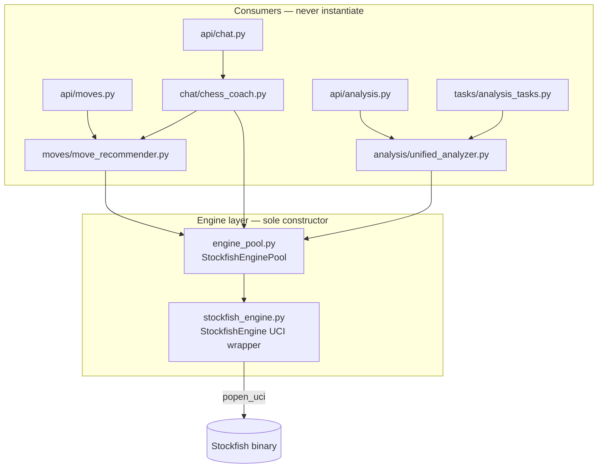
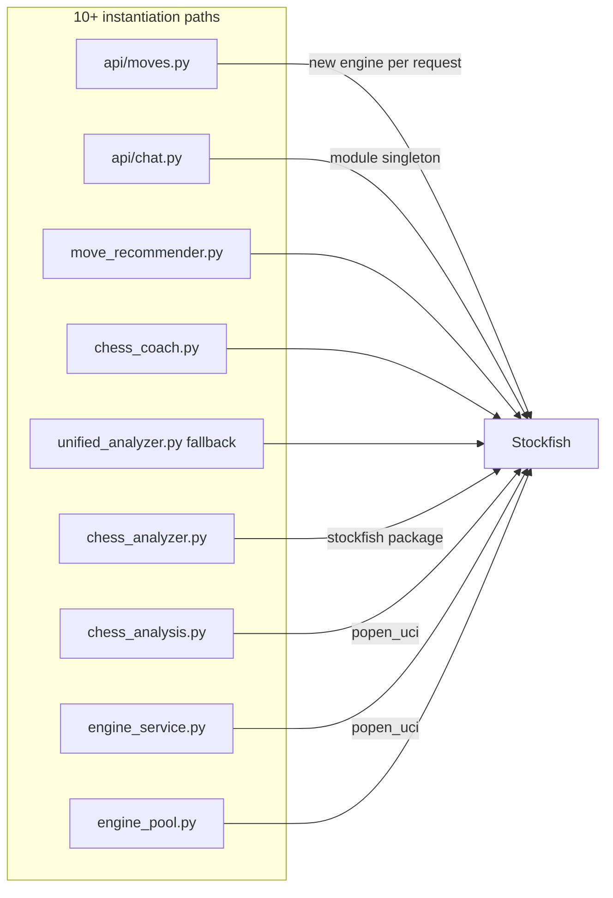

# Stockfish Architecture

> Canonical reference for how ChessIQ accesses the Stockfish chess engine.
> Enforced by invariant **FP-4 / SF-1–SF-5** and `scripts/review-loops/check-stockfish-violations.ps1`.

---

## Principle

**Only one file may construct `StockfishEngine`:** `backend/app/services/engine/engine_pool.py`.

All routes, Celery tasks, chat, move recommendation, and game analysis services **acquire** engines from the pool. They never spawn UCI subprocesses or call `StockfishEngine(...)` directly.

---

## Layer diagram (after consolidation)



---

## Before vs after

### Before (fragmented)



Problems:

- Route handlers created engines on every `/moves/*` request.
- Chat maintained a **second** parallel Stockfish lifecycle beside the pool.
- Three legacy wrappers duplicated UCI logic with hard-coded Linux paths.
- Celery and FastAPI could each hold separate engine instances unpredictably.

### After (consolidated)

| Layer | Responsibility |
|-------|----------------|
| `engine_pool.py` | Singleton pool; one `StockfishEngine` per asyncio event loop |
| `stockfish_engine.py` | UCI wrapper (`evaluate_position`, `get_best_move`, lifecycle) |
| Services | Call `get_pooled_engine()` or inject engine in tests only |
| Routes | Depend on services; health checks use `check_engine_health()` |

---

## Public API

### Acquire engine (services)

```python
from app.services.engine.engine_pool import get_pooled_engine

engine = await get_pooled_engine()
result = await engine.evaluate_position(board, depth=18)
```

### Health probe (routes)

```python
from app.services.engine.engine_pool import check_engine_health

health = await check_engine_health()
# {"available": True, "initialized": True, "path": "..."}
```

### Shutdown (app lifecycle / tests)

```python
from app.services.engine.engine_pool import StockfishEnginePool

await StockfishEnginePool.shutdown()
```

---

## Thread and queue safety

| Context | Behaviour |
|---------|-----------|
| **FastAPI (uvicorn)** | One event loop per worker process → pool keeps one engine per loop ID |
| **Celery analysis worker** | Each task runs `asyncio.run(...)` → new loop per task → pool creates/reuses engine for that loop; worker `max_tasks_per_child=50` recycles processes |
| **Concurrent requests** | Per-loop `asyncio.Lock` during engine initialization prevents double-spawn races |
| **Cross-thread** | Pool singleton guarded by `threading.Lock`; engines are **not** shared across threads — only across coroutines on the same loop |

**Rule:** Never pass a pooled `StockfishEngine` instance across event loops or threads.

---

## Configuration

All engine instances inherit settings from `app.core.config`:

| Setting | Purpose |
|---------|---------|
| `STOCKFISH_PATH` | Binary location (Render: `stockfish/stockfish`) |
| `STOCKFISH_DEPTH` | Default search depth |
| `STOCKFISH_THREADS` | UCI `Threads` option |
| `STOCKFISH_HASH` | UCI `Hash` (MB) |
| `STOCKFISH_TIME` | Default per-position time limit (seconds) |

---

## Analysis pipeline (unchanged behaviour)

```
Celery analyze_game_task
  → UnifiedChessAnalyzer.analyze_game(pgn)
    → get_pooled_engine()
    → evaluate_position() per move
  → persist GameAnalysis / insights
```

Move recommendation and chat follow the same pool:

```
POST /moves/analyze  → MoveRecommender → get_pooled_engine()
POST /chat/message   → ChessCoach → MoveRecommender → get_pooled_engine()
```

Output schemas and classification thresholds were **not** modified in this consolidation.

---

## Removed modules

| File | Reason |
|------|--------|
| `services/chess_analyzer.py` | Duplicate of `unified_analyzer.py`; used `stockfish` Python package |
| `services/chess_analysis.py` | Duplicate; hard-coded `/usr/games/stockfish` |
| `services/analysis/engine_service.py` | Duplicate `popen_uci` wrapper |

---

## Enforcement

```bash
# From repo root (requires ripgrep)
./scripts/review-loops/check-stockfish-violations.ps1
# or
./scripts/review-loops/bash/check-stockfish-violations.sh
```

Expected clean state:

- `StockfishEngine(` only in `engine_pool.py` (and class definition in `stockfish_engine.py` is allowed by SF-3)
- No `popen_uci` / `SimpleEngine` in `api/` or `tasks/`
- No `from stockfish import Stockfish` in `backend/app/`

---

## Related documents

- [`repository-invariants.md`](./repository-invariants.md) — FP-4, SF-* invariant IDs
- [`../review-reports/stockfish-consolidation-report.md`](../review-reports/stockfish-consolidation-report.md) — remediation sign-off
- [`../audit/technical-debt-report.md`](../audit/technical-debt-report.md) — pre-consolidation findings
