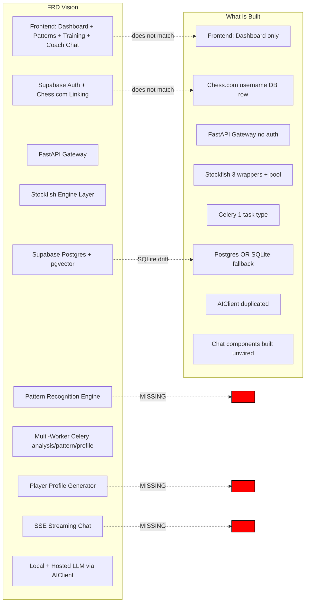

# ChessIQ — Architecture Divergence Report

**Date:** 2026-05-26  
**Comparison axis:** `docs/product/FRD_PRODUCT.md` + `docs/requirements/FRD_TECHNICAL.md` **vs** the actual repository implementation.

The FRD documents describe a sophisticated personalized chess intelligence platform. The current implementation builds approximately **35–40% of the described system**, with several active subsystems that diverge from the intended architecture.

---

## 1. Top-Level Comparison



---

## 2. Subsystem-by-Subsystem Delta

### 2.1 Architecture Stack

| Layer | FRD specifies | Reality | Delta |
|-------|---------------|---------|-------|
| Frontend framework | Next.js + React Query + Axios + Tailwind | Same ✓ | None |
| Backend framework | FastAPI + SQLAlchemy + Pydantic v2 | Same ✓ | None |
| Database | Supabase Postgres | Postgres OR SQLite (fallback) | 🔴 Divergent — SQLite fallback is unintended |
| Cache | Redis | Redis ✓ | None |
| Queue | Celery | Celery ✓ | None |
| Engine | Stockfish via wrapper | Multiple wrappers ✓ (fragmented) | 🟠 Drift — should be 1 |
| LLM | OpenAI / Anthropic via abstraction | OpenAI / OpenRouter via duplicate AIClient | 🟠 Drift — Anthropic not implemented, duplicates exist |
| Vector store | pgvector | Not implemented | 🔴 Missing |
| Auth | Supabase Auth | Chess.com username only | 🔴 Major divergence |
| Realtime | Streaming SSE for chat | Polling (frontend), request/response (backend) | 🔴 Missing |

### 2.2 Core Capabilities

| Capability | FRD | Reality | Status |
|------------|-----|---------|--------|
| Chess.com account linking by username | ✓ | ✓ | 🟢 Built |
| Game fetching with filters | ✓ | ✓ (`games_filters.py` exists but orphaned) | 🟡 Built but not exposed |
| Lightweight game storage with retention | ✓ | ✗ — games persist forever | 🔴 Missing retention |
| Batch analysis with Celery | ✓ | ✓ | 🟢 Built |
| Move timing / clock ingestion | ✓ | ✗ — `Game` model has no per-move clock data | 🔴 Missing |
| Deeper-than-Chess.com free analysis | ✓ | ✓ (depth 18 default) | 🟢 Built |
| Pattern detection — recurring mistakes | ✓ | ✗ | 🔴 Missing |
| Pattern detection — opening weaknesses | ✓ | Partial — opening_name stored, no pattern detection | 🟡 Foundation only |
| Pattern detection — middlegame collapse | ✓ | ✗ | 🔴 Missing |
| Pattern detection — tactical misses | ✓ | ✗ | 🔴 Missing |
| Pattern detection — endgame weaknesses | ✓ | Partial — `endgame_acpl` aggregated, no patterns | 🟡 Foundation only |
| Time management pattern detection | ✓ | ✗ | 🔴 Missing |
| Strong recurring pattern recognition | ✓ | ✗ | 🔴 Missing |
| Longitudinal player profile | ✓ | ✗ | 🔴 Missing |
| Natural language Q&A | ✓ | ✓ (`chess_coach.py`) | 🟢 Built (but sessions are in-memory) |
| Personalized recommendations | ✓ | Partial — `recommendation_engine.py` exists | 🟡 Built but its quality / scope unknown |
| Interactive drills | ✓ | ✗ | 🔴 Missing |
| Dashboard | ✓ | ✓ (oversized, but functional) | 🟢 Built |
| Pattern dashboard | ✓ | ✗ | 🔴 Missing |
| Training mode | ✓ | ✗ | 🔴 Missing |
| Behavioral pattern dashboard | ✓ | ✗ | 🔴 Missing |

**Built**: 5 of 22 capabilities (23%)  
**Partial**: 4 of 22 (18%)  
**Missing**: 13 of 22 (59%)

### 2.3 Data Model

| FRD entity | Implemented? | Notes |
|------------|:------------:|-------|
| `users` | ✓ | But Chess.com-centric, no Supabase ID |
| `games` | ✓ | OK |
| `game_analyses` | ✓ | OK — has phase-aware ACPL |
| `game_moves` (per-move analysis) | ✗ | Move data inlined in analysis_data JSONB? Not verified — but no dedicated table |
| `move_timings` (clock data) | ✗ | Game model has no move clocks |
| `pattern_detections` | ✗ | Not in models/ |
| `player_profiles` | ✗ | Not in models/ |
| `chat_sessions` | ✗ | In-memory only |
| `chat_messages` | ✗ | In-memory only |
| `embedding_vectors` (pgvector) | ✗ | Not in models/ |
| `user_insights` | ✓ | Per `models/insights.py` |
| `subscriptions` / `payments` | ✗ | Tier field on user is the only indicator |

### 2.4 Backend Services

| FRD service | Implemented? | File |
|-------------|:------------:|------|
| Stockfish engine wrapper | ✓ (fragmented) | `services/engine/*` + 6 other places |
| Pattern recognition engine | ✗ | — |
| Move timing analyzer | ✗ | — |
| Player profile generator | ✗ | — |
| AI Coach API | 🟡 | `api/chat.py` + `services/chat/chess_coach.py` (sessions broken) |
| Analysis pipeline service | ✓ | `services/analysis/unified_analyzer.py` |
| Chess.com API client | ✓ | `services/integration/chesscom_api.py` |
| Auth service | 🟡 | `services/auth/auth_service.py` — works but unused |
| Tier / subscription service | ✓ | `services/tier_service.py` |
| Move recommender | ✓ | `services/moves/move_recommender.py` |
| Recommendation engine | ✓ | `services/coaching/recommendation_engine.py` |
| Game filtering | ✓ | `services/filter_service.py` |

### 2.5 Background Workers

| FRD worker | Implemented? | Task module |
|------------|:------------:|-------------|
| Analysis worker (`analyze_games_task`) | ✓ | `app/tasks/analysis_tasks.py` |
| Pattern worker (`detect_patterns_task`) | ✗ | — |
| Profile worker (`update_player_profile_task`) | ✗ | — |
| Periodic game sync worker | ✗ | — |

Only **1 of 4** workers exist.

### 2.6 Frontend Pages

| FRD page | Implemented? | Notes |
|----------|:------------:|-------|
| Home / login | ✓ | `pages/index.tsx` (oversized, Chess.com only) |
| Dashboard | ✓ | `pages/dashboard.tsx` (oversized, polling-based) |
| Game detail (move-by-move) | ✗ | — |
| AI Coach page | ✗ | Components built, no page |
| Pattern dashboard | ✗ | — |
| Training mode | ✗ | — |
| Profile (longitudinal) | ✗ | — |
| Settings | ✗ | — |

**2 of 8 pages built (25%)**

### 2.7 Tier System

| Tier (FRD) | Implemented? | Notes |
|------------|:------------:|-------|
| Free | ✓ | 5 AI analyses limit |
| Pro | ✓ | Unlimited AI |
| Elite | ✗ | FRD mentions "elite" tier with hosted LLM access — model has only `free` / `pro` |

---

## 3. Dangerous Divergences (not just missing — actively wrong)

### 3.1 Auth philosophy reversal
**FRD §1.1:** "Chess.com account linking by username (no OAuth in MVP)" — implying *linking* on top of an existing user identity.  
**Reality:** Chess.com username **IS** the user identity. There is no underlying user system to link to.

This means:
- Users cannot have multiple Chess.com usernames per account
- Users cannot change their Chess.com username after signup without losing their data
- No identity portability — losing the Chess.com username = losing the account
- No password reset (because there's no password)

### 3.2 Storage retention philosophy
**FRD §1.1:** "Recently fetched games are temporarily cached (configurable retention window). Stockfish analysis outputs and detected patterns are stored permanently."  
**Reality:** Games are stored permanently in `games` table with no TTL or archival policy.

Long-term implications:
- Database grows linearly per user with no decay
- Storage costs will balloon for power users
- Re-syncing games will produce duplicates (existing-row checks help, but not retention)

### 3.3 LLM provider abstraction divergence
**FRD §1.1:** AI Coach LLM with hosted fallback (Elite tier only).  
**Reality:** `AIClient` supports OpenAI + OpenRouter + Mock — but **not Anthropic** (FRD specifies Anthropic). And the abstraction is duplicated across two files.

### 3.4 Streaming vs polling
**FRD §3 (chat architecture):** Streaming chat responses with token-by-token rendering.  
**Reality:** Synchronous request/response. Frontend polls game-analysis status every 8 seconds for batch jobs.

### 3.5 Pattern recognition is THE differentiator
**FRD §1.1:** "The key differentiator is **long-term pattern recognition**: The AI learns recurring patterns across a player's games and provides personalized coaching based on those longitudinal insights, not just individual game analysis."  
**Reality:** No pattern recognition code exists. The product's unique value proposition is unimplemented.

---

## 4. What is Built That Was Not in the FRD

These are existing systems that the FRD does not call for. Each requires a "keep / move / delete" decision.

| Built artefact | FRD says? | Recommendation |
|----------------|-----------|----------------|
| `services/chess_analyzer.py` (308 lines) | No | Delete — `unified_analyzer.py` replaces |
| `services/chess_analysis.py` (174 lines) | No | Delete |
| `core/ai_client.py` (duplicate) | No | Delete |
| Backward-compat shims (`chesscom_api.py`, `auth_service.py` at root) | No | Delete after audit |
| `services/filter_service.py` | Implied (game filtering) | Keep |
| `services/tier_service.py` | Implied (Free / Pro) | Keep |
| `api/analysis_stockfish.py` (orphaned) | No | Delete or wire |
| `api/games_filters.py` (orphaned) | No | Delete or wire |
| `add_indexes.py` at backend root | No | Convert to Alembic migration |
| `start_celery_worker.py` at backend root | No | Delete (use `celery -A app.celery_app worker`) |
| `setup_supabase.py` at backend root | No | Move to `scripts/` or delete |
| `run_tests.py` / `run_all_tests.py` | No | Delete (pytest exists) |

---

## 5. What is in the FRD That is NOT Yet Built (action required)

Sorted by FRD priority. Each item requires a future implementation sprint — see the remediation roadmap for sequencing.

1. **Pattern recognition engine** — the core differentiator
2. **Player profile generator** — longitudinal aggregation
3. **Move timing / clock data ingestion** — required input for behavioral patterns
4. **Per-move data persistence** (`game_moves` table) — required for pattern queries
5. **pgvector extension + embedding store** — for pattern similarity search
6. **Streaming chat responses** (SSE/WebSocket)
7. **Chat session persistence** (Redis short-term, DB long-term)
8. **Supabase Auth wiring** — to backend JWT verification
9. **Game detail page (frontend)**
10. **AI Coach page (frontend)** — wire existing chat components
11. **Pattern dashboard page (frontend)**
12. **Training mode page (frontend)**
13. **Pattern worker (Celery)**
14. **Profile worker (Celery)**
15. **Anthropic provider in AIClient**
16. **Elite tier in tier system**
17. **Game retention policy + sync worker**

---

## 6. Divergence Severity Score

| Area | FRD coverage | Implementation drift |
|------|:-:|:-:|
| Core platform (Chess.com integration, analysis) | 75% | Low |
| Pattern recognition | 0% | N/A — missing |
| AI Coach (chat) | 60% | Medium — sessions broken, no streaming |
| Frontend pages | 25% | Medium — 2 of 8 pages |
| Auth | 30% | High — wrong system active |
| Database schema | 50% | Low — basic models present, advanced ones missing |
| Workers | 25% | Medium — single worker type |
| Infrastructure / deploy | 60% | High — deploy is broken |
| Realtime / streaming | 0% | N/A — missing |

**Overall FRD coverage:** ~36%  
**Implementation drift on what IS built:** Moderate — most subsystems work but architectural rules are routinely violated.

---

## 7. Visualisation — FRD vs Reality Side-by-Side

### 7.1 Frontend pages

```
FRD:        / → /dashboard → /games/[id] → /coach → /patterns → /training → /profile → /settings
                                 (8 pages)
Reality:    / → /dashboard
                                 (2 pages)
            /auth/login, /auth/signup, /auth/callback  [orphaned]
```

### 7.2 Analysis pipeline depth

```
FRD:
  fetch_game → store_game_with_clocks → analyze_position_by_position
            → extract_move_features → detect_patterns_in_history
            → update_player_profile → generate_recommendations
            → stream_to_coach_when_asked

Reality:
  fetch_game → store_game (no per-move clocks)
            → analyze_game (acpl + phase metrics only)
            → store_aggregate_analysis
            → [no pattern step]
            → [no profile step]
            → [no streaming]
```

### 7.3 Auth flow

```
FRD:
  signup → Supabase Auth → email confirm
        → link Chess.com username → start using

Reality:
  enter Chess.com username → DB row created (no password)
                          → start using (no auth, no session)
```

### 7.4 Worker fan-out

```
FRD:                           Reality:
  analyze_game_task              analyze_game_task
       │                              │
       ├─► pattern_worker             └─► (nothing)
       │
       └─► profile_worker
            │
            └─► embedding_worker
```

---

## 8. Decision Required From Product / Engineering Leadership

The FRD describes a vastly more capable product than what exists. Three paths:

| Path | Description | Cost | Risk |
|------|-------------|------|------|
| **A — Build to FRD** | Implement pattern recognition, profiles, streaming, full frontend over the next 6–12 weeks | High | Long road; user value is delayed but high |
| **B — Trim FRD** | Cut pattern recognition + profiles + training; ship the dashboard + coach as v1 | Medium | Lower differentiation vs Chess.com's own analysis |
| **C — Hybrid** | P0 fix all broken systems → ship a hardened dashboard + chat v1 → start pattern engine next | Medium | Recommended — preserves value, defers complexity |

The remediation roadmap assumes **Path C** and sequences accordingly.
