# ChessIQ — Backend Audit

**Scope:** `backend/` directory — FastAPI application, services, tasks, models, infrastructure.  
**Date:** 2026-05-26  
**Method:** Direct source inspection + targeted greps. Every finding includes file:line evidence.

---

## 1. Entry Point Mismatch (P0 — deployment-blocking)

| Source | Claims entry is | Actual entry |
|--------|-----------------|--------------|
| `render.yaml:31` | `uvicorn app.main:app` | `app:app` (re-exported from `app/__main__.py`) |
| `docker-compose.yml:74` | `celery -A app.workers.celery_app` | `celery -A app.celery_app` |
| `docker-compose.yml:31` | (backend container) `uvicorn app:app` | OK — but the service is **commented out** |
| `.cursor/rules/backend.mdc` | Mentions `app/main.py` | `app/__main__.py` |

**Impact:** A fresh Render deploy will fail at startup. The Celery worker container will fail to find the Celery app. The Cursor rule itself drifted from reality and may mislead future agents.

**Evidence (`render.yaml:30-31`):**
```yaml
startCommand: |
  cd backend
  uvicorn app.main:app --host 0.0.0.0 --port $PORT
```

**Evidence (`backend/app/__init__.py`):**
```python
from .__main__ import app
__all__ = ["app"]
```

---

## 2. API Routing & Authentication

### 2.1 Routes registered in `__main__.py` (lines 53-58)

| Router | Prefix | Status |
|--------|--------|--------|
| `users.router` | `/api/v1/users` | ✅ Registered |
| `games.router` | `/api/v1/games` | ✅ Registered |
| `analysis.router` | `/api/v1/analysis` | ✅ Registered |
| `insights.router` | `/api/v1/insights` | ✅ Registered |
| `moves.router` | `/api/v1/moves` | ✅ Registered |
| `chat.router` | `/api/v1/chat` | ✅ Registered |
| `analysis_stockfish.router` | — | 🔴 **NOT REGISTERED** (file exists at `api/analysis_stockfish.py`) |
| `games_filters.router` | — | 🔴 **NOT REGISTERED** (file exists at `api/games_filters.py`) |

**Impact:** Two route files exist but their endpoints are unreachable. Either delete them or wire them up.

### 2.2 Auth dependency usage

Grep result for `Depends(get_current_user)` in `backend/app/api/`:

```
(no matches)
```

**Impact:** Every mutating endpoint is publicly callable. This includes:
- `POST /api/v1/users/` — create user (verified)
- `DELETE /api/v1/users/{user_id}` — delete user (verified)
- `POST /api/v1/users/{user_id}/upgrade-to-pro` — anyone can self-grant Pro tier (verified at `users.py:358`)
- `POST /api/v1/analysis/{user_id}/analyze` — anyone can trigger analysis on any user's behalf, consuming their AI quota
- `DELETE /api/v1/analysis/game/{game_id}` — delete analysis data

The `auth_middleware.py` file exists and is complete (`get_current_user` + `get_current_user_optional`), but **nothing imports it**.

### 2.3 Route file sizes

| File | Lines | Limit (F2) | Status |
|------|-------|------------|--------|
| `api/analysis.py` | 545 | 250 | 🔴 Over by 295 |
| `api/games.py` | (not measured but visibly large) | 250 | 🟡 Likely over |
| `api/users.py` | 373 | 250 | 🔴 Over by 123 |
| `api/chat.py` | ~235 | 250 | 🟡 At threshold |
| `api/moves.py` | (not measured) | 250 | 🟡 TBD |
| `api/insights.py` | (not measured) | 250 | 🟡 TBD |

---

## 3. Service Layer

### 3.1 Duplicate implementations confirmed

| Service area | Locations | Verdict |
|--------------|-----------|---------|
| Chess.com API client | `services/chesscom_api.py` (shim) + `services/integration/chesscom_api.py` (real) | Acceptable shim — but undocumented |
| Auth service | `services/auth_service.py` (shim) + `services/auth/auth_service.py` (real) | Acceptable shim — but undocumented |
| AI client | `core/ai_client.py` + `services/integration/ai_client.py` | 🔴 **TRUE duplicate** — both contain identical `AIClient` class, only relative imports differ. Header explicitly says "Note: Also available via app.services.integration.ai_client for consistency." |
| Chess analyzer | `services/chess_analyzer.py` (~308 lines) + `services/analysis/unified_analyzer.py` (the modern one) + `services/chess_analysis.py` (an independent simpler ChessAnalysisService) | 🔴 **TRIPLE duplication** |
| Stockfish wrapper | `services/engine/engine_pool.py` (correct) + `services/engine/stockfish_engine.py` (used directly by routes) + `services/analysis/engine_service.py` + 7 other call sites | 🔴 Severe fragmentation |

### 3.2 Stockfish access sites (should be 1 file — the pool)

```
backend/app/services/engine/engine_pool.py        ✓ correct (pool itself)
backend/app/services/engine/stockfish_engine.py   ✓ used by the pool
backend/app/services/analysis/unified_analyzer.py 🔴 instantiates StockfishEngine
backend/app/services/analysis/engine_service.py   🔴 separate wrapper
backend/app/services/analysis/                    (more files)
backend/app/services/chat/chess_coach.py          🔴 line 39: StockfishEngine(depth=18, threads=2)
backend/app/services/chess_analysis.py            🔴 line 17: hardcoded path /usr/games/stockfish
backend/app/services/moves/move_recommender.py    🔴 instantiates engine
backend/app/api/analysis.py                       🔴 line 229: StockfishEngine(depth=18, threads=2)
backend/app/api/chat.py                           🔴 line 50: StockfishEngine(depth=18, threads=2)
backend/app/api/moves.py                          🔴 (per grep)
```

**Architecture rule violated:** A1 (Stockfish outside engine pool). Per `.cursor/rules/backend.mdc`, only the pool should construct engines. **10 sites do so today**.

### 3.3 LLM call sites

```
backend/app/core/ai_client.py                     🔴 duplicate of below
backend/app/services/integration/ai_client.py     ✓ canonical (intended)
backend/app/core/config.py                        ✓ env var declaration only
```

LLM access itself is reasonably contained — only the `AIClient` class touches the providers. The problem is the **duplicate class definition**, not scattered LLM calls.

---

## 4. Database Layer

### 4.1 Silent SQLite fallback (P0 — production risk)

**File:** `backend/app/core/database.py:21-43`

```python
try:
    engine = create_engine(database_url, ...)
    with engine.connect() as conn:
        conn.execute(text("SELECT 1"))
    print(f"✅ Connected to PostgreSQL: {engine.url.host}")
except Exception as e:
    # Fall back to local SQLite file
    print(f"⚠️ PostgreSQL connection failed: {e}")
    print("📁 Using local SQLite database: ./chess_ai.db")
    database_url = "sqlite:///./chess_ai.db"
    engine = create_engine(...)
```

**Impact:** Any production Postgres outage (network blip, credential rotation, Supabase service degradation) silently switches the app to a per-container local SQLite file. Data writes succeed but are isolated to that container. **This is a data-loss-class bug.**

### 4.2 Auto-create tables on startup

**File:** `backend/app/__main__.py:28`

```python
Base.metadata.create_all(bind=engine)
```

**Impact:** Defeats Alembic. Will create any new SQLAlchemy model column on startup, drifting the production schema away from the migration history. New columns added by developers won't have proper migrations because the dev DB has them auto-created.

### 4.3 `get_db` shape

```python
def get_db():
    """Dependency for getting database session."""
    db = SessionLocal()
    try:
        yield db
    finally:
        db.close()
```

This is a **sync generator**. But the `.cursor/rules/backend.mdc` says:

> Use `async with get_db() as db:` from `app/core/database.py`.

🔴 The rule is wrong. There is no async DB context manager. Either fix the rule or refactor to async SQLAlchemy.

### 4.4 SessionLocal in route files (A3 violation)

Confirmed grep matches for `SessionLocal` in `backend/app/api/`:
- `api/analysis.py:6` — direct import + use in deprecated sync fallback (line 19)
- `api/users.py:17` — imported for background task (line 17, used in `fetch_initial_games_background`)
- `api/analysis_stockfish.py` — imported (file orphaned, so currently dead)

The pattern of using `SessionLocal` inside `BackgroundTasks` callbacks is justifiable because the request's `db` session ends when the response returns. But it should be wrapped in a helper, not imported into every route file.

### 4.5 Models inventory

| Model | Table | Notes |
|-------|-------|-------|
| `User` | `users` | Chess.com-centric. No Supabase user ID linkage. Fake email default (`<username>@chess.placeholder`). |
| `Game` | `games` | Standard Chess.com mirror. `is_analyzed` flag used. |
| `GameAnalysis` | `game_analyses` | One-to-one with Game. Contains ACPL, move classification counts. |
| `UserInsight` | (per `models/insights.py`) | Not read in this audit. Cross-reference. |

**Missing per FRD:** `PatternDetection`, `PlayerProfile`, `GameMoves` (move-by-move), `ChatSession`, `ChatMessage`, `PgVectorEmbedding`. The FRD specifies these in section 4 of `FRD_TECHNICAL.md`; none exist in `backend/app/models/`.

### 4.6 Alembic migrations

```
backend/alembic/versions/
  0001_initial_tables.py
  0002_add_tier_management.py
  0003_add_enhanced_recommendation_fields.py
  0004_sync_user_insights_schema.py
  99221b79d5ec_merge_migration_heads.py
  add_game_filter_indexes.py            (non-standard naming — no rev id)
```

The merge migration suggests at least one historical branch divergence. The `add_game_filter_indexes.py` filename violates the `NNNN_<slug>.py` convention used by the others.

---

## 5. Celery / Background Workers

### 5.1 Celery app

**File:** `backend/app/celery_app.py` — clean, well-configured. Includes only `app.tasks.analysis_tasks`.

```python
celery_app = Celery(
    "chess_ai",
    broker=settings.CELERY_BROKER_URL,
    backend=settings.CELERY_RESULT_BACKEND,
    include=['app.tasks.analysis_tasks']
)
```

✅ Single queue: `analysis`. Soft/hard time limits set. Worker prefetch = 1.

### 5.2 Tasks

Only one task module: `backend/app/tasks/analysis_tasks.py`. Contains `analyze_game_task` and `analyze_batch_games_task`.

**Per FRD:** Multiple workers expected — analysis worker, pattern worker, profile worker. **2 of 3 missing.**

### 5.3 Stray Celery scripts at backend root

- `backend/start_celery_worker.py` — duplicates `celery -A app.celery_app worker` command
- `backend/conftest.py` — pytest config (OK)
- `backend/setup_supabase.py` — one-shot setup script (orphaned)
- `backend/add_indexes.py` — should be an Alembic migration
- `backend/run_tests.py`, `backend/run_all_tests.py` — pytest already exists; these are redundant

---

## 6. Chat Subsystem

### 6.1 Session storage is in-memory (P0)

**File:** `backend/app/services/chat/chess_coach.py:43-44`

```python
# In-memory session storage (replace with database in production)
self.sessions: Dict[str, ChatContext] = {}
```

**Impact:** 
- Worker restart loses all sessions
- Horizontal scaling impossible — each container has its own session map
- No session timeout / cleanup logic visible

The comment explicitly admits the limitation. It must move to Redis (short-term) or a `chat_sessions` table (long-term).

### 6.2 Stockfish engine constructed per request

**File:** `backend/app/api/chat.py:50`

```python
_engine_instance = StockfishEngine(depth=18, threads=2)
await _engine_instance.initialize()
_coach_instance = ChessCoach(stockfish_engine=_engine_instance)
```

A module-level singleton is built via `get_chess_coach()` and reused across requests, which is functionally OK. But it bypasses `engine_pool.py`, meaning two parallel Stockfish lifecycles run (the pool for analysis, this singleton for chat). This:
- Doubles memory footprint
- Creates inconsistent depth configs (chat: 18; pool default: 15)
- Makes engine restart / health checks inconsistent

### 6.3 Streaming responses

The chat endpoint is request/response only. FRD calls for streaming (server-sent events) for the AI coach.

---

## 7. Routes — Per-File Findings

### 7.1 `api/users.py` (373 lines)

| Finding | Line | Severity |
|---------|------|----------|
| No auth on any endpoint | all | 🔴 P0 |
| Background task imports `SessionLocal` | 17 | 🟡 P1 |
| Fake email default `f"{username}@chess.placeholder"` | 181 | 🟡 P1 — collision risk |
| Anyone can self-upgrade to Pro | 358 | 🔴 P0 |
| `parse_game_data` called via service — good | 35 | ✓ |
| Soft 10-game limit hard-coded | 32 | 🟡 P2 |

### 7.2 `api/analysis.py` (545 lines — over hard limit)

| Finding | Line | Severity |
|---------|------|----------|
| 545 lines (limit 250) | file | 🔴 P1 |
| Imports `SessionLocal` directly | 6 | 🟡 P2 |
| Has `analyze_game_background_DEPRECATED` function | 58-172 | 🔴 P1 dead code |
| Sync fallback uses `game.white_player` (model has `white_username`) | 239 | 🔴 P0 — broken when triggered |
| Sync fallback uses `game.analyzed` (model has `is_analyzed`) | 275 | 🔴 P0 — broken |
| Sync fallback treats result as dict (`.get('accuracy_white')`); analyzer returns dataclass | 252-258 | 🔴 P0 — broken |
| Imports `StockfishEngine` inside route handler | 229 | 🔴 A1 violation |
| Duplicate `return {"message": ...}` at EOF | 544-545 | 🟡 P2 |
| No auth | all | 🔴 P0 |

### 7.3 `api/analysis_stockfish.py` (orphaned)

- Not registered in `__main__.py`
- Imports `from ..middleware.auth_middleware import get_current_user` — only file in `api/` that does
- Currently dead code; can serve as a reference for how auth would be wired

### 7.4 `api/chat.py`

| Finding | Line | Severity |
|---------|------|----------|
| Singleton lazy init with global `_coach_instance` | 38-60 | 🟡 P2 — should be a FastAPI lifespan event |
| Initialization lock global is not actually a lock (race condition possible) | 40 | 🟡 P2 |
| Direct `StockfishEngine(...)` call | 50 | 🔴 A1 violation |
| No auth | all | 🔴 P0 |

### 7.5 `api/games.py` (not fully read)

Imports look clean (uses `chesscom_api` service). Likely has the same auth gap.

### 7.6 `api/moves.py`

Per grep result: instantiates `StockfishEngine` directly. A1 violation.

### 7.7 `api/insights.py`

Not deeply audited. Per the inventory, there is no `insight_service.py` — logic likely inlined in the route.

---

## 8. Configuration

### 8.1 Mixed environment variable strategy

`.env.example` declares both:
- `SUPABASE_URL`, `SUPABASE_ANON_KEY`, `SUPABASE_SERVICE_ROLE_KEY` (used by `core/supabase_client.py`)
- `POSTGRES_SERVER`, `POSTGRES_USER`, etc. (used by `render.yaml` mapping)
- And `DATABASE_URL` is consumed by `core/database.py` but not declared in `.env.example`

There is no documentation of which is canonical. The `core/config.py` has both Supabase fields and Postgres fields, with `SQLALCHEMY_DATABASE_URI` reading from `DATABASE_URL` directly.

### 8.2 Duplicate API key fallback

```python
OPENAI_API_KEY: str = os.getenv("OPENAI_API_KEY", os.getenv("OPEN_API_KEY", ""))
```

`OPEN_API_KEY` is a typo workaround. This kind of inconsistency between two env vars for the same value will cause silent misconfiguration. Pick one, deprecate the other.

### 8.3 `BACKEND_CORS_ORIGINS` validator

`backend/app/core/config.py:45-75` — well-implemented. Refuses wildcard in production. ✓

### 8.4 `SECRET_KEY` validator

Lines 27-40. Refuses empty / default / short keys. ✓

---

## 9. Tests

### 9.1 Pytest suite (`backend/tests/`)

12 test files:
- `test_analysis_engine_core.py`
- `test_api_users_complete.py`
- `test_auth_complete.py`
- `test_chess_analyzer.py`
- `test_chess_analysis_comprehensive.py`
- `test_chesscom_api_integration.py`
- `test_insights_integration.py`
- `test_move_recommender.py`
- `test_recommendation_engine.py`
- `test_stockfish_engine.py`
- `test_user_creation_with_games.py`
- `benchmark_analysis.py` (likely benchmark, not test)
- `fixtures/sample_pgns.py`

✅ Reasonable coverage on analysis + chess.com integration.  
🔴 Likely outdated given the duplicate analyzer situation — `test_chess_analyzer.py` and `test_chess_analysis_comprehensive.py` may test stale files.

### 9.2 Stray test scripts (NOT part of pytest)

```
backend/scripts/
  test_celery_api.py
  test_chesscom_api.py
  test_db_connection.py
  test_rate_limiting.py
  test_redis_cache.py
  test_supabase_connection.py
```

These are manual smoke scripts. Their presence in a `scripts/` directory with `test_` prefix is misleading — pytest does NOT pick them up (already documented in `AGENTS.md`), but a new contributor will assume they're part of the test suite. Consider renaming to `smoke_*.py` or `check_*.py`.

---

## 10. Backend Dependency Map (current state)

```mermaid
flowchart TB
    subgraph API["api/"]
        users_py[users.py]
        games_py[games.py]
        analysis_py[analysis.py 545L]
        chat_py[chat.py]
        moves_py[moves.py]
        insights_py[insights.py]
        astock_py[analysis_stockfish.py ORPHAN]
        gfilter_py[games_filters.py ORPHAN]
    end

    subgraph Services["services/"]
        chesscom[integration/chesscom_api.py]
        aiclient[integration/ai_client.py]
        coreai[core/ai_client.py DUPE]
        unified[analysis/unified_analyzer.py]
        chess_analyzer[chess_analyzer.py DUPE]
        chess_analysis[chess_analysis.py DUPE]
        coach[chat/chess_coach.py]
        recommender[moves/move_recommender.py]
        pool[engine/engine_pool.py]
        stockfish[engine/stockfish_engine.py]
        tier[tier_service.py]
        auth[auth/auth_service.py]
        recomm[coaching/recommendation_engine.py]
    end

    subgraph Tasks["tasks/"]
        analysis_tasks[analysis_tasks.py]
    end

    subgraph Models["models/"]
        user_m[User]
        game_m[Game / GameAnalysis]
        insight_m[UserInsight]
    end

    users_py --> chesscom
    users_py --> tier
    users_py -->|reads/writes| user_m
    games_py --> chesscom
    games_py --> game_m
    analysis_py --> unified
    analysis_py --> tier
    analysis_py -->|🔴 direct| stockfish
    analysis_py --> analysis_tasks
    analysis_py --> game_m
    chat_py --> coach
    chat_py -->|🔴 direct| stockfish
    coach -->|🔴 direct| stockfish
    coach --> recommender
    recommender -->|🔴 direct| stockfish
    analysis_tasks --> unified
    analysis_tasks --> pool
    unified -->|🔴 direct| stockfish
    pool --> stockfish

    style analysis_py stroke:#f00
    style coach stroke:#f00
    style chat_py stroke:#f00
    style chess_analyzer stroke:#f80,stroke-dasharray: 5 5
    style chess_analysis stroke:#f80,stroke-dasharray: 5 5
    style coreai stroke:#f80,stroke-dasharray: 5 5
    style astock_py stroke:#888,stroke-dasharray: 5 5
    style gfilter_py stroke:#888,stroke-dasharray: 5 5
```



Red = architecture violation. Orange dashed = duplicate / dead code. Grey dashed = orphaned routes.

---

## 11. Summary — Backend Health Score

| Dimension | Score | Notes |
|-----------|-------|-------|
| Security | 1/10 | No auth on any route. Anyone can do anything. |
| Architecture cleanliness | 3/10 | Engine pool exists but bypassed by 9 callers; 5 duplicated services |
| Test coverage | 5/10 | Tests exist but may target deprecated code paths |
| Production readiness | 2/10 | Deploy will fail; SQLite fallback masks failures |
| Documentation accuracy | 4/10 | Cursor rules drifted; entry-point name wrong |
| Code size discipline | 4/10 | 2 route files over hard limit |
| Database hygiene | 3/10 | Alembic + auto-create mixed; SQLite fallback present |
| External integration | 7/10 | Chess.com client is solid; Stockfish wrapper works |
| Background workers | 6/10 | Celery is configured correctly; only 1 of 3 worker types from FRD exists |
| Service-layer purity | 4/10 | Routes import engine + SessionLocal directly |

**Overall backend health:** **3.9 / 10** — partial, salvageable, requires P0 fixes before any feature work.
