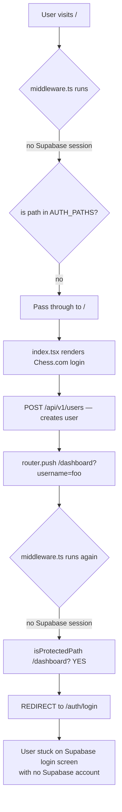
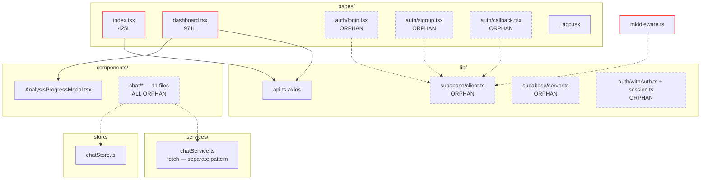

# ChessIQ — Frontend Audit

**Scope:** `frontend/src/` — Next.js Pages Router + TypeScript + Tailwind + React Query + Supabase scaffold.  
**Date:** 2026-05-26  
**Method:** Direct source inspection of pages, lib, services, types.

---

## 1. Critical Findings (P0)

| # | Finding | Severity | Evidence |
|---|---------|---------|----------|
| F-1 | `dashboard.tsx` is 971 lines — 6.5× the hard size limit (150 lines for pages) | 🔴 P1 | `pages/dashboard.tsx` |
| F-2 | `index.tsx` is 425 lines — 2.8× over | 🔴 P1 | `pages/index.tsx` |
| F-3 | Two parallel, **unintegrated** authentication systems | 🔴 P0 | Chess.com username flow in `pages/index.tsx` vs Supabase Auth in `pages/auth/*` |
| F-4 | Two parallel HTTP client libraries with different patterns | 🔴 P1 | `lib/api.ts` (axios) vs `services/chatService.ts` (fetch) |
| F-5 | Zero React Query hooks layer; all queries inlined in pages | 🔴 P1 | `dashboard.tsx:152-184` has 4 inline `useQuery` blocks |
| F-6 | Supabase middleware guards `/dashboard` but the app's actual login flow never sets a Supabase session | 🔴 P0 | `middleware.ts` redirects to `/auth/login` (Supabase) but real login is at `/` |
| F-7 | No game-detail page; users cannot inspect individual game analysis | 🔴 P1 (feature gap) | Only `/` and `/dashboard` exist |
| F-8 | Manual polling implementation (8s interval) for analysis progress | 🟡 P2 | `dashboard.tsx:411-474` — should be SSE / WebSocket per FRD |
| F-9 | Inline `MoveQualityChart` component is declared AND duplicated in JSX further down | 🟡 P2 | `dashboard.tsx:11-46` and inlined again at line 711+ |
| F-10 | 9 chat components built but **not wired to any page** | 🔴 P1 | `components/chat/*` orphaned |

---

## 2. Page Inventory

```
frontend/src/pages/
├── _app.tsx              — Next.js root (assumed standard)
├── index.tsx             — 425 lines: home + Chess.com username login + game-fetch + filters
├── dashboard.tsx         — 971 lines: user view + 4 React Query hooks + analysis trigger + game list
└── auth/
    ├── callback.tsx      — Supabase PKCE callback handler (orphaned)
    ├── login.tsx         — Supabase email/password login (orphaned)
    └── signup.tsx        — Supabase email/password signup (orphaned)
```

**Missing pages (per FRD):**
- `/games/[id]` — game detail with move-by-move analysis
- `/coach` — AI Coach chat interface
- `/patterns` — Pattern dashboard
- `/training` — Training mode with drills
- `/profile` — Player profile / longitudinal view
- `/settings`

---

## 3. The Dual-Auth Problem (P0 deep-dive)

### 3.1 Authentication system A — Chess.com username

**Flow:**
1. User enters Chess.com username on `/`
2. `pages/index.tsx:99` calls `api.users.getByUsername()`
3. If 404, calls `api.users.create()` (no password, no token)
4. Polls `/users/by-username/{username}` until games are fetched
5. Redirects to `/dashboard?username=foo`
6. Dashboard reads `?username=` from query string — that's "session"

**Properties:**
- Active and functional
- Zero authentication — anyone with anyone's username can act as them
- No server-side session validation
- No cookies, no tokens

### 3.2 Authentication system B — Supabase

**Flow:**
1. User visits `/auth/signup` → creates Supabase user
2. Email confirmation via `/auth/callback`
3. Supabase sets HTTP-only session cookies
4. `middleware.ts` checks `supabase.auth.getUser()` on every request
5. If user navigates to `/dashboard` while unauthenticated, middleware redirects to `/auth/login`

**Properties:**
- Recently scaffolded (by a prior agent)
- Complete: client.ts, server.ts, middleware.ts, withAuth HOC, session helper
- **Not invoked by the real login flow**
- `middleware.ts` config matcher excludes only static assets — so it actually runs on every page request, including `/`

### 3.3 What happens when both exist simultaneously



**This is broken right now.** The middleware will redirect every successful Chess.com login away from the dashboard because `/dashboard` is in `PROTECTED_PATHS` but the user has no Supabase session.

Unless the matcher in `middleware.ts` has been carefully configured to exclude this path, the recently-added Supabase scaffolding has actively broken the Chess.com username flow. **Verify this immediately** — read `middleware.ts` and `pages/dashboard.tsx`'s redirect behavior.

### 3.4 Resolution requirement

Pick ONE auth system:

- **Option A — Supabase canonical:** Backend trusts Supabase JWT, frontend uses Supabase Auth for all login. The Chess.com username becomes a *profile field* of the Supabase user. This is what the FRD implies.
- **Option B — Chess.com canonical:** Delete the Supabase scaffold. Add a real backend session/JWT system. Less aligned with the FRD.

**Recommendation:** Option A. Add `supabase_user_id` to the `User` model, migrate the login flow, delete the Chess.com-only login.

---

## 4. `pages/index.tsx` — 425 lines

### 4.1 Responsibilities (too many)

The file currently handles:
1. Chess.com username form with validation
2. Email form (optional)
3. Game filter UI (time control checkboxes, rated filter, date range)
4. Polling logic (`pollUserData` — manual setInterval loop)
5. Background game-fetch coordination
6. Toast notifications
7. OAuth "coming soon" placeholder section
8. Loading states (3 different ones: `loading`, `pollingStatus`, `fetchError`)
9. Form submission orchestration (existing user vs new user)
10. Conditional redirect logic with timeouts

### 4.2 Extraction plan (preview — full plan in remediation roadmap)

| Extract to | Lines moved |
|------------|-------------|
| `components/auth/UsernameLoginForm.tsx` | ~100 |
| `components/games/GameFilterControls.tsx` | ~110 |
| `hooks/useChessComLogin.ts` | ~80 (the polling + user-create logic) |
| `lib/polling.ts` (utility) | ~20 |
| Keep in `index.tsx` | ~50 layout + composition |

Target final size of `index.tsx`: ≤ 100 lines.

---

## 5. `pages/dashboard.tsx` — 971 lines

### 5.1 Sub-component definitions inside the file

| Component | Lines | Should be extracted? |
|-----------|-------|---------------------|
| `MoveQualityChart` | 11-46 | ✓ to `components/charts/MoveQualityChart.tsx` |
| `PerformanceCard` | 48-86 | ✓ to `components/dashboard/PerformanceCard.tsx` |
| `CoachingInsightCard` | 88-129 | ✓ to `components/dashboard/CoachingInsightCard.tsx` |
| `Dashboard` | 131-971 | ✓ to slim wrapper page |

### 5.2 Hooks (4 inline `useQuery`)

```typescript
const { data: userData } = useQuery({ queryKey: ['user', ...], queryFn: () => api.users.getByUsername(...) })
const { data: analysisSummary } = useQuery({ queryKey: ['analysis-summary', user?.id], ... })
const { data: recommendations } = useQuery({ queryKey: ['recommendations', user?.id], ... })
const { data: games } = useQuery({ queryKey: ['games', user?.id], ... })
```

All four should move to `frontend/src/hooks/`:

```
hooks/
  useUser.ts              — by-username + by-id
  useAnalysisSummary.ts
  useRecommendations.ts
  useGames.ts
```

### 5.3 Polling logic

`dashboard.tsx` has THREE polling implementations:
- `startSingleGamePolling(gameId)` — 5s interval, max 45 polls
- `startAnalysisPolling()` — 8s interval, max 50 polls
- The `userData` useQuery effectively polls via `refetchOnWindowFocus`

All three should be:
1. Replaced with backend SSE/WebSocket push (the FRD specifies this)
2. Or — if polling stays — consolidated into a single `usePollAnalysisProgress(gameIds)` hook

### 5.4 Duplicated chart data

The `MoveQualityChart` data array is declared **twice in the JSX** (once on line ~714, again on line ~731). The second is used as the `data` for `<Cell>` children. Pure code duplication.

### 5.5 Dead code

- Line 491 commented out: `// await api.analysis.cancelBatchAnalysis(user.id);` — a feature that was started and never finished.
- Line 250-265 commented out: a "Game Count" select that was removed but left in HTML comments.

### 5.6 Mixed concerns

- Game color logic (`userColor = game.white_username?.toLowerCase() === user?.chesscom_username?.toLowerCase() ? 'white' : 'black'`) appears 5+ times inline. Belongs in a `lib/chess/userPerspective.ts` utility.
- Result labelling logic (win/loss/draw mapping) duplicated 4 times.

---

## 6. `lib/api.ts` — Axios Client

### 6.1 Coverage

| Backend route | Frontend client? |
|---------------|------------------|
| `/users/*` | ✓ `userApi` |
| `/games/*` | ✓ `gamesApi` |
| `/analysis/*` | ✓ `analysisApi` |
| `/insights/*` | ✓ `insightsApi` |
| `/moves/*` | 🔴 NOT covered — `moves` endpoint exists on backend, no frontend client |
| `/chat/*` | 🔴 NOT covered here — has separate `services/chatService.ts` (fetch-based) |
| `/analysis-stockfish/*` | N/A — backend route orphaned |
| `/games-filters/*` | N/A — backend route orphaned |

### 6.2 Strengths

- Single `apiClient` instance with shared base URL
- Response interceptor for error logging
- Strong TypeScript types from `@/types`

### 6.3 Weaknesses

- No request interceptor — cannot add auth headers automatically (because there's no auth system to inject from)
- No retry logic
- Errors logged to console only — no centralised error reporting
- The interceptor swallows context: `error.response?.data?.detail` is the only useful path, and pages rebuild this manually 5+ times

---

## 7. `services/chatService.ts` — fetch Client (Separate Pattern)

### 7.1 Why does it exist separately?

Likely because the chat work happened in a different sprint than the api.ts work. There is no architectural justification for the separation.

### 7.2 Differences

| Aspect | `lib/api.ts` | `services/chatService.ts` |
|--------|--------------|---------------------------|
| HTTP library | axios | native fetch |
| Type imports | `@/types` | `@/types/chat.types` |
| Error handling | response interceptor | per-method try/catch |
| Stateful session ID | no | yes (instance field) |
| Pattern | functional namespace export (`userApi.create`) | class with singleton instance |

### 7.3 Resolution

Move chat methods into `lib/api.ts` as `api.chat.*`. Delete `services/chatService.ts`. Migrate `sessionId` to a Zustand store or React Query mutation context.

---

## 8. Chat Components — Built but Unwired

Files in `frontend/src/components/chat/`:

```
AnalysisCard.tsx
ChatHeader.tsx
ChatInput.tsx
ChatWindow.tsx
Chatbot.tsx
ChatbotIcon.tsx
Message.tsx
MessageList.tsx
SuggestionChips.tsx
TypingIndicator.tsx
index.tsx
```

That's 11 components for the chat UI. Yet:
- No `/coach` page imports `Chatbot` or `ChatWindow`
- The `Dashboard` does not embed a chat icon
- `_app.tsx` does not mount a global chat dock

The most likely path: surface a floating `ChatbotIcon` on the dashboard, mount `Chatbot` in a portal. Or build `/coach` as the FRD specifies.

`store/chatStore.ts` exists (Zustand presumably) but its scope, persistence, and integration with `chatService.ts` were not verified in this audit.

---

## 9. Types

```
frontend/src/types/
  index.ts            — main domain types (User, Game, Analysis, etc.)
  chat.types.ts       — chat-only types
  supabase.ts         — Database type placeholder
```

✅ Reasonably organised. The split between `index.ts` and `chat.types.ts` suggests the same domain bifurcation that produced the dual HTTP clients. Consolidating later is reasonable.

The `Database` type in `supabase.ts` is likely a hand-rolled placeholder — should be regenerated from the live Supabase schema via `supabase gen types typescript` once the auth system is wired.

---

## 10. Middleware

`frontend/src/middleware.ts` — Supabase SSR middleware.

```typescript
const PROTECTED_PATHS = ['/dashboard']
const AUTH_PATHS = ['/auth/login', '/auth/signup']
```

**Issue:** `/dashboard` is in `PROTECTED_PATHS`. Anyone using the Chess.com username login (the only working flow) will fail this check and be redirected to `/auth/login`. The Chess.com flow is currently *blocked by* the recently-added Supabase scaffolding.

**Mitigation until auth unification:** Either
- Remove `/dashboard` from `PROTECTED_PATHS` until Supabase is the real auth
- Or invert: make the matcher exclude `/dashboard` entirely

---

## 11. Hooks Directory — Missing

The convention in `.cursor/rules/frontend.mdc` and the reference patterns in `reference/nextjs-patterns/` call for:

```
frontend/src/hooks/
  useUser.ts
  useGames.ts
  useAnalysis.ts
  useChat.ts
  ...
```

This directory **does not exist**. All custom React Query hooks are inlined into pages.

---

## 12. Frontend Dependency Map (current state)



Red border = oversized. Dashed = orphaned (no real consumer).

---

## 13. Frontend Health Score

| Dimension | Score | Notes |
|-----------|-------|-------|
| Page size discipline | 1/10 | 2 pages massively over limit |
| Component reuse | 4/10 | Chart and card patterns duplicated inside pages |
| Hooks layer | 0/10 | No `hooks/` directory exists |
| HTTP client consistency | 3/10 | Two parallel patterns (axios + fetch) |
| Auth integration | 1/10 | Two parallel systems, neither protects the real flow |
| Type safety | 7/10 | Strong typing where used |
| Routing completeness | 3/10 | Only 2 working pages out of ~7 per FRD |
| Realtime / streaming | 0/10 | Pure polling, no SSE / WebSocket |
| Chat UX | 5/10 | Components built but not wired |
| Style consistency | 7/10 | Tailwind well-applied where used |

**Overall frontend health:** **3.1 / 10** — sparse, oversized, with significant unwired investment in components and Supabase scaffold.
