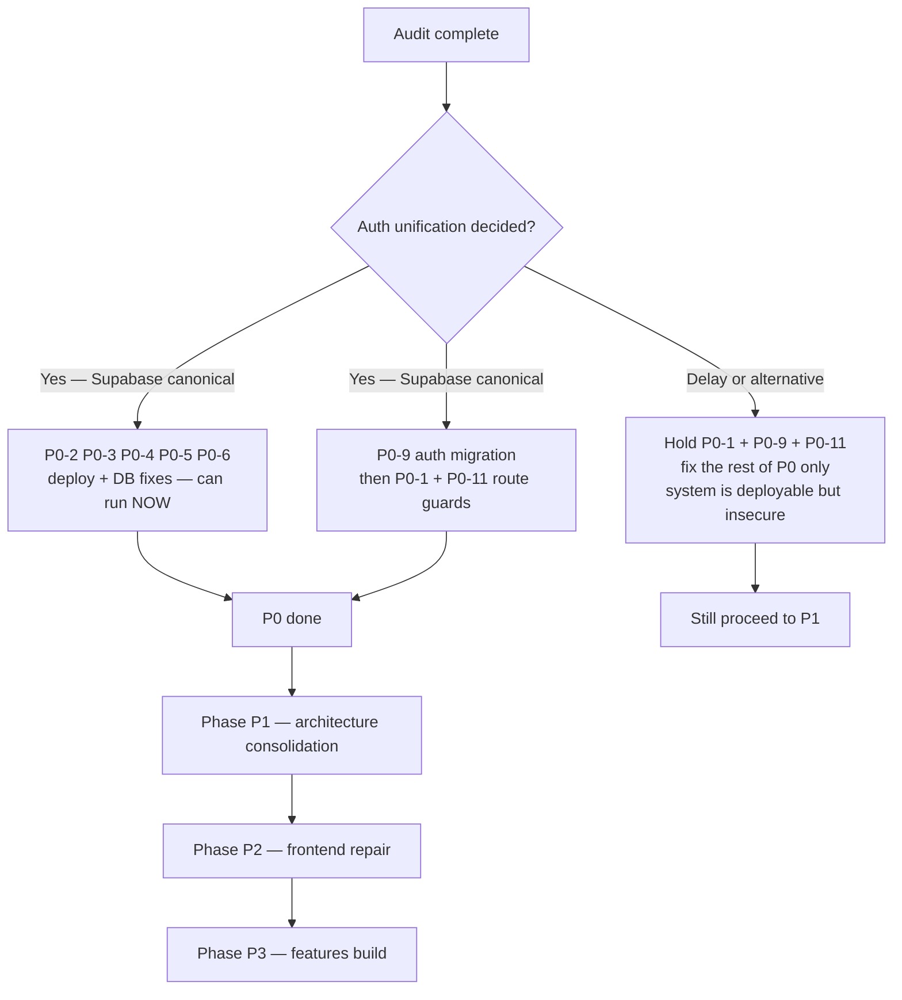

# ChessIQ — Recommended Remediation Roadmap

**Date:** 2026-05-26  
**Strategy:** Path C (hybrid) — fix critical breakage first, consolidate architecture, then build new features.  
**Constraint:** Each phase must close before the next begins. Each fix is small, atomic, and reviewable in a single PR (≤ 400 lines).

---

## How to read this roadmap

Every item has:
- **ID** — for tracking (P0-1, P1-3, etc.)
- **What** — concrete action
- **Why** — the root cause it resolves
- **Where** — affected files
- **How** — execution sketch
- **Effort** — small / medium / large
- **Blocks** — what cannot proceed until this is done

Items within a phase can often run in parallel. Items across phases must run in order.

---

## PHASE P0 — Critical Fixes (Week 1)

**Goal:** Make the system deployable and stop the security bleed.

### P0-1 — Wire authentication into every route

**Why:** All endpoints are currently public. Anyone can self-grant Pro tier, delete user accounts, drain AI quotas.  
**Where:** `backend/app/api/{users,games,analysis,insights,moves,chat}.py`  
**How:** This depends on **P0-9 (auth unification)** below. Sequence: do P0-9 first, then this.  
**Effort:** Medium (4–8 hours after P0-9).  
**Blocks:** Any user-facing launch.

### P0-2 — Fix `render.yaml` start command

**Why:** Deploy will fail.  
**Where:** `render.yaml:31`  
**How:** Change `uvicorn app.main:app` → `uvicorn app:app`. Test by running locally: `cd backend && uvicorn app:app`.  
**Effort:** Small (5 min + test deploy).  
**Blocks:** All Render deployments.

### P0-3 — Fix `render.yaml` database type

**Why:** `pserv` is wrong. Render expects `postgres`.  
**Where:** `render.yaml:3-11`  
**How:** Change `type: pserv` → `type: postgres`. Verify with `gh api repos/ArcnetLabs/chess-AI` or by attempting a render preview deploy.  
**Effort:** Small (15 min).  
**Blocks:** Render deployments.

### P0-4 — Fix `docker-compose.yml` celery module path

**Why:** Celery worker container will fail to find the app.  
**Where:** `docker-compose.yml:74`  
**How:** Change `app.workers.celery_app` → `app.celery_app`. Verify with `docker compose --profile celery up`.  
**Effort:** Small (5 min + verify).  
**Blocks:** Local celery development.

### P0-5 — Remove silent SQLite fallback

**Why:** Production Postgres outages mask as success → data loss.  
**Where:** `backend/app/core/database.py:21-43`  
**How:**
1. Delete the entire try/except block (lines 21-43).
2. Replace with a single `engine = create_engine(database_url, pool_pre_ping=True)` call.
3. If `database_url` is empty/None, raise `RuntimeError` at module load time.
4. Confirm Alembic still works in CI.

**Effort:** Small (1 hour).  
**Blocks:** Production reliability.

### P0-6 — Remove `Base.metadata.create_all` on startup

**Why:** Defeats Alembic; causes schema drift.  
**Where:** `backend/app/__main__.py:28`  
**How:** Delete the line. Ensure `alembic upgrade head` runs in `render.yaml` buildCommand (it already does). Run migrations in local dev manually or in a `Makefile`.  
**Effort:** Small (15 min).  
**Blocks:** Schema integrity.

### P0-7 — Fix broken synchronous analysis fallback

**Why:** If Celery is down, the route raises `AttributeError` instead of returning a graceful error.  
**Where:** `backend/app/api/analysis.py:212-303` (the sync fallback inside `analyze_single_game`)  
**How:**
1. Delete the entire `except Exception as celery_error:` block (lines 223-303).
2. Replace with:
   ```python
   except Exception as celery_error:
       logger.error(f"Celery queue failed for game {game_id}: {celery_error}")
       raise HTTPException(
           status_code=503,
           detail={
               "error": "Analysis queue unavailable",
               "message": "Please try again in a few moments",
               "retry_after": 30
           },
           headers={"Retry-After": "30"}
       )
   ```
3. Also delete `analyze_game_background_DEPRECATED` (lines 58-172) while in the file.

**Effort:** Small (1 hour + test).  
**Blocks:** Analysis robustness.

### P0-8 — Move chat sessions to Redis

**Why:** Sessions lost on restart; horizontal scaling broken.  
**Where:** `backend/app/services/chat/chess_coach.py:43-44`  
**How:**
1. Replace `self.sessions: Dict[str, ChatContext] = {}` with a `RedisSessionStore` class that uses the existing `redis_client` from `core/database.py`.
2. Serialise `ChatContext` to JSON; key format: `chat:session:{session_id}`.
3. Set 24-hour TTL.
4. Update `process_message` to load/save via the store.

**Effort:** Medium (1 day).  
**Blocks:** Multi-worker chat deployment.

### P0-9 — Auth unification decision and migration

**Why:** Two parallel auth systems block all per-user features.  
**Where:** Backend `User` model, frontend `pages/auth/*`, `pages/index.tsx`, `middleware.ts`  
**How:** **Recommendation: Supabase canonical.**

Plan:
1. Create Alembic migration `0006_add_supabase_user_id.py`:
   - Add `supabase_user_id UUID UNIQUE NULL` to `users` table.
   - Add index on the new column.
2. Update `User` model to declare the new field.
3. Implement `verify_supabase_jwt(token: str) -> dict` in `backend/app/services/auth/auth_service.py`.
4. Implement `get_current_user(token: str = Depends(oauth2_scheme))` in `auth_middleware.py` that validates Supabase JWT and looks up the local user via `supabase_user_id`.
5. Update `pages/index.tsx`: replace Chess.com-username form with "sign up with Supabase → THEN enter Chess.com username".
6. Apply `Depends(get_current_user)` to all mutating routes (this satisfies P0-1).
7. Verify `frontend/src/middleware.ts` matcher includes `/dashboard` and excludes `/` for the new flow.

**Effort:** Large (4–6 days).  
**Blocks:** Every multi-user feature.

### P0-10 — Verify `middleware.ts` doesn't break Chess.com flow today

**Why:** The Supabase middleware may already redirect every `/dashboard` request to `/auth/login`, breaking the only working login flow.  
**Where:** `frontend/src/middleware.ts`  
**How:** As an immediate hotfix before P0-9 completes, either:
- Remove `/dashboard` from `PROTECTED_PATHS`, OR
- Add a temporary bypass: if URL has `?username=` query param, skip the redirect.

**Effort:** Small (30 min) — depends on what the current behaviour actually is.  
**Blocks:** Day-to-day product usage.

### P0-11 — Add API auth guard tests

**Why:** Prevent regression of the "no auth" state.  
**Where:** `backend/tests/test_api_auth_guards.py` (new file)  
**How:** Test that every mutating endpoint returns 401 without a token. Loop through `app.routes` programmatically to enforce per-route coverage.  
**Effort:** Medium (4 hours after P0-9).  
**Blocks:** Future regressions.

---

## PHASE P1 — Architecture Consolidation (Weeks 2–3)

**Goal:** Stop the bleeding. Consolidate duplicate services. Make the codebase teachable.

### P1-1 — Delete duplicate `AIClient`

**Where:** `backend/app/core/ai_client.py`  
**How:**
1. Grep for `from app.core.ai_client` and `from ..core.ai_client` across `backend/` — update each to `from app.services.integration.ai_client`.
2. Delete `backend/app/core/ai_client.py`.
3. Run `pytest`.

**Effort:** Small (1 hour).

### P1-2 — Delete duplicate chess analyzers

**Where:** `backend/app/services/chess_analyzer.py`, `backend/app/services/chess_analysis.py`  
**How:**
1. Grep for callers of each (especially `tests/test_chess_analyzer.py` and `tests/test_chess_analysis_comprehensive.py`).
2. Verify all callers can be migrated to `services/analysis/unified_analyzer.py`.
3. Delete both files.
4. Update test files to target `unified_analyzer`.
5. Delete tests that targeted deleted code with no equivalent in the new analyzer.

**Effort:** Medium (1 day).

### P1-3 — Consolidate all Stockfish access through the engine pool

**Where:** 9 files that instantiate `StockfishEngine` directly  
**How:** Refactor in two passes:

Pass A — Routes (no engine instantiation in `api/*.py`):
- `api/analysis.py:229` — remove the import + instantiation (made obsolete by P0-7 anyway)
- `api/chat.py:50` — replace singleton init with `pool.acquire()` calls inside `chess_coach`
- `api/moves.py` — same

Pass B — Services use the pool:
- `services/analysis/unified_analyzer.py` — accept pool, call `pool.analyze(...)` instead of constructing own engine
- `services/chat/chess_coach.py:39` — receive engine pool, not raw engine
- `services/moves/move_recommender.py` — receive engine pool

Add `# grep-exempt: engine pool definition` to `engine_pool.py` and `engine_service.py`.

**Effort:** Large (2–3 days).

### P1-4 — Delete backward-compat shims

**Where:** `backend/app/services/chesscom_api.py`, `backend/app/services/auth_service.py`  
**How:**
1. Grep all callers.
2. Update each to import from the integration / auth subdirectories.
3. Delete the shims.

**Effort:** Small (1 hour).

### P1-5 — Delete or wire orphaned API routes

**Where:** `backend/app/api/analysis_stockfish.py`, `backend/app/api/games_filters.py`  
**How:** Decide per file:
- If their endpoints are needed → register the routers in `__main__.py`.
- If duplicating existing routes → delete.

**Effort:** Medium (4 hours of analysis + decision + cleanup).

### P1-6 — Remove stray scripts at backend root

**Where:** `backend/add_indexes.py`, `backend/setup_supabase.py`, `backend/start_celery_worker.py`, `backend/run_tests.py`, `backend/run_all_tests.py`  
**How:** Convert each:
- `add_indexes.py` → create a proper Alembic migration `0005_add_indexes.py`.
- `setup_supabase.py` → move to `backend/scripts/setup_supabase.py` (one-time provisioning).
- `start_celery_worker.py` → delete (use direct `celery -A app.celery_app worker` command).
- `run_tests.py`, `run_all_tests.py` → delete (use `pytest`).

**Effort:** Small (2–3 hours).

### P1-7 — Rename misleading smoke scripts

**Where:** `backend/scripts/test_*.py` (6 files)  
**How:** Rename to `smoke_*.py`. Update any references in docs.  
**Effort:** Small (1 hour).

### P1-8 — Update `.cursor/rules/backend.mdc` to match reality

**Where:** `.cursor/rules/backend.mdc`  
**How:**
- Change "All routers registered in `app/main.py`" → "All routers registered in `app/__main__.py`".
- Remove the "async with get_db()" guidance (or implement async DB).

**Effort:** Small (15 min).

### P1-9 — Fix CORS / OPEN_API_KEY config drift

**Where:** `backend/app/core/config.py:117`  
**How:** Remove the `OPEN_API_KEY` fallback. Document in `.env.example` and warn at startup if it was the only env var set.  
**Effort:** Small (30 min).

### P1-10 — Restore docker-compose backend service

**Where:** `docker-compose.yml:32-52`  
**How:** Uncomment the backend service block, fix any path mismatches, ensure it can build via `Dockerfile.backend`. Update the comment to explain why it was commented out previously (developer preference for host run when using Supabase).  
**Effort:** Medium (4 hours).

---

## PHASE P2 — Frontend Repair (Weeks 4–5)

**Goal:** Make the frontend maintainable. Wire up the orphaned chat. Add the missing game detail page.

### P2-1 — Create `hooks/` directory and extract React Query

**Where:** `frontend/src/hooks/` (new)  
**How:** Extract from `dashboard.tsx`:
- `useUser(username)` → wraps `api.users.getByUsername`
- `useUserById(id)` → wraps `api.users.getById`
- `useAnalysisSummary(userId, days)` → wraps `api.analysis.getSummary`
- `useRecommendations(userId)` → wraps `api.insights.getRecommendations`
- `useGames(userId, options)` → wraps `api.games.getForUser`

Also extract from `index.tsx`:
- `useChessComLogin()` — bundles user create/get + game fetch + polling.

**Effort:** Medium (2 days).

### P2-2 — Split `dashboard.tsx`

**Where:** `frontend/src/pages/dashboard.tsx` (971 lines → ≤ 100)  
**How:** Create:
- `components/charts/MoveQualityChart.tsx`
- `components/dashboard/PerformanceCard.tsx`
- `components/dashboard/CoachingInsightCard.tsx`
- `components/dashboard/PhasePerformanceChart.tsx`
- `components/dashboard/GameListItem.tsx`
- `components/dashboard/GamesList.tsx`
- `components/dashboard/DashboardHeader.tsx`
- `components/dashboard/ActionButtons.tsx`
- `lib/chess/perspective.ts` — `getUserColor(game, username)` + `getResultLabel(game, color)`

Final `dashboard.tsx` should be ~80 lines of layout composition.

**Effort:** Large (3–4 days).

### P2-3 — Split `index.tsx`

**Where:** `frontend/src/pages/index.tsx` (425 lines → ≤ 100)  
**How:** Extract to `components/auth/SupabaseSignupForm.tsx` (post-P0-9), `components/games/GameFilterControls.tsx`, `lib/polling.ts`.  
**Effort:** Medium (2 days, after P0-9).

### P2-4 — Merge `chatService.ts` into `lib/api.ts`

**Where:** `frontend/src/services/chatService.ts` → `frontend/src/lib/api.ts`  
**How:**
1. Add `chatApi` namespace to `lib/api.ts` mirroring `userApi` style.
2. Replace fetch calls with `apiClient.post/get` (axios).
3. Move session-ID state to a Zustand store or React Query mutation context.
4. Update all chat-component imports.
5. Delete `services/chatService.ts`.

**Effort:** Medium (1 day).

### P2-5 — Build `/coach` page and wire chat components

**Where:** `frontend/src/pages/coach.tsx` (new)  
**How:** Compose `ChatWindow` + `ChatHeader` + `ChatInput` + `MessageList` + `SuggestionChips` on a dedicated page. Hook `useChatSession()`. Add link from dashboard.  
**Effort:** Medium (2 days).

### P2-6 — Build `/games/[id]` game detail page

**Where:** `frontend/src/pages/games/[id].tsx` (new)  
**How:**
1. Fetch single game via `api.games.getById(id)` → render PGN viewer.
2. Fetch game analysis via `api.analysis.getForGame(id)`.
3. Add chessboard component (use `chessboardjsx` or `react-chessboard`).
4. Highlight moves on board as user clicks through move list.
5. Show per-move evaluation badge (brilliant / great / blunder, etc.).

**Effort:** Large (4–5 days).

### P2-7 — Add chat to dashboard via floating icon

**Where:** `frontend/src/components/chat/ChatbotIcon.tsx`  
**How:** Mount `ChatbotIcon` in `_app.tsx` so it's globally available. Clicking opens `Chatbot` in an overlay drawer.  
**Effort:** Small (1 day).

### P2-8 — Add Supabase type generation script

**Where:** `frontend/package.json` scripts + `frontend/src/types/supabase.ts`  
**How:** Add `npm run gen:supabase-types` that runs `npx supabase gen types typescript --project-id <id>` and writes to `frontend/src/types/supabase.ts`.  
**Effort:** Small (1 hour).

### P2-9 — Frontend grep-loop CI gate

**Where:** CI workflow (GitHub Actions or otherwise)  
**How:** Run `.\scripts\review-loops\full-review.ps1` (or a bash equivalent) on every PR; block merge if exit code ≠ 0.  
**Effort:** Medium (1 day).

---

## PHASE P3 — Feature Build (Weeks 6+)

**Goal:** Build the features the FRD actually calls for. Always: one feature, one PR.

### P3-1 — Per-move data persistence

**Where:** `backend/app/models/`, new `0007_add_game_moves_table.py`  
**How:** Add `game_moves` table with columns: `game_id`, `move_number`, `ply`, `san`, `uci`, `fen_before`, `eval_cp`, `best_move`, `classification`, `time_remaining_white`, `time_remaining_black`. Update analyzer to write per-move rows.  
**Effort:** Medium (3 days).  
**Blocks:** Pattern recognition, training mode, game-detail rich view.

### P3-2 — Chess.com move timing ingestion

**Where:** `services/integration/chesscom_api.py`  
**How:** Parse the `[%clk]` annotations from PGN files. Store in `game_moves.time_remaining_*` columns.  
**Effort:** Medium (2 days).

### P3-3 — Pattern recognition engine — first pattern

**Where:** `backend/app/services/patterns/` (new)  
**How:** Start with ONE pattern: "recurring opening blunders". Service queries `game_moves` filtered by `ply <= 20 AND classification = 'blunder'`, groups by ECO opening code, identifies patterns where blunder rate > 30% in same opening.  
**Effort:** Large (5 days).

### P3-4 — Pattern worker

**Where:** `backend/app/tasks/pattern_tasks.py` (new)  
**How:** Celery task `detect_patterns_for_user_task(user_id)` runs the pattern engine, writes results to `pattern_detections` table.  
**Effort:** Medium (3 days).

### P3-5 — Player profile generator

**Where:** `backend/app/services/profile/` (new)  
**How:** Aggregates all `pattern_detections` + ACPL trends into a `player_profile` row. Periodic Celery task refreshes weekly.  
**Effort:** Large (5 days).

### P3-6 — Streaming chat responses (SSE)

**Where:** `backend/app/api/chat.py` + `services/chat/chess_coach.py`  
**How:**
1. Add new endpoint `POST /api/v1/chat/messages/stream` returning `text/event-stream`.
2. Modify `chess_coach.process_message_stream()` to yield tokens.
3. Replace OpenAI client call with streaming variant.
4. Frontend: use `EventSource` in a new `useStreamingChat` hook.

**Effort:** Large (4 days).

### P3-7 — Pattern dashboard frontend

**Where:** `frontend/src/pages/patterns.tsx`  
**How:** Reads from `pattern_detections` table via new `/api/v1/patterns/{user_id}` endpoint. Renders chart/cards per pattern category.  
**Effort:** Medium (3 days).

### P3-8 — Training mode frontend

**Where:** `frontend/src/pages/training.tsx`  
**How:** Picks the user's top weakness pattern, generates a drill (e.g., "play this opening 5 times, avoid the blunder"). Tracks progress.  
**Effort:** Large (5 days).

### P3-9 — Anthropic provider in AIClient

**Where:** `backend/app/services/integration/ai_client.py`  
**How:** Add `ANTHROPIC` enum value + provider class. Add `ANTHROPIC_API_KEY` env var. Update provider selection logic.  
**Effort:** Small (1 day).

### P3-10 — Elite tier

**Where:** `backend/app/models/user.py`, `tier_service.py`  
**How:** Add `elite` to tier choices. Elite gets hosted Anthropic LLM. Add billing integration (Stripe — separate epic).  
**Effort:** Medium (2 days + Stripe epic).

### P3-11 — Game retention policy

**Where:** New Celery task + scheduled beat  
**How:** Periodic task deletes `games` rows older than `MAX_GAME_RETENTION_DAYS` (env-configurable, default 90). Keeps `game_analyses` and `pattern_detections` intact (they reference deleted games via nullable FK).  
**Effort:** Medium (2 days).

### P3-12 — pgvector + embeddings

**Where:** `backend/app/services/embeddings/` (new)  
**How:** Add `pgvector` extension to migrations. Embed position FENs from `game_moves`. Enable pattern similarity search.  
**Effort:** Large (5–7 days).

---

## Cross-cutting actions

### CC-1 — Establish a "no feature work" freeze until P0 closes

**How:** Add to `AGENTS.md`: "Until all P0 items in `docs/audit/recommended-remediation-roadmap.md` are checked off, do not merge any PR that adds a new feature. PRs that fix audit findings are welcome."

### CC-2 — Make grep-review a required CI check

**How:** Run `scripts/review-loops/full-review.ps1` (or bash port) in GitHub Actions. Required for merge to `staging` and `main`.

### CC-3 — Update root README with audit pointer

**How:** Add a section: "Before contributing, read `docs/audit/system-state-audit.md` for the current system state."

---

## Sequencing Decision Tree



---

## Estimated Total Effort

| Phase | Items | Effort |
|-------|-------|--------|
| P0 | 11 | ~3 weeks (1 engineer) |
| P1 | 10 | ~3 weeks |
| P2 | 9 | ~4 weeks |
| P3 | 12 | ~12+ weeks |
| **Total to FRD coverage** | **42** | **~22 weeks** |
| **Minimum to safe operation (P0)** | **11** | **~3 weeks** |

---

## Acceptance Criteria for Phase Closure

### P0 closed when:
- [ ] `scripts/review-loops/check-stockfish-violations.ps1` exits 0
- [ ] `scripts/review-loops/check-route-violations.ps1` exits 0
- [ ] `scripts/review-loops/check-auth-guards.ps1` exits 0
- [ ] A fresh Render deploy of `main` succeeds end-to-end
- [ ] All mutating API routes return 401 without a valid Supabase JWT
- [ ] No SQLite file is created during normal production operation
- [ ] Chat sessions survive a worker restart (Redis-backed)

### P1 closed when:
- [ ] `check-duplicates.ps1` exits 0
- [ ] `check-file-sizes.ps1` reports zero hard failures
- [ ] Stockfish access grep returns ≤ 2 sites (the pool + a documented exemption)
- [ ] No stray `*.py` files at `backend/` root level
- [ ] All Cursor rules match the actual code

### P2 closed when:
- [ ] `dashboard.tsx` < 150 lines
- [ ] `index.tsx` < 150 lines
- [ ] `frontend/src/hooks/` exists with ≥ 5 hooks
- [ ] `/coach` and `/games/[id]` pages live and functional
- [ ] Only one HTTP client pattern in frontend (`lib/api.ts`)
- [ ] `chatService.ts` deleted

### P3 closed when:
- [ ] FRD coverage ≥ 80%
- [ ] Pattern recognition produces at least 3 pattern types
- [ ] Streaming chat works in production
- [ ] Training mode page generates and tracks drills
- [ ] All 4 worker types exist and are healthy
