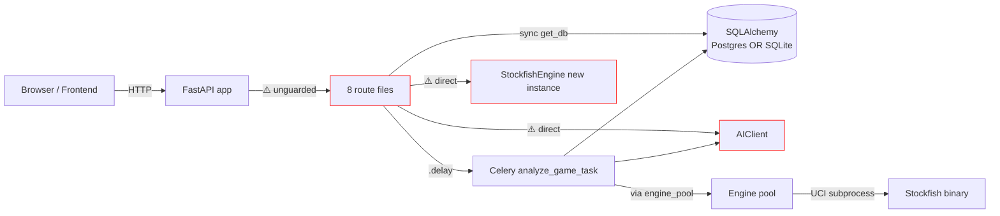
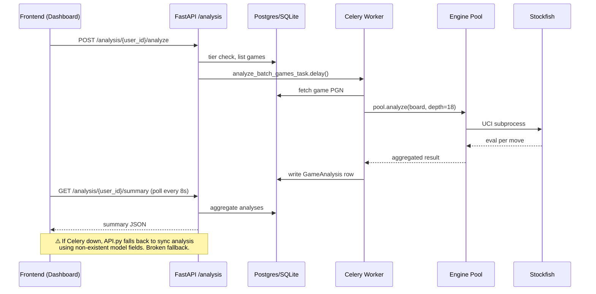

# ChessIQ — System State Audit

**Audit date:** 2026-05-26  
**Audit scope:** Full repository — backend, frontend, infrastructure, documentation  
**Auditor mode:** Read-only system mapping (no code changes)  
**Branch audited:** `staging` @ HEAD as of audit start

---

## Executive Summary

ChessIQ is **not production-ready**. The repository contains a partially working backend with a functional Chess.com → Stockfish → analysis pipeline, but **suffers from severe architectural drift, security gaps, and divergence from the FRD vision**. The frontend is a single oversized dashboard page with two parallel, unintegrated auth systems. Deployment configurations contain incorrect entry points that will fail on a fresh deploy.

The grep-loop review system that was recently added correctly classifies the codebase as **BLOCKED** on multiple A-series (architecture) and D-series (security) checks.

### Top 5 Critical Issues (P0 — fix before any feature work)

1. **All API endpoints are unauthenticated.** `get_current_user` is defined in `backend/app/middleware/auth_middleware.py` but **imported by zero route files**. Every POST/PUT/DELETE is publicly callable. Verified by grep: `Depends(get_current_user)` returns no matches in `backend/app/api/`.
2. **Deployment will fail.** `render.yaml` line 31 points to `app.main:app` (non-existent module). The actual entry is `app:app` from `backend/app/__init__.py`. `docker-compose.yml` line 74 points to `app.workers.celery_app` (no `workers/` directory). The real module is `app.celery_app`.
3. **Stockfish architecture is fragmented.** 10 different files instantiate or use Stockfish — including 3 route files (`api/analysis.py`, `api/chat.py`, `api/moves.py`) that should never touch the engine directly. The engine pool exists but is bypassed.
4. **Database silently degrades to SQLite in production code.** `backend/app/core/database.py` lines 21-43 catch any Postgres connection error and fall back to a local SQLite file. This will mask real production database outages.
5. **Two parallel authentication systems coexist with no integration.** The active system is Chess.com-username-based (no password, no token). A Supabase email/password system was scaffolded but is wired to nothing. The `User` model has no `supabase_user_id` field.

### System Health at a Glance

| Subsystem | Status | Production Ready? | Notes |
|-----------|--------|-------------------|-------|
| FastAPI app skeleton | 🟡 Partial | No | Working, but routes unguarded, sync `get_db`, schema auto-create on startup |
| Chess.com integration | 🟢 Functional | Yes (with hardening) | Rate-limited, retry-safe, Redis-cached |
| Stockfish engine pool | 🟡 Built but bypassed | No | Pool exists in `services/engine/engine_pool.py` but 9 other files instantiate engines directly |
| Game fetching pipeline | 🟢 Functional | Yes | E2E works; needs auth wrap |
| Analysis pipeline (Stockfish) | 🟡 Partial | No | Works happy-path; sync fallback in `api/analysis.py` references non-existent fields |
| Analysis pipeline (AI-enhanced) | 🟡 Partial | No | AIClient wired; tier-gating works; prompt quality unknown |
| Celery worker | 🟡 Partial | No | Wired correctly in code; docker-compose path is wrong |
| AI Coach chatbot | 🔴 Broken in production | No | Sessions stored in-memory (`Dict[str, ChatContext]`), lost on restart, breaks horizontal scale |
| Pattern recognition engine | 🔴 Missing | No | FRD describes extensive pattern detection — **no pattern code exists** |
| Player profile generator | 🔴 Missing | No | FRD specifies longitudinal profiling — **not implemented** |
| Supabase Auth integration | 🟡 Scaffolded | No | Frontend + service exist; never wired to backend routes or User model |
| Supabase database tables | 🔴 Unverified | No | App uses SQLAlchemy/Alembic to local Postgres or SQLite; Supabase Postgres connection unverified |
| Realtime / WebSocket | 🔴 Missing | No | Frontend uses manual polling (8s intervals); no SSE or WebSocket implementation |
| Docker (local dev) | 🟡 Partial | N/A | Backend service commented out; celery command path wrong |
| Render deployment | 🔴 Broken | No | Wrong start command, wrong DB service type (`pserv` instead of `postgres`) |
| Frontend dashboard | 🟡 Functional but bloated | No | 971-line single file (6.5× over hard limit) |
| Frontend home/login | 🟡 Functional but bloated | No | 425-line file with inline polling logic |
| Frontend game viewer | 🔴 Missing | No | No game-detail or move-by-move analysis UI |
| Frontend AI Coach UI | 🟡 Components exist | No | 8 chat components; not yet integrated into a dedicated page |
| Tests | 🟡 Partial | No | 7 pytest files + 6 manual `scripts/test_*.py` scripts (not part of pytest suite) |

Legend: 🟢 production-ready · 🟡 partial / needs work · 🔴 broken or missing

---

## Phase 1 — Repository Intelligence (Inventory)

### 1.1 Backend Surface Area

```
backend/
├── app/
│   ├── __init__.py             — re-exports FastAPI app
│   ├── __main__.py             — actual entrypoint (NOT app.main:app as render.yaml claims)
│   ├── celery_app.py           — Celery init (NOT app.workers.celery_app as docker-compose claims)
│   ├── api/                    — 8 route files
│   │   ├── analysis.py             [545 lines — OVER LIMIT]
│   │   ├── analysis_stockfish.py   [NOT registered in __main__.py — orphaned]
│   │   ├── chat.py
│   │   ├── games.py
│   │   ├── games_filters.py        [NOT registered in __main__.py — orphaned]
│   │   ├── insights.py
│   │   ├── moves.py
│   │   └── users.py
│   ├── services/
│   │   ├── analysis/               — 4 files (unified_analyzer, analysis_pipeline, pgn_parser, engine_service)
│   │   ├── auth/auth_service.py    + auth_service.py shim re-export
│   │   ├── chat/                   — chess_coach.py + intent_classifier.py
│   │   ├── coaching/               — recommendation_engine.py
│   │   ├── engine/                 — stockfish_engine.py + engine_pool.py
│   │   ├── integration/            — chesscom_api.py + ai_client.py
│   │   ├── moves/                  — move_recommender.py
│   │   ├── chess_analyzer.py       [DUPLICATE of services/analysis/unified_analyzer.py]
│   │   ├── chess_analysis.py       [DUPLICATE — independent ChessAnalysisService]
│   │   ├── chesscom_api.py         [SHIM — re-exports from services/integration/]
│   │   ├── auth_service.py         [SHIM — re-exports from services/auth/]
│   │   ├── filter_service.py
│   │   └── tier_service.py
│   ├── core/
│   │   ├── ai_client.py            [DUPLICATE of services/integration/ai_client.py]
│   │   ├── config.py
│   │   ├── database.py             [SILENT SQLite FALLBACK]
│   │   ├── logging_config.py
│   │   └── supabase_client.py
│   ├── middleware/
│   │   └── auth_middleware.py      [DEAD CODE — never imported anywhere]
│   ├── models/                     — user.py, game.py, insights.py
│   └── tasks/
│       └── analysis_tasks.py       — only Celery task module
├── alembic/                        — 5 migrations
├── scripts/                        — 6 stray *.py test/diagnostic scripts (NOT part of pytest)
├── tests/                          — 12 pytest files
├── add_indexes.py                  [STRAY — should be migration]
├── setup_supabase.py               [STRAY]
├── start_celery_worker.py          [STRAY]
├── run_tests.py                    [STRAY]
├── run_all_tests.py                [STRAY]
└── conftest.py
```

**File count:** 64 Python files in `backend/app/`. 5 known **duplicate implementations**. 5 stray scripts at backend root.

### 1.2 Frontend Surface Area

```
frontend/src/
├── pages/
│   ├── _app.tsx
│   ├── index.tsx               [425 lines — OVER LIMIT (hard limit 150)]
│   ├── dashboard.tsx           [971 lines — 6.5× OVER LIMIT]
│   └── auth/
│       ├── callback.tsx
│       ├── login.tsx           — Supabase email/password (orphaned)
│       └── signup.tsx          — Supabase email/password (orphaned)
├── components/
│   ├── AnalysisProgressModal.tsx
│   └── chat/                   — 9 chat-specific components, not wired to any page
│       ├── Chatbot.tsx
│       ├── ChatHeader.tsx
│       ├── ChatInput.tsx
│       ├── ChatWindow.tsx
│       ├── ChatbotIcon.tsx
│       ├── Message.tsx
│       ├── MessageList.tsx
│       ├── SuggestionChips.tsx
│       ├── TypingIndicator.tsx
│       ├── AnalysisCard.tsx
│       └── index.tsx
├── lib/
│   ├── api.ts                  — axios-based client for /users, /games, /analysis, /insights
│   ├── auth/
│   │   ├── session.ts          — Supabase getServerUser helper (unused)
│   │   └── withAuth.ts         — Supabase HOC (unused)
│   └── supabase/               — client.ts, server.ts (unused)
├── services/
│   └── chatService.ts          — fetch-based client for /chat (parallel to lib/api.ts)
├── store/
│   └── chatStore.ts            — Zustand store, scope unverified
├── types/                      — 3 files
├── middleware.ts               — Next.js Supabase middleware (orphaned — protects /dashboard but app doesn't use Supabase login)
└── (no hooks/ directory)
```

**Observations:**
- No `hooks/` directory; all React Query usage inlined in `dashboard.tsx`.
- No game-detail page exists. Only `/` and `/dashboard`. The FRD calls for game-by-game review, move-by-move analysis, training mode, and pattern dashboard — none exist.
- The Supabase auth scaffold and the Chess.com username login are **completely independent**.
- Frontend has **two HTTP client patterns** (axios in `lib/api.ts`, fetch in `services/chatService.ts`).

### 1.3 Infrastructure Surface Area

| File | Purpose | State |
|------|---------|-------|
| `docker-compose.yml` | Local dev stack | 🔴 Broken — celery cmd uses wrong module path; backend service is commented out |
| `docker-compose.production.yml` | Prod compose | 🟡 Not audited in depth |
| `Dockerfile.backend` | Backend image | 🟡 Not audited in depth |
| `Dockerfile.celery` | Celery worker image | 🟡 Not audited in depth |
| `Dockerfile.frontend` | Frontend image | 🟡 Not audited in depth |
| `render.yaml` | Render Blueprint | 🔴 Broken — `app.main:app` is wrong; `pserv` is wrong type for Postgres |
| `netlify.toml` | Frontend deploy | 🟡 Not audited in depth |
| `.env.example` | Env template | 🟡 References both Supabase and direct Postgres without clarifying which is canonical |

### 1.4 Documentation Surface Area

- **Active docs**: 4 architecture, 2 strategy, 1 product FRD, 1 technical FRD, 3 deployment guides, 7 HTML renders.
- **Archived docs**: 51 markdown files in `docs/archive/` and `docs/archive/legacy-docs/`. Most are phase reports, status reports, and bugfix notes. Already correctly archived in a prior cleanup pass.

The FRD documents are **extensive and ambitious** (700+ and 1800+ lines respectively) and describe a substantially more sophisticated system than what is currently built — see `architecture-divergence-report.md` for the detailed gap analysis.

---

## Phase 2 — Implementation Verification (Highlights)

### What works end-to-end

| Flow | Status |
|------|--------|
| Create user with Chess.com username | ✅ Works |
| Fetch recent games from Chess.com | ✅ Works (rate-limited, retry-safe) |
| Queue analysis via Celery | ✅ Works when Redis + worker running |
| Synchronous analysis fallback when Celery down | 🔴 **Broken** — uses non-existent fields `game.white_player`, `game.analyzed`, `analysis_result.get('accuracy_white')` (the analyzer returns a dataclass, not a dict) |
| Dashboard view of analysis summary | ✅ Works |
| Chat session creation + message send | 🟡 Works in-process; sessions lost on restart |

### What does not match the FRD

See `architecture-divergence-report.md` for the full delta. Highlights:

| FRD specifies | Reality |
|---------------|---------|
| Pattern recognition engine across hundreds of games | Not implemented |
| Longitudinal player profile generator | Not implemented |
| Multi-worker Celery (analysis, pattern, profile) | Only `analyze_game_task` + `analyze_batch_games_task` exist |
| Training Mode with drills | Not implemented |
| Streaming chat responses | Not implemented (request/response only) |
| pgvector for pattern similarity search | Not implemented |
| Free / Pro / Elite tiers | Only free / pro (no elite enum value) |
| Auth on every mutating route | No auth on any route |
| `getSession()` for SSR / `getUser()` for protected work | Supabase middleware exists but app uses Chess.com username flow instead |

### Dangerous architectural shortcuts found

1. **`Base.metadata.create_all(bind=engine)` runs on startup** (`backend/app/__main__.py:28`) — defeats the purpose of Alembic; will create schema drift on production deploy.
2. **SQLite silent fallback** (`backend/app/core/database.py:21-43`) — production failure mode is hidden.
3. **In-memory chat sessions** (`backend/app/services/chat/chess_coach.py:44`) — `self.sessions: Dict[str, ChatContext] = {}` — broken on restart, broken on horizontal scale.
4. **Synchronous Celery fallback in route** (`backend/app/api/analysis.py:212-303`) — does heavy Stockfish work in the request thread; references fields that don't exist on the models.
5. **Three-way `users.py:181` email collision-mitigation**: defaults to `f"{username}@chess.placeholder"` — fake emails inserted into the unique `email` index. Will collide if multiple users share a username root.
6. **`backend/app/api/analysis.py:1-2` line 6**: `from ..core.database import get_db, SessionLocal` — A3 violation (direct SessionLocal in route).
7. **`asyncio.set_event_loop_policy(WindowsProactorEventLoopPolicy())`** (`__main__.py:13`) — Windows-only code in production entrypoint without a guard.

---

## Phase 3 — Architecture Maps

### 3.1 Current Backend Request Flow



### 3.2 Current Frontend Data Flow

```mermaid
flowchart LR
    User[User] --> Index[/ pages/index.tsx]
    Index -->|POST /users| API
    Index -->|poll every 3s| API
    Index -->|router.push| Dashboard[/ pages/dashboard.tsx]
    Dashboard -->|useQuery x4| API[lib/api.ts axios]
    Dashboard -->|manual polling 8s| API
    AuthLogin[pages/auth/login.tsx] -.->|orphaned| Supabase[Supabase Auth]
    Chat[components/chat/*] -.->|not wired| ChatService[services/chatService.ts fetch]
    Middleware[middleware.ts] -.->|orphaned guard| Supabase
    style AuthLogin stroke-dasharray: 5 5
    style Middleware stroke-dasharray: 5 5
    style Chat stroke-dasharray: 5 5
```

### 3.3 Current Analysis Pipeline



### 3.4 Current Authentication Reality

```mermaid
flowchart TB
    subgraph Real["What actually happens"]
        U1[User] --> I1[Enter Chess.com username]
        I1 --> API1[POST /api/v1/users/]
        API1 --> DB1[(Insert User row<br/>email = username@chess.placeholder)]
        DB1 --> SAVE[localStorage / URL ?username=foo]
        SAVE -->|no token,<br/>no session| ALL[All API calls public]
    end

    subgraph Scaffolded["What was added but unused"]
        U2[User] -.-> L2[Supabase login page]
        L2 -.-> S2[Supabase Auth]
        S2 -.-> COOKIE[Session cookie]
        COOKIE -.-> MW[middleware.ts redirect to /dashboard]
        MW -.-> NEVER[Never wired to backend routes]
    end

    style Scaffolded stroke-dasharray: 5 5
```



The two systems share **zero code paths**. The `User` model has no `supabase_user_id` column. There is no synchronisation between Supabase Auth user IDs and the integer `users.id` primary key.

---

## Phase 4 — Repository Health Audit

| System | Production-ready? | Partial? | Broken? | Architectural debt? | Should rebuild? | Safe to extend? |
|--------|:-:|:-:|:-:|:-:|:-:|:-:|
| FastAPI scaffold + CORS | | ✓ | | | | ✓ |
| Chess.com API client | ✓ | | | | | ✓ |
| Stockfish engine pool | | ✓ | | ✓ | | (after consolidation) |
| Engine wrappers (3 of them) | | | | ✓ | ✓ consolidate to 1 | |
| Analysis route file | | | ✓ | ✓ | ✓ split + remove fallback | |
| Celery analysis task | ✓ | | | | | ✓ |
| AI Coach chat (sessions) | | | ✓ | ✓ | ✓ move to Redis/DB | |
| AI Coach chat (intent + response) | | ✓ | | | | ✓ |
| Recommendation engine | | ✓ | | | | ✓ |
| Pattern recognition | | | | | ✓ build new | |
| Player profile generator | | | | | ✓ build new | |
| Auth middleware | | | ✓ | ✓ | ✓ replace with Supabase JWT verification | |
| Supabase Auth integration | | ✓ | | ✓ | ✓ wire to User model | |
| Database layer | | ✓ | | ✓ | (remove SQLite fallback + auto-create) | |
| Alembic migrations | ✓ | | | | | ✓ |
| Dashboard page | | ✓ | | ✓ | ✓ split into 8–10 components | |
| Home/login page | | ✓ | | ✓ | ✓ split | |
| Chat components | | ✓ | | | | ✓ wire to a page |
| Frontend API client (axios) | ✓ | | | | | ✓ |
| Frontend chat service (fetch) | | ✓ | | ✓ | ✓ merge into lib/api.ts | |
| Game detail UI | | | | | ✓ build new | |
| Training Mode UI | | | | | ✓ build new | |
| Realtime / streaming | | | | | ✓ build new | |
| docker-compose | | ✓ | ✓ celery | | (fix path, restore backend) | |
| render.yaml | | | ✓ | | ✓ rewrite | |
| Cursor rules | ✓ | | | | | ✓ |
| Grep review scripts | ✓ | | | | | ✓ |
| Reference / prompts / skills system | ✓ | | | | | ✓ |

---

## Phase 5 — Technical Debt Summary

See `technical-debt-report.md` for the full evidence-backed list. Headline counts:

- **5** duplicate service implementations (chesscom, auth, ai_client, chess_analyzer variants)
- **10** files with direct Stockfish access (only 1 should — the pool)
- **3** unauthenticated route files (every mutating route in every file)
- **2** orphaned API route files (registered nowhere)
- **2** orphaned frontend auth pages
- **2** parallel HTTP clients in frontend
- **2** files over hard size limit by > 2x (`dashboard.tsx` at 971 lines, `analysis.py` at 545)
- **1** silent SQLite fallback in production code path
- **1** in-memory chat session store (won't survive restart)
- **0** routes with auth dependency

---

## Phase 6 — Remediation Roadmap (Pointer)

See `recommended-remediation-roadmap.md` for the prioritised, sequenced plan. High-level sequencing:

```
P0 (1 week) — Make it secure and deployable
   1. Wire get_current_user into every mutating route
   2. Fix render.yaml entrypoint + DB service type
   3. Fix docker-compose celery module path
   4. Remove SQLite fallback (fail loudly)
   5. Remove Base.metadata.create_all on startup

P1 (1–2 weeks) — Stop the bleeding (architecture consolidation)
   6. Delete duplicate ai_client / chess_analyzer / chess_analysis
   7. Consolidate all Stockfish access through engine_pool
   8. Remove deprecated sync analysis fallback from api/analysis.py
   9. Move chat sessions from in-memory to Redis
  10. Decide canonical auth: Chess.com username OR Supabase (recommend Supabase)
  11. Add supabase_user_id to User model + migration

P2 (2–4 weeks) — Repair the frontend
  12. Split dashboard.tsx into ~10 components + hooks
  13. Split index.tsx
  14. Build /games/[id] game-detail page
  15. Wire chat components into a /coach page
  16. Merge chatService into lib/api.ts
  17. Add hooks/ directory with React Query hooks

P3 (4+ weeks) — Build what the FRD describes
  18. Pattern recognition service (one pattern at a time)
  19. Player profile generator
  20. Streaming chat responses (SSE)
  21. Training mode UI
  22. pgvector embedding for pattern similarity
```

---

## Cross-References

- **Backend deep-dive:** `./backend-audit.md`
- **Frontend deep-dive:** `./frontend-audit.md`
- **Technical debt evidence:** `./technical-debt-report.md`
- **FRD vs reality:** `./architecture-divergence-report.md`
- **Action plan:** `./recommended-remediation-roadmap.md`
- **Audit index:** `./README.md`

---

## Methodology Notes

This audit used:
- Direct file inspection (Read tool) on ~25 critical source files
- Glob enumeration of all backend + frontend source trees
- Targeted ripgrep checks for:
  - Stockfish instantiation sites
  - LLM call sites
  - SessionLocal usage in routes
  - `get_current_user` import sites
  - Service duplication patterns
- Cross-reference of `render.yaml`, `docker-compose.yml`, and `__main__.py` for deployment correctness
- Comparison of `docs/requirements/FRD_TECHNICAL.md` claims against actual code locations

No code was modified during this audit. All findings include file paths and (where given) line numbers as evidence.
