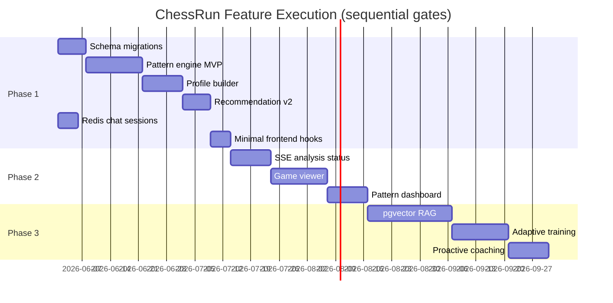

# ChessRun Feature Execution Roadmap

**Date:** 2026-05-26  
**Mode:** Controlled feature execution (post-remediation)  
**Constraint:** Each unit ≤ 400 lines, single concern, review-safe PR  
**Companion:** [`feature-priority-map.md`](./feature-priority-map.md)

---

## Strategic principle

> **Intelligence before interface. Retention before polish. Grounded AI last.**

ChessRun wins when players return because the system **remembers their chess identity**. That requires persisted patterns and profiles before new dashboards or chat tricks.

---

## Execution phases overview

| Phase | Theme | Duration (est.) | Exit criterion |
|-------|-------|-----------------|----------------|
| **Phase 1** | Backend intelligence core | 4–6 weeks | Patterns + profiles persisted; recommendations pattern-linked |
| **Phase 2** | Retention & visualization | 4–6 weeks | Game viewer, pattern UI, realtime analysis status |
| **Phase 3** | Advanced AI & training | 6–8 weeks | RAG coach, adaptive drills, proactive coaching |

Phases are **sequential gates**. Phase 2 starts when Phase 1 exit criteria pass on `staging`. Phase 3 starts when Phase 2 retention APIs are stable.

---

## Phase 1 — Backend intelligence systems

**Goal:** Make the moat real in the database and service layer.

### 1.1 Data layer

| ID | Unit | Deliverable | Owner |
|----|------|-------------|-------|
| P1-DB-01 | Pattern schema migration | `player_patterns`, `pattern_occurrences` tables + Alembic | Infra agent |
| P1-DB-02 | Profile schema migration | `player_profiles` with snapshot versioning | Infra agent |
| P1-DB-03 | Analysis indexes | Query paths for pattern jobs (`user_id`, `game_id`, `is_analyzed`) | Infra agent |

### 1.2 Pattern recognition (MVP)

| ID | Unit | Deliverable | Owner |
|----|------|-------------|-------|
| P1-PR-01 | Pattern service scaffold | `services/patterns/pattern_engine.py` — orchestrator only | Backend intelligence |
| P1-PR-02 | Phase weakness detector | Opening/middlegame/endgame ACPL pattern rules | Backend intelligence |
| P1-PR-03 | Blunder cluster detector | Recurring mistake themes from move quality + FEN similarity | Backend intelligence |
| P1-PR-04 | Pattern persistence | `pattern_service.persist_patterns()` | Backend intelligence |
| P1-PR-05 | Celery pattern task | `tasks/pattern_tasks.py` → thin wrapper | Backend intelligence |
| P1-PR-06 | Pattern API routes | `GET /users/{id}/patterns`, `POST /users/{id}/patterns/analyze` | Backend intelligence |

**Dependencies:** `analysis_service.py` outputs; no new Stockfish paths.

### 1.3 Longitudinal profiling

| ID | Unit | Deliverable | Owner |
|----|------|-------------|-------|
| P1-PP-01 | Profile builder service | `services/profiles/profile_builder.py` | Backend intelligence |
| P1-PP-02 | Snapshot Celery task | Nightly + post-analysis trigger | Backend intelligence |
| P1-PP-03 | Profile API | `GET /users/{id}/profile`, `GET /users/{id}/profile/history` | Backend intelligence |

### 1.4 Recommendation engine v2

| ID | Unit | Deliverable | Owner |
|----|------|-------------|-------|
| P1-RE-01 | Pattern-aware recommendations | Extend `recommendation_engine.py` to consume `PatternMatch` | Backend intelligence |
| P1-RE-02 | Stable recommendation IDs | Link recommendations to `pattern_id` | Backend intelligence |
| P1-RE-03 | Insights route update | `insights.py` returns pattern-linked recommendations | Backend intelligence |

### 1.5 Coaching infrastructure (foundation)

| ID | Unit | Deliverable | Owner |
|----|------|-------------|-------|
| P1-CM-01 | Redis chat session store | Replace in-memory `ChatContext` dict | Infra agent |
| P1-CM-02 | Context assembly stub | `chess_coach.py` loads profile + top patterns into prompt | Backend intelligence |

### 1.6 Phase 1 frontend (minimal)

| ID | Unit | Deliverable | Owner |
|----|------|-------------|-------|
| P1-FE-01 | `usePatterns` hook | React Query for pattern API | Frontend experience |
| P1-FE-02 | Pattern count on dashboard | Small badge in `CoachingInsightsSection` | Frontend experience |
| P1-FE-03 | `api.patterns.*` client | Additions to `lib/api.ts` only | Frontend experience |

**Phase 1 exit checklist:**

- [ ] Patterns generated for analyzed games via Celery
- [ ] Profile snapshot exists per user with ≥10 analyzed games
- [ ] Recommendations include `pattern_id` references
- [ ] Chat sessions survive worker restart (Redis)
- [ ] Grep-loop A+D pass; type-check + pytest pass
- [ ] No new Stockfish instantiation outside pool

---

## Phase 2 — Retention systems & visualization

**Goal:** Give players a reason to return daily; replace polling hacks.

### 2.1 Auto-analysis pipeline v2

| ID | Unit | Deliverable |
|----|------|-------------|
| P2-AA-01 | Post-fetch auto-queue | Option to analyze on sync |
| P2-AA-02 | Analysis job status model | Redis or DB job tracking |
| P2-AA-03 | SSE progress endpoint | `GET /analysis/{user_id}/status/stream` |
| P2-AA-04 | `useAnalysisStatus` hook | Replace interval polling in `analysisPollingService` |
| P2-AA-05 | Celery beat sync job | Optional scheduled Chess.com pull |

### 2.2 Game detail & move exploration

| ID | Unit | Deliverable |
|----|------|-------------|
| P2-GV-01 | Game detail API enrichment | Moves, evals, phase markers |
| P2-GV-02 | `/games/[id]` page | Thin page + `features/game-viewer/` |
| P2-GV-03 | Move list component | Quality badges per move |
| P2-GV-04 | Coach context handoff | “Ask coach about this position” → chat FEN |

### 2.3 Pattern visualization

| ID | Unit | Deliverable |
|----|------|-------------|
| P2-PV-01 | Pattern list page | `/patterns` feature module |
| P2-PV-02 | Pattern detail card | Frequency, example games, recommendation |
| P2-PV-03 | Trend charts | ACPL / accuracy over time (reuse chart components) |
| P2-PV-04 | Dashboard integration | Replace generic insights empty state with pattern teaser |

### 2.4 Retention mechanics

| ID | Unit | Deliverable |
|----|------|-------------|
| P2-RT-01 | “New patterns detected” toast | After analysis completes |
| P2-RT-02 | Weekly summary email stub | Backend task + template (no send until configured) |
| P2-RT-03 | Last-visit delta | “3 new blunder patterns since last visit” on dashboard |

**Phase 2 exit checklist:**

- [ ] Game viewer shipped for analyzed games
- [ ] Pattern dashboard live on staging
- [ ] Analysis progress uses SSE (polling deprecated)
- [ ] D7 retention instrumentation in place (event hooks)

---

## Phase 3 — Advanced AI & adaptive training

**Goal:** Grounded conversational coaching and personalized training loops.

### 3.1 Coaching memory (RAG)

| ID | Unit | Deliverable |
|----|------|-------------|
| P3-CM-01 | pgvector extension migration | Supabase / Postgres |
| P3-CM-02 | Embedding pipeline | Pattern + game chunk embedder |
| P3-CM-03 | Retrieval service | `services/coaching/retrieval_service.py` |
| P3-CM-04 | Coach prompt v2 | Structured context blocks in `chess_coach.py` |
| P3-CM-05 | Grounding eval set | 50 Q&A pairs with expected pattern citations |

### 3.2 Conversational intelligence v2

| ID | Unit | Deliverable |
|----|------|-------------|
| P3-CC-01 | Intent → retrieval routing | `intent_classifier.py` selects memory slices |
| P3-CC-02 | Suggestion chips from patterns | Dynamic chips in chat UI |
| P3-CC-03 | `/coach` dedicated page | Full-screen coach (optional) |

### 3.3 Adaptive training

| ID | Unit | Deliverable |
|----|------|-------------|
| P3-TR-01 | Training plan schema | `training_plans`, `drill_attempts` |
| P3-TR-02 | Drill generator | Pattern → puzzle selection service |
| P3-TR-03 | `/training` feature | Frontend training module |
| P3-TR-04 | Progress tracking | Completion stats on profile |

### 3.4 Proactive coaching

| ID | Unit | Deliverable |
|----|------|-------------|
| P3-PC-01 | Weekly digest task | Celery beat |
| P3-PC-02 | In-app notification feed | Optional; backend first |

**Phase 3 exit checklist:**

- [ ] Coach answers cite retrieved pattern IDs in metadata
- [ ] Training MVP with ≥1 drill type per major pattern category
- [ ] Grounding eval pass rate ≥ 90%
- [ ] Full grep-loop A–E pass before `main` promotion

---

## Implementation sequencing (global)



Parallelism is allowed **within** a phase only when domains are isolated (see [`parallel-development-workflows.md`](./parallel-development-workflows.md)).

---

## Backend / frontend coordination contract

Every cross-layer feature follows this sequence:

1. **Architect** publishes interface contract (OpenAPI shape + TS types).
2. **Backend intelligence** ships route + service + Celery task on feature branch.
3. **Frontend experience** adds `lib/api.ts` + hook (mockable until backend merges).
4. **Frontend experience** ships UI after backend is on `staging`.
5. **Infra agent** validates migrations, Redis, worker health on staging.

No frontend feature module may call undocumented endpoints.

---

## Review-loop checkpoints

| Gate | When | Required |
|------|------|----------|
| **G1 — PR merge to staging** | Every PR | Grep A+D, type-check, pytest |
| **G2 — Phase completion** | End of each phase | Full grep A–E, architecture doc update |
| **G3 — staging → main** | Release promotion | Full suite + smoke on production URLs |
| **G4 — Post-feature cleanup** | After phase merge | Separate cleanup PR per `skills/code-cleanup.md` |

Details: [`review-loop-enforcement.md`](./review-loop-enforcement.md)

---

## Branch strategy

```
main          ← production (promote from staging only)
staging       ← integration target for all feature PRs
feature/<domain>-<topic>   ← e.g. feature/backend-pattern-engine
fix/<topic>                ← hotfixes targeting staging
chore/<topic>              ← docs, CI, grep scripts
```

Rules (from `AGENTS.md`):

- Never push directly to `main` or `staging`.
- Auto-merge PRs after checks pass unless destructive.
- Delete feature branches after merge.
- One concern per PR; split if > 400 lines.

---

## Risk register

| Risk | Mitigation |
|------|------------|
| Agents duplicate pattern logic | Single owner: `services/patterns/`; grep for `def detect_` before adding |
| Frontend builds before API exists | Interface contracts + mocked hooks |
| LLM hallucinates patterns | Patterns computed by engine/rules; LLM explains only |
| Migration conflicts | One agent owns `alembic/versions/` at a time |
| Scope creep into UI redesign | Phase 1 FE limited to hooks + badges |

---

## Related documents

- [`feature-priority-map.md`](./feature-priority-map.md) — moat ranking and dependency matrix
- [`multi-agent-development-strategy.md`](./multi-agent-development-strategy.md) — agent roles
- [`parallel-development-workflows.md`](./parallel-development-workflows.md) — safe parallelism
- [`review-loop-enforcement.md`](./review-loop-enforcement.md) — merge gates
- [`../architecture/MEMORY_RETRIEVAL_CONTEXT_ARCHITECTURE.md`](../architecture/MEMORY_RETRIEVAL_CONTEXT_ARCHITECTURE.md)
