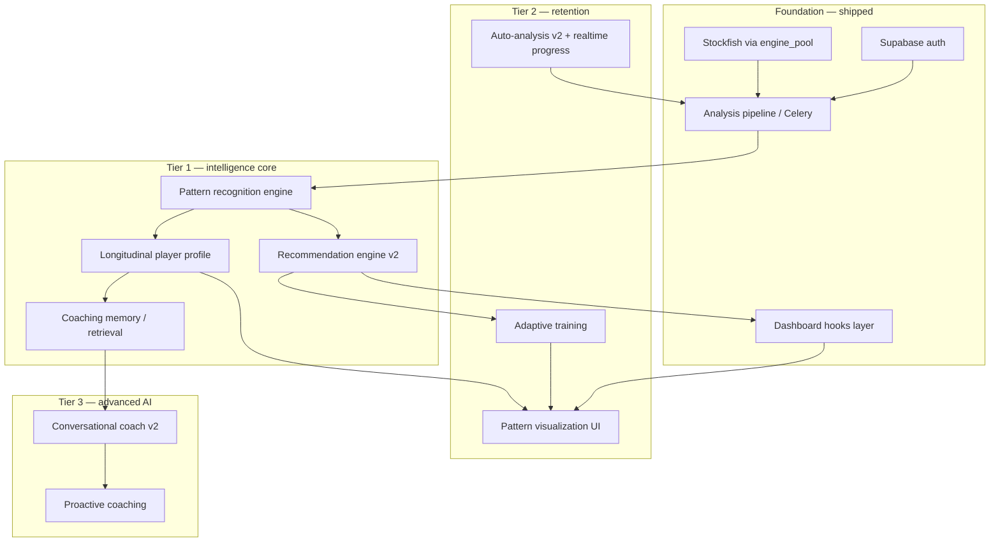

# ChessRun Feature Priority Map

**Date:** 2026-05-26  
**Status:** Active — post-remediation feature execution  
**Audience:** Product, engineering, AI agents  
**Companion docs:** [`feature-execution-roadmap.md`](./feature-execution-roadmap.md), [`multi-agent-development-strategy.md`](./multi-agent-development-strategy.md)

---

## Executive summary

ChessRun’s moat is **longitudinal chess intelligence**: turning Stockfish-verified analysis into durable player patterns, coaching memory, and adaptive guidance — not one-off engine scores.

Remediation is complete (auth, Stockfish pool, backend consolidation, frontend hooks layer, deployment). Feature work now follows an **intelligence-first** order: build durable backend truth before visualization and advanced AI.

---

## Remediation baseline (complete — do not re-open)

| Domain | Status | Canonical reference |
|--------|--------|---------------------|
| Auth unification | ✅ Supabase JWT → FastAPI `/users/me` | `docs/architecture/auth-system.md` |
| Stockfish access | ✅ `engine_pool.py` only | `docs/architecture/stockfish-architecture.md` |
| Backend services | ✅ Consolidated analysis pipeline | `docs/review-reports/backend-consolidation-report.md` |
| Frontend structure | ✅ hooks / features / components | `docs/frontend/frontend-remediation-report.md` |
| Deployment | ✅ Render + Netlify + Celery | `docs/deployment/infrastructure-stabilization-report.md` |
| Engineering enforcement | ✅ grep-loop, `.cursor/rules/`, AGENTS.md | `workflows/grep-review-workflow.md` |

New features must **extend** these paths — not create parallel implementations.

---

## Core moat systems (ranked)

### Tier 0 — Foundation already shipped

These exist in partial form; feature work **extends** them rather than replacing them.

| System | Current state | Moat contribution |
|--------|---------------|-------------------|
| Auto-analysis pipeline | Celery + `analysis_service.py` + Stockfish | Raw truth layer for everything else |
| Basic recommendation engine | `recommendation_engine.py` (rule-based on aggregates) | First coaching surface; not yet pattern-linked |
| Conversational coach shell | `chess_coach.py` + frontend chatbot | UX channel; context assembly immature |
| Dashboard metrics | Phase ACPL, move quality, insights cards | Retention hook; not yet pattern-native |

### Tier 1 — Primary differentiators (build first)

| Rank | System | Why it’s the moat | Maturity |
|------|--------|-------------------|----------|
| **1** | **Pattern recognition** | Converts analysis rows into recurring behavioral signals (opening leaks, tactical blind spots, time pressure) | 🔴 Missing as a service |
| **2** | **Longitudinal player profiling** | Aggregates patterns + ratings + phase stats into a stable `PlayerProfile` | 🔴 Missing |
| **3** | **Coaching memory & retrieval** | Grounds LLM in verified patterns + history, not chat-only context | 🟡 Designed (`MEMORY_RETRIEVAL_CONTEXT_ARCHITECTURE.md`), not built |
| **4** | **Recommendation engine v2** | Pattern-linked, prioritized, explainable coaching actions | 🟡 Rule engine exists; needs pattern inputs |

### Tier 2 — Retention & engagement

| Rank | System | Depends on |
|------|--------|------------|
| **5** | **Auto-analysis pipelines v2** | Scheduled sync, analysis-on-fetch, progress via SSE/WebSocket | Tier 1 analysis + Redis |
| **6** | **Adaptive training systems** | Pattern-specific drills, study plans | Pattern recognition + profiles |
| **7** | **Frontend visualization (patterns)** | Pattern dashboard, game detail, trend views | Backend pattern + profile APIs |

### Tier 3 — Advanced AI

| Rank | System | Depends on |
|------|--------|------------|
| **8** | **Conversational coaching intelligence v2** | RAG over patterns, grounded explanations | Coaching memory + pgvector |
| **9** | **Proactive coaching** | Notifications, weekly digests, “pattern of the week” | Profiles + retention infra |

---

## System dependency graph

**Rule:** No Tier 2/3 feature may ship without its Tier 1 inputs being persisted and queryable.

---

## Cross-cutting implications matrix

| Moat system | Infrastructure | Database | AI / LLM | Frontend |
|-------------|----------------|----------|----------|----------|
| **Pattern recognition** | Celery batch jobs; Redis cache for hot aggregates | New `player_patterns`, `pattern_occurrences`; indexes on `user_id`, `pattern_type` | LLM **must not** detect patterns — Stockfish + rules/heuristics first | None until API stable |
| **Longitudinal profiling** | Nightly Celery snapshot task | `player_profiles` JSONB or normalized tables; versioned snapshots | LLM summarizes profile, does not compute it | Profile summary card; trend sparklines |
| **Coaching memory** | Redis session store (P0 debt); pgvector on Supabase | `coach_conversations`, `coach_memory_chunks`, embeddings | Retrieval-augmented prompts via `chess_coach.py` only | Chat context indicators (“remembering your Sicilian leaks”) |
| **Auto-analysis v2** | Celery beat; optional SSE/WebSocket on Render | Job table or Redis progress keys | Optional AI-enhanced pass after Stockfish | Replace polling with `useAnalysisStatus` hook |
| **Recommendation v2** | Sync API + cache | Reads patterns + profiles | LLM rewrites recommendation text only | Extend `CoachingInsightsSection` |
| **Adaptive training** | Celery for drill generation | `training_plans`, `drill_attempts` | LLM generates drill narrative from pattern template | New `/training` feature module |
| **Conversational coach v2** | Redis + vector search | Embeddings of patterns + key games | All calls via `chess_coach.py`; context assembly in service | Chat already global; enrich `AnalysisCard` |
| **Pattern visualization** | CDN/static assets only | Read-only APIs | None | `features/patterns/` — new route |

---

## Priority scoring (implementation order)

Scores: **Impact** (1–5) × **Dependency readiness** (0.5–1.0) ÷ **Effort** (1–5).

| Feature unit | Impact | Readiness | Effort | Score | Phase |
|--------------|--------|-----------|--------|-------|-------|
| Pattern detection service (MVP: phase + blunder clusters) | 5 | 1.0 | 3 | **1.67** | 1 |
| `player_patterns` schema + migration | 5 | 1.0 | 2 | **2.50** | 1 |
| Profile snapshot service | 4 | 0.5 | 3 | **0.67** | 1 |
| Wire recommendations to patterns | 4 | 0.5 | 2 | **1.00** | 1 |
| Redis chat sessions | 3 | 1.0 | 2 | **1.50** | 1 |
| Analysis progress SSE/WebSocket | 3 | 1.0 | 3 | **1.00** | 2 |
| Game detail / move viewer | 4 | 0.8 | 4 | **0.80** | 2 |
| Pattern dashboard UI | 4 | 0.3 | 3 | **0.40** | 2 |
| pgvector coaching memory | 5 | 0.2 | 5 | **0.20** | 3 |
| Adaptive training MVP | 4 | 0.2 | 4 | **0.20** | 3 |
| Proactive weekly digest | 3 | 0.2 | 3 | **0.20** | 3 |

**Interpretation:** Phase 1 is backend intelligence + minimal API exposure. Phase 2 is retention UX. Phase 3 is advanced AI and training.

---

## What ChessRun is NOT building (yet)

Explicitly deferred to protect focus:

- Chess.com OAuth (blocked on external API)
- Full game archive / PGN library product
- Real-time multiplayer or live coaching
- Custom Stockfish fork or cloud GPU inference
- Pattern dashboards before pattern APIs exist (per remediation constraint)

---

## Success metrics per tier

| Tier | Metric | Target |
|------|--------|--------|
| Tier 1 | % analyzed games with ≥1 detected pattern | > 80% |
| Tier 1 | Recommendations citing pattern IDs | 100% |
| Tier 2 | D7 return rate (dashboard) | +15% vs baseline |
| Tier 2 | Analysis completion without manual refresh | > 95% |
| Tier 3 | Coach responses grounded in retrieved patterns | > 90% (eval set) |
| Tier 3 | Training drill completion rate | > 30% of active users |

---

## Agent routing (quick reference)

| If the task touches… | Primary agent | See |
|--------------------|---------------|-----|
| Pattern algorithms, profiles, recommendations | Backend Intelligence | [`multi-agent-development-strategy.md`](./multi-agent-development-strategy.md) |
| Dashboard, game viewer, training UI | Frontend Experience | same |
| Celery, Redis, migrations, Render | Infrastructure / Performance | same |
| Cross-cutting contracts, phase gates | Principal Architect | same |

---

## Related documents

- Product vision: [`../product/FRD_PRODUCT.md`](../product/FRD_PRODUCT.md)
- Memory architecture: [`../architecture/MEMORY_RETRIEVAL_CONTEXT_ARCHITECTURE.md`](../architecture/MEMORY_RETRIEVAL_CONTEXT_ARCHITECTURE.md)
- Execution sequencing: [`feature-execution-roadmap.md`](./feature-execution-roadmap.md)
- Parallel work rules: [`parallel-development-workflows.md`](./parallel-development-workflows.md)
