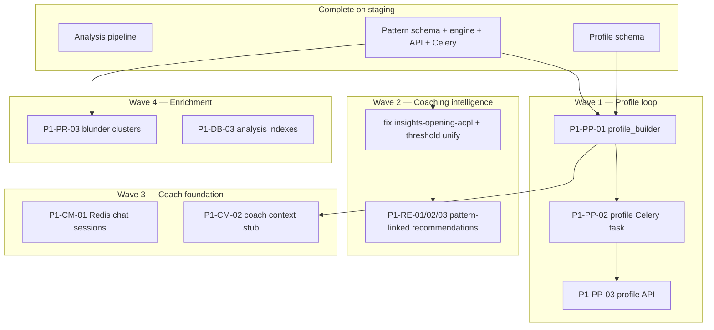

# ChessIQ Implementation State & Execution Governance

**Date:** 2026-05-26  
**Author:** Principal Architect / Orchestration Agent  
**Branch audited:** `origin/staging` @ `9742e53`  
**Mode:** Audit + planning — no feature implementation in this document

---

## Executive summary

ChessIQ has completed **remediation** and the **first third of Phase 1 backend intelligence**. The pattern detection loop (schema → engine → Celery → API) is on `staging`. The **longitudinal profile loop** and **pattern-linked coaching** are not built yet. Frontend is structurally remediated but intentionally deferred for feature UI.

**Strategic priority now:** complete Phase 1 backend intelligence (profile builder → recommendation v2 → coach foundation) before any frontend feature work.

**Critical path:**

```text
Analysis ✅ → Patterns ✅ → Profiles ⬜ → Recommendations ⬜ → Coach memory ⬜
```

---

# 1. Implementation-State Report

## 1.1 Completed systems

| System | Evidence | Notes |
|--------|----------|-------|
| **Auth unification** | `middleware/auth_middleware.py`; `get_current_user` on api routes | Supabase JWT → local `User` row |
| **Stockfish consolidation** | `services/engine/engine_pool.py`; grep clean in api/tasks | Only `stockfish_engine.py` uses `popen_uci` |
| **Analysis pipeline** | `analysis_service.py`, `unified_analyzer.py`, `analysis_tasks.py` | Celery-backed; auth on routes |
| **Chess.com integration** | `integration/chesscom_api.py` | Rate-limited fetch |
| **Pattern schema** | Migration `0006`; `models/pattern.py` | P1-DB-01 ✅ |
| **Profile schema** | Migration `0007`; `models/profile.py` | P1-DB-02 ✅ — **no builder yet** |
| **Pattern engine** | `services/patterns/*` (9 modules) | Deterministic; reads `GameAnalysis` only |
| **Pattern persistence** | `pattern_service.persist_pattern_snapshots` | Idempotent upserts |
| **Pattern Celery** | `tasks/pattern_tasks.py`; hook in `analysis_tasks.py` | Redis debounce (120s TTL, 60s countdown) |
| **Pattern API** | `api/patterns.py` | GET list + POST analyze; auth + ownership |
| **Recommendation engine (v1)** | `coaching/recommendation_engine.py` | Rule-based; **not pattern-linked** |
| **AI coach shell** | `chess_coach.py`, `api/chat.py` | LLM via coach only; **in-memory sessions** |
| **Move recommender** | `moves/move_recommender.py`, `api/moves.py` | Uses engine pool |
| **Frontend remediation** | hooks/, features/dashboard/, thin pages | On staging via PR #49–50 |
| **Tier / filter services** | `tier_service.py`, `filter_service.py` | Supporting infra |

## 1.2 Partially implemented

| System | State | Gap |
|--------|-------|-----|
| **Pattern recognition** | Phase + opening detectors only | P1-PR-03 blunder clusters missing |
| **Longitudinal profiling** | DB schema only | No `services/profiles/`, no task, no API |
| **Coaching memory** | Designed in architecture docs | Chat sessions in `Dict` on coach instance (P1-CM-01) |
| **Recommendations** | Works from aggregate metrics | No `pattern_id`; thresholds duplicated vs `patterns/constants.py` |
| **Insights generation** | `api/insights.py` background job | Opening stats bug (`user_acpl` vs `opening_acpl` line 158); overlaps `pattern_data.py` |
| **Chat frontend** | Global chatbot in `_app.tsx` | No pattern/profile context in UI |
| **Tests** | 17 pattern tests + legacy suite | No profile tests; some legacy tests target deleted modules |
| **Execution docs** | Written locally | `docs/execution/` **not committed** to repo yet |
| **Migrations in prod** | Code on staging | Requires `alembic upgrade head` for 0006/0007 on deployed Postgres |

## 1.3 Missing systems (Phase 1 roadmap)

| ID | System | Owner |
|----|--------|-------|
| P1-PP-01 | Profile builder service | Backend |
| P1-PP-02 | Profile Celery task | Backend |
| P1-PP-03 | Profile API routes | Backend |
| P1-RE-01 | Pattern-aware recommendations | Backend |
| P1-RE-02 | Stable recommendation ↔ `pattern_id` | Backend |
| P1-RE-03 | Insights route returns pattern-linked recs | Backend |
| P1-PR-03 | Blunder cluster detector | Backend |
| P1-CM-01 | Redis chat session store | Infra |
| P1-CM-02 | Coach context assembly (profile + patterns) | Backend |
| P1-DB-03 | Analysis query indexes | Infra |
| P1-FE-* | Frontend pattern/profile hooks | Frontend — **deferred by policy** |

## 1.4 Duplicate / parallel logic (risk)

| Area | Locations | Risk |
|------|-----------|------|
| ACPL thresholds | `recommendation_engine.py` vs `patterns/constants.py` | Drift |
| Analysis aggregation | `insights.py` vs `pattern_data.py` | Bug fixes in two places |
| Pattern storage | `user_insights.pattern_matches` JSON vs `player_patterns` table | Dual truth if both written |
| Legacy tests | `test_chess_analyzer.py`, etc. | May reference removed modules |

## 1.5 Architecturally inconsistent / oversized

| Item | Issue |
|------|-------|
| `api/games.py` (~474 lines) | Route bloat; business logic should move to services |
| `api/insights.py` (~492 lines) | Same; overlaps pattern aggregation |
| `api/users.py` (~429 lines) | Over limit |
| `api/analysis.py` (~362 lines) | Over limit |
| `api/games_filters.py` | **Orphaned** — not registered in `__main__.py` |
| `chess_coach.py` in-memory sessions | Breaks horizontal scale; conflicts with memory architecture |
| Alembic heads | `99221b79d5ec_merge_migration_heads.py` + `add_game_filter_indexes.py` — verify single head in deploy |

## 1.6 Broken / pre-existing issues

| Item | Severity |
|------|----------|
| `insights.py:158` uses `user_acpl` for per-opening stats | Medium — disagrees with pattern engine |
| Windows grep automation (`rg` missing) | Low — manual review required |
| `check-duplicates.ps1` syntax error | Low — tooling |
| Some auth tests may mock outdated paths | Low — verify in CI |

## 1.7 Reuse map (do not rebuild)

| Need | Reuse |
|------|-------|
| Game analysis | `analysis_service.analyze_game_for_user`, `persist_game_analysis` |
| Stockfish | `get_pooled_engine()` / `engine_pool.py` only |
| Pattern detection | `run_pattern_detection(db, user_id, persist=True)` |
| Pattern list | `pattern_service.list_user_patterns` |
| Pattern schedule | `schedule_pattern_detection_for_user` |
| LLM | `ChessCoach` only |
| Auth | `get_current_user`, `require_ownership` |
| Chess.com | `integration/chesscom_api.py` |
| DB models | `PlayerPattern`, `PatternOccurrence`, `PlayerProfile`, `GameAnalysis` |

## 1.8 Roadmap foundation matrix

| Roadmap unit | Foundation status |
|--------------|-------------------|
| P1-DB-01 | ✅ Merged |
| P1-DB-02 | ✅ Merged |
| P1-PR-01–06 | ✅ Merged (PR-03 blunder clusters open) |
| P1-PP-01–03 | 🟡 Schema only |
| P1-RE-01–03 | 🟡 Engine exists; not wired |
| P1-CM-01–02 | 🔴 Not started |
| P1-FE-01–03 | 🔴 Deferred |
| Phase 2 (SSE, game viewer, pattern UI) | 🔴 Blocked on Phase 1 exit |

---

# 2. Feature Execution Plan

## 2.1 Strategic principles (enforced)

1. Intelligence before interface  
2. Retention before polish  
3. Grounded AI before conversational AI  
4. Deterministic chess truth before LLM explanation  
5. Backend + infra only until Phase 1 exit  

## 2.2 Phase 1 completion — dependency-aware sequencing



### Wave 1 — Profile loop (Backend, sequential PRs)

| Step | Unit | Branch | Blocks |
|------|------|--------|--------|
| 1.1 | P1-PP-01 `profile_builder.py` | `feature/backend-profile-builder` | PP-02, PP-03, CM-02 |
| 1.2 | P1-PP-02 Celery task | `feature/backend-profile-task` | PP-03 |
| 1.3 | P1-PP-03 Profile API | `feature/backend-profile-api` | Phase 1 exit |

### Wave 2 — Recommendation intelligence (Backend)

| Step | Unit | Branch |
|------|------|--------|
| 2.0 | `fix/insights-opening-acpl` + `chore/pattern-threshold-unify` | `fix/insights-pattern-consistency` |
| 2.1 | P1-RE-01 pattern-aware `RecommendationEngine` | `feature/backend-recommendation-v2` |
| 2.2 | P1-RE-02/03 insights route + `pattern_id` | same or follow-up |

### Wave 3 — Coach foundation (Infra + Backend, parallel after PP-01)

| Step | Unit | Agent | Branch |
|------|------|-------|--------|
| 3.1 | P1-CM-01 Redis sessions | Infra | `feature/infra-redis-chat-sessions` |
| 3.2 | P1-CM-02 coach context stub | Backend | `feature/backend-coach-context` |

### Wave 4 — Enrichment (non-blocking)

| Unit | Agent |
|------|-------|
| P1-PR-03 blunder clusters | Backend |
| P1-DB-03 indexes | Infra |

### Frontend

**Frozen** until Phase 1 exit checklist passes. No P1-FE, no Phase 2 UI.

## 2.3 Service ownership

| Domain | Canonical path | Owner |
|--------|----------------|-------|
| Patterns | `services/patterns/` | Backend |
| Profiles | `services/profiles/` (to create) | Backend |
| Analysis | `services/analysis/analysis_service.py` | Backend |
| Recommendations | `services/coaching/recommendation_engine.py` | Backend |
| Coach / LLM | `services/chat/chess_coach.py` | Backend |
| Migrations | `alembic/versions/` | Infra |
| Redis / Celery / deploy | `celery_app.py`, `render.yaml`, etc. | Infra |

## 2.4 Risk analysis

| Risk | Mitigation |
|------|------------|
| Dual pattern truth (insights JSON vs relational) | Backend writes only `player_patterns`; deprecate JSON writes |
| Threshold drift | Single `patterns/constants.py` in P1-RE-01 |
| Alembic conflicts | Infra serializes migrations; Backend never adds revisions |
| Oversized route PRs | Extract to services in separate cleanup PRs after features |
| Chat session loss on restart | P1-CM-01 before scaling workers |
| Deploy without migration | Infra runs `alembic upgrade head` on staging/prod |
| Weak PR velocity | Reject at R1/R2; no merge for architecture violations |

## 2.5 Review checkpoints

| Checkpoint | Trigger |
|------------|---------|
| CP-PP | After P1-PP-03 merged — profile loop smoke |
| CP-RE | After P1-RE-03 — recommendations cite `pattern_id` |
| CP-CM | After P1-CM-02 — coach prompt includes profile + patterns |
| **Phase 1 gate** | All exit checklist items — then frontend + staging→main release |

---

# 3. Task Assignment Matrix

## Infrastructure / Performance Agent

| Priority | Task ID | Description | Branch | Depends on |
|----------|---------|-------------|--------|------------|
| P0 | OPS-01 | Verify `alembic upgrade head` on staging/production | chore | 0006/0007 merged |
| 1 | P1-CM-01 | Redis chat session store | `feature/infra-redis-chat-sessions` | None — parallel with PP |
| 2 | P1-DB-03 | Analysis/pattern query indexes | `feature/infra-analysis-indexes` | After query patterns stable |
| 3 | OPS-02 | Fix Windows grep/duplicate scripts | `chore/review-tooling` | Optional |

**Forbidden:** `services/patterns/`, `services/profiles/` logic, frontend, coach prompt logic

## Backend Intelligence Agent

| Priority | Task ID | Description | Branch | Depends on |
|----------|---------|-------------|--------|------------|
| **1** | **P1-PP-01** | Profile builder service | `feature/backend-profile-builder` | P1-DB-02 ✅ |
| 2 | P1-PP-02 | Profile Celery task | `feature/backend-profile-task` | PP-01 |
| 3 | P1-PP-03 | Profile API | `feature/backend-profile-api` | PP-01 |
| 4 | FIX-01 | Insights opening_acpl + threshold unify | `fix/insights-pattern-consistency` | None |
| 5 | P1-RE-01/02/03 | Pattern-linked recommendations | `feature/backend-recommendation-v2` | PP-01, FIX-01 |
| 6 | P1-CM-02 | Coach context stub | `feature/backend-coach-context` | PP-01, CM-01 preferred |
| 7 | P1-PR-03 | Blunder cluster detector | `feature/backend-blunder-clusters` | After RE or parallel |

**Forbidden:** alembic, deploy configs, frontend

## Frontend Experience Agent

| Status | Note |
|--------|------|
| **IDLE** | No assignments until Phase 1 exit |
| Next (later) | P1-FE-01–03, then Phase 2 game viewer / pattern UI |

---

# 4. Execution TODO Breakdown

## 4.1 P1-PP-01 — Profile builder (NEXT BACKEND UNIT)

**Acceptance criteria:**

- [ ] `services/profiles/profile_builder.py` builds deterministic snapshot from `GameAnalysis` + `PlayerPattern`
- [ ] Inserts new `PlayerProfile` row with `profile_version = MAX + 1` (append-only)
- [ ] Populates `pattern_summary_refs`, `phase_performance`, `rating_trends`, counts
- [ ] Skips if `games_analyzed_count < 10`
- [ ] No LLM calls; optional `profile_summary` left null
- [ ] pytest coverage for builder logic
- [ ] Review report in `docs/review-reports/`

**Review gates:** R0 → R1 → R2 → R4  
**Merge:** PR to `staging`; ≤400 lines preferred

## 4.2 P1-PP-02 — Profile Celery task

**Acceptance criteria:**

- [ ] Thin task in `tasks/profile_tasks.py` calling builder
- [ ] Trigger after `detect_patterns_task` success (debounced per user)
- [ ] Registered in `celery_app.py`
- [ ] Tests mock Celery/DB

## 4.3 P1-PP-03 — Profile API

**Acceptance criteria:**

- [ ] `GET /users/{id}/profile` — latest snapshot
- [ ] `GET /users/{id}/profile/history` — paginated versions
- [ ] Auth + ownership
- [ ] Thin routes; logic in service
- [ ] API tests

## 4.4 FIX-01 — Insights consistency

**Acceptance criteria:**

- [ ] `insights.py` opening stats use `opening_acpl`
- [ ] `recommendation_engine.py` imports thresholds from `patterns/constants.py`
- [ ] No behavior regression in existing insight tests

## 4.5 P1-RE-01/02/03 — Recommendation v2

**Acceptance criteria:**

- [ ] Recommendations consume `PlayerPattern` rows
- [ ] Response includes `pattern_id` where applicable
- [ ] `insights.py` recommendations endpoint uses updated engine
- [ ] Document precedence: opening-specific > generic phase pattern

## 4.6 P1-CM-01 — Redis chat (Infra)

**Acceptance criteria:**

- [ ] Replace `chess_coach.sessions` dict with Redis store
- [ ] TTL on sessions (e.g. 24h)
- [ ] Survives worker restart (smoke test)
- [ ] No change to LLM prompt logic in this PR

## 4.7 P1-CM-02 — Coach context stub (Backend)

**Acceptance criteria:**

- [ ] `chess_coach.py` loads latest profile + top N patterns into system context
- [ ] LLM still does not compute chess evals
- [ ] Tests with mocked DB

## 4.8 Phase 1 exit checklist (gate before frontend)

- [ ] Patterns generated via Celery after analysis
- [ ] Profile snapshots for users with ≥10 analyzed games
- [ ] Recommendations include `pattern_id`
- [ ] Chat sessions in Redis
- [ ] Coach context includes profile + patterns
- [ ] Grep A+D pass; pytest pass on staging
- [ ] `alembic upgrade head` applied on production DB

---

# 5. Merge + Review Governance Plan

## 5.1 PR sequencing

```text
staging (integration)
  ← feature/* (one concern per PR)
  ← fix/* (bug/chore)

main (production)
  ← staging (Phase 1 gate PR only)
```

**Current staging ahead of main:** PRs #51–#54 (pattern + profile schema + engine + Celery/API). Do **not** promote to `main` until Phase 1 exit.

## 5.2 Review authority

| Gate | Owner | Blocks merge? |
|------|-------|---------------|
| R0 Architecture / deps | Principal Architect | Yes |
| R1 Grep-loop A+D | Implementing agent + Architect spot-check | Yes |
| R2 Extensibility / coupling | Architect | Yes on shared surfaces |
| R3 Regression / integration | Agent + staging smoke | Yes at phase boundaries |
| R4 Merge readiness | Architect | Yes |

**Reject and return** if: Stockfish outside pool, LLM in routes, business logic in tasks/routes, duplicate service, >600 lines without split, migration in Backend PR.

## 5.3 Staging flow

1. Agent cuts `feature/*` from latest `staging`
2. Implements single unit with tests + review report
3. Opens PR → `staging`
4. R0–R1 checks in PR body
5. Architect approval (or auto-merge if checks pass and scope clean)
6. Delete feature branch
7. Infra applies migrations on staging environment when schema PR merges

## 5.4 Grep-loop enforcement

Every PR (R1):

```bash
# A-series
rg "SimpleEngine|popen_uci" backend/app/api/ backend/app/tasks/
rg "openai\.|anthropic\.|ollama\." backend/app/api/
rg "from app.core.database import SessionLocal" backend/app/api/

# Duplication
rg "def analyze_" backend/app/services/ backend/app/api/
rg "def fetch_games" backend/app/
```

Phase gate (R2–R3): full suite per `docs/execution/review-loop-enforcement.md`

## 5.5 Rollback strategy

| Scenario | Action |
|----------|--------|
| Bad service logic merged | Revert PR on staging; fix forward on new branch |
| Bad migration merged | `alembic downgrade` one revision; hotfix migration if data affected |
| Production incident | Revert staging→main promotion; do not force-push main |
| Architecture violation discovered post-merge | Separate revert PR + governance note in review-reports |

## 5.6 Immediate orchestration actions

| # | Action | Owner |
|---|--------|-------|
| 1 | Commit `docs/execution/` to staging (governance docs) | Architect chore PR |
| 2 | Confirm migrations 0006/0007 applied on Render Postgres | Infra OPS-01 |
| 3 | Assign **P1-PP-01** to Backend Agent | Architect |
| 4 | Assign **P1-CM-01** to Infra Agent (parallel) | Architect |
| 5 | Hold Frontend Agent idle | Policy |

---

## Appendix A — Staging merge log (Phase 1)

| PR | Unit |
|----|------|
| #51 | P1-DB-01 pattern schema |
| #52 | P1-PR-01/02/04 pattern engine |
| #53 | P1-DB-02 profile schema |
| #54 | P1-PR-05/06 Celery + API |

## Appendix B — Agent session scope (reference)

See user exports: `cursor_infra_agent.md`, `cursor_backend_agent.md`. All Task/subagent prompts must include full scope blocks from those exports plus current unit ID and staging HEAD.

## Related documents

- [`feature-execution-roadmap.md`](./feature-execution-roadmap.md)
- [`feature-priority-map.md`](./feature-priority-map.md)
- [`multi-agent-development-strategy.md`](./multi-agent-development-strategy.md)
- [`review-loop-enforcement.md`](./review-loop-enforcement.md)
- [`../architecture/MEMORY_RETRIEVAL_CONTEXT_ARCHITECTURE.md`](../architecture/MEMORY_RETRIEVAL_CONTEXT_ARCHITECTURE.md)
