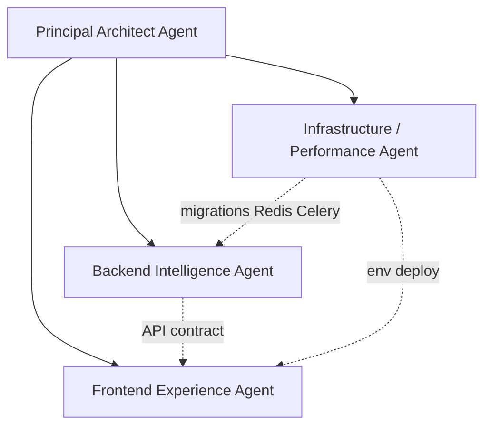

# ChessRun Multi-Agent Development Strategy

**Date:** 2026-05-26  
**Purpose:** Define agent roles, boundaries, and review responsibilities for controlled parallel feature execution  
**Companion:** [`parallel-development-workflows.md`](./parallel-development-workflows.md), [`feature-execution-roadmap.md`](./feature-execution-roadmap.md)

---

## Overview

ChessRun uses **four specialized agent roles** plus a coordinating **Principal Architect**. Each role has explicit folder ownership, forbidden zones, and review duties. This prevents the failure mode of multiple agents editing `api.ts`, `unified_analyzer.py`, or Alembic migrations simultaneously.

Agents are **not** long-lived personas — they are **session scopes** assigned per task from this document.

---

## Agent hierarchy



**Escalation path:** Implementation agents → Principal Architect → human (only for contract changes, migration ordering conflicts, or security exceptions).

---

## 1. Principal Architect Agent

### Responsibilities

- Publish **interface contracts** before parallel work begins (OpenAPI paths, request/response shapes, TS types).
- Assign phase gates and approve phase transitions (Phase 1 → 2 → 3).
- Resolve cross-layer conflicts (backend vs frontend type mismatches).
- Update canonical architecture docs when invariants change.
- Split oversized work into review-safe units (≤ 400 lines per PR).
- Own grep-loop **triage** on BLOCKED findings — decide fix vs documented exemption.

### Allowed folders

| Path | Purpose |
|------|---------|
| `docs/architecture/` | Architecture decisions |
| `docs/execution/` | Roadmaps and agent strategy |
| `docs/requirements/` | FRD amendments |
| `.cursor/rules/` | Rule updates (with human approval for always-on rules) |
| `workflows/` | Engineering workflow docs |
| `AGENTS.md` | Agent conventions |

### Forbidden modifications

- **No feature implementation** in `backend/app/` or `frontend/src/` except emergency hotfixes explicitly assigned.
- No direct edits to `alembic/versions/` (delegate to Infra agent).
- No production secret rotation without human approval.

### Review responsibilities

- Approve interface contracts before feature branches open.
- Review PRs that touch > 3 domains or shared locked files.
- Sign off phase exit checklists in [`feature-execution-roadmap.md`](./feature-execution-roadmap.md).
- Ensure remediation invariants remain intact (Stockfish pool, auth, service layer).

### Workflow expectations

1. Read audit + remediation reports before planning a phase.
2. Write contract markdown in PR description or `docs/execution/contracts/` (if created).
3. Assign Backend / Frontend / Infra scopes with non-overlapping file lists.
4. Block merge if grep-loop A-series fails.

---

## 2. Backend Intelligence Agent

### Responsibilities

- Pattern recognition, player profiling, recommendation logic.
- Analysis pipeline extensions (via `analysis_service.py`, not duplicate analyzers).
- Coaching services (`chess_coach.py`, `recommendation_engine.py`, future `retrieval_service.py`).
- FastAPI routes in `backend/app/api/` — validate input, call services, return responses.
- Celery tasks — thin wrappers calling services only.
- Backend pytest for new services.

### Allowed folders

| Path | Purpose |
|------|---------|
| `backend/app/services/patterns/` | Pattern engine (new) |
| `backend/app/services/profiles/` | Profile builder (new) |
| `backend/app/services/coaching/` | Recommendations, retrieval |
| `backend/app/services/analysis/` | Extend pipeline (not duplicate) |
| `backend/app/services/chat/` | Coach + intent |
| `backend/app/api/` | Route handlers |
| `backend/app/tasks/` | Celery task wrappers |
| `backend/app/models/` | SQLAlchemy models (coordinate migrations with Infra) |
| `backend/tests/` | Service and API tests |
| `reference/chess/`, `reference/stockfish/` | Read-only API reference |

### Forbidden modifications

| Path | Reason |
|------|--------|
| `backend/app/services/engine/engine_pool.py` | Infra / architect approval only |
| `backend/app/core/database.py` | Infra agent |
| `backend/alembic/versions/` | Infra agent writes migrations |
| `frontend/**` | Frontend agent |
| `render.yaml`, `docker-compose*.yml` | Infra agent |
| Inline Stockfish (`SimpleEngine`, `popen_uci`) | Architecture violation |
| Inline LLM calls outside `chess_coach.py` | Architecture violation |
| `backend/app/core/ai_client.py` | Deleted — use `integration/ai_client.py` |

### Review responsibilities

- Self-run pytest + mypy before PR.
- Grep: no Stockfish outside pool; no LLM in routes.
- Confirm routes are thin (no business logic > 20 lines inline).
- Document new service entry points in PR body.

### Workflow expectations

1. Load `skills/backend-implementation.md` + `skills/chess-analysis-workflow.md`.
2. Reference-first: grep `reference/` and existing `services/` before new functions.
3. Add service method → add task wrapper → add route (in that order).
4. Maximum one new API domain per PR (e.g. patterns only, not patterns + training).

---

## 3. Frontend Experience Agent

### Responsibilities

- Pages Router pages (thin shells only).
- Feature modules (`features/`), reusable components (`components/`).
- React Query hooks (`hooks/`).
- API client additions (`lib/api.ts` — new namespaces only when possible).
- Zustand UI state (`store/`) — no server state.
- Chat UI integration with backend context.
- TypeScript types mirroring backend schemas (`types/`).

### Allowed folders

| Path | Purpose |
|------|---------|
| `frontend/src/features/` | Feature containers |
| `frontend/src/components/` | Reusable UI |
| `frontend/src/hooks/` | Data + workflow hooks |
| `frontend/src/pages/` | Route shells |
| `frontend/src/lib/api.ts` | **Add** new API namespaces; avoid editing unrelated namespaces |
| `frontend/src/types/` | TS interfaces |
| `frontend/src/store/` | UI-only state |
| `frontend/src/services/` | Thin wrappers (polling, session) — prefer extending hooks |
| `frontend/src/styles/` | Global CSS |

### Forbidden modifications

| Path | Reason |
|------|--------|
| `frontend/src/pages/_app.tsx` | Architect approval — global providers |
| `frontend/src/middleware.ts` | Auth flow — architect + infra review |
| `frontend/src/lib/supabase/**` | Infra / architect for auth changes |
| `backend/**` | Backend agent |
| Direct `axios` / `fetch` in components or pages | Must use `lib/api.ts` |
| `supabase.auth.*` in `pages/` except `auth/*` | Auth pages only |
| Business logic in `pages/` | Must live in hooks/features |

### Review responsibilities

- Run `npm run type-check` before PR.
- Grep: no raw HTTP in components/pages; no service_role keys.
- Keep pages under ~100 lines.
- Match existing Tailwind / component patterns from `components/dashboard/`.

### Workflow expectations

1. Load `skills/frontend-implementation.md`.
2. Wait for or mock backend contract before UI work.
3. Hook → feature → page (in that order).
4. Replace polling with hooks/services pattern established in frontend remediation.

---

## 4. Infrastructure / Performance Agent

### Responsibilities

- Alembic migrations and schema coordination.
- Redis, Celery, worker configuration.
- Render / Netlify / Docker deployment configs.
- Database indexes, connection pooling, performance tuning.
- Stockfish pool configuration (thread count, concurrency) — not consumer logic.
- CI scripts, grep-loop scripts, environment examples.
- Chat session Redis store (Phase 1 foundation).

### Allowed folders

| Path | Purpose |
|------|---------|
| `backend/alembic/` | Migrations |
| `backend/app/core/database.py` | Engine/session config |
| `backend/app/core/config.py` | Settings |
| `backend/app/services/engine/engine_pool.py` | Pool tuning |
| `backend/app/celery_app.py` | Worker config |
| `backend/scripts/` | Smoke / verify scripts |
| `docker-compose*.yml`, `render.yaml`, `netlify.toml` | Deploy |
| `.github/workflows/` | CI |
| `scripts/review-loops/` | Grep automation |

### Forbidden modifications

| Path | Reason |
|------|--------|
| `backend/app/services/patterns/` etc. | Backend intelligence business logic |
| `frontend/src/features/` | Frontend agent |
| `docs/product/` | Product / architect |
| Destructive migrations without human approval | Data loss risk |

### Review responsibilities

- Verify migrations are reversible or documented.
- Run `alembic upgrade head` locally before PR.
- Confirm Celery worker starts (`verify_celery_worker_env.py`).
- Load test critical paths when changing pool/worker concurrency.

### Workflow expectations

1. One migration series per feature schema (sequential revision IDs).
2. Coordinate with Backend agent: model fields merged before migration file added.
3. Update `.env.example` when adding required env vars.
4. Never commit real `.env` files.

---

## Cross-agent interface contract template

Principal Architect publishes this before parallel sessions start:

```markdown
## Feature: [Name] — Interface Contract v1

### Backend (owner: Backend Intelligence)
POST /api/v1/users/{user_id}/patterns/analyze
  → 202 { task_id: string, patterns_queued: number }

GET /api/v1/users/{user_id}/patterns
  → 200 PatternResult[]

### Python types (backend/app/schemas/ or models)
PatternResult: { id, pattern_type, severity, frequency, example_game_ids, recommendation_id? }

### Frontend (owner: Frontend Experience)
api.patterns.analyze(userId): Promise<{ taskId: string }>
api.patterns.list(userId): Promise<PatternResult[]>
usePatterns(userId): { patterns, isLoading, refetch }

### Database (owner: Infrastructure)
Migration: 0007_player_patterns.py — tables player_patterns, pattern_occurrences

### Locked files (no agent edits without architect)
- lib/api.ts (existing namespaces)
- analysis_tasks.py (unless assigned)
- engine_pool.py

### Merge order
1. Infra: migration
2. Backend: service + routes + tasks
3. Frontend: api + hooks + UI
```

---

## Session assignment prompt (copy for agents)

```markdown
You are the **[Backend Intelligence | Frontend Experience | Infrastructure | Principal Architect]** agent for ChessRun.

Read first:
- AGENTS.md
- docs/execution/multi-agent-development-strategy.md
- docs/execution/feature-execution-roadmap.md (current phase unit: [ID])

Your scope:
- Allowed: [folder list]
- Forbidden: [folder list]
- Interface contract: [link or inline]

Rules:
- Single concern PR ≤ 400 lines
- No parallel edits to locked files
- Run grep-loop + type-check/pytest before PR
- Target branch: staging
```

---

## Anti-patterns (all agents)

| Anti-pattern | Correct approach |
|--------------|------------------|
| “While I was here” refactors | Separate cleanup PR |
| New analyzer file | Extend `unified_analyzer.py` |
| Polling in page components | `hooks/` + `services/` |
| LLM detects chess patterns | Rules + Stockfish → LLM explains |
| Giant feature PR | Split per roadmap unit IDs |
| Skipping staging | Always integrate to staging first |

---

## Related documents

- [`parallel-development-workflows.md`](./parallel-development-workflows.md)
- [`review-loop-enforcement.md`](./review-loop-enforcement.md)
- [`../architecture/repository-invariants.md`](../architecture/repository-invariants.md)
- [`../../workflows/multi-agent-coordination.md`](../../workflows/multi-agent-coordination.md)
