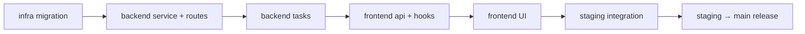

# ChessIQ Parallel Development Workflows

**Date:** 2026-05-26  
**Purpose:** Safe parallel implementation across agents, branches, and layers  
**Companion:** [`multi-agent-development-strategy.md`](./multi-agent-development-strategy.md), [`review-loop-enforcement.md`](./review-loop-enforcement.md)

---

## Core principle

> **Parallelize domains, serialize shared surfaces.**

Two agents may work simultaneously only when their **file sets do not intersect** and an **interface contract** is frozen.

---

## Feature isolation strategy

### Domain boundaries (safe to parallelize)

| Domain | Primary paths | Typical agent |
|--------|---------------|---------------|
| Patterns backend | `services/patterns/`, `api/patterns.py`, `tasks/pattern_tasks.py` | Backend intelligence |
| Profiles backend | `services/profiles/`, profile routes/tasks | Backend intelligence |
| Pattern frontend | `features/patterns/`, `hooks/usePatterns.ts` | Frontend experience |
| Game viewer frontend | `features/game-viewer/` | Frontend experience |
| Schema / infra | `alembic/`, `docker-compose`, `render.yaml` | Infrastructure |
| Chat Redis store | `chess_coach.py` session layer, Redis config | Infra + backend pair |

### Shared surfaces (serialize — one agent at a time)

| File / area | Lock reason | Lock holder |
|-------------|-------------|-------------|
| `backend/alembic/versions/` | Ordered revisions | Infra agent |
| `frontend/src/lib/api.ts` | All HTTP client code | One agent per PR; split by namespace |
| `frontend/src/types/index.ts` | Shared TS types | Architect approves changes |
| `frontend/src/pages/_app.tsx` | Global providers | Architect approval |
| `backend/app/tasks/analysis_tasks.py` | Core async entry | Backend intelligence |
| `backend/app/__main__.py` | Router registration | One PR registers all new routers |
| `backend/app/services/engine/engine_pool.py` | Stockfish canonical path | Infra only |

### Isolation checklist (before starting parallel sessions)

- [ ] Interface contract published by Principal Architect
- [ ] Each agent has explicit allowed / forbidden paths
- [ ] No two agents assigned the same file
- [ ] Migration owner identified (always Infra)
- [ ] Merge order documented

---

## Branch strategy

### Branch naming

```
feature/<domain>-<topic>     # feature/backend-pattern-engine
fix/<topic>                  # fix/celery-redis-url
chore/<topic>                # chore/grep-loop-scripts
docs/<topic>                 # docs/execution-roadmap
```

**Integration target:** `staging` (never `main` for feature work).

**Production promotion:** `staging` → `main` PR after phase gate passes.

### Parallel branch example (Phase 1)

```
staging
├── feature/infra-pattern-schema      ← Agent: Infra (migration only)
├── feature/backend-pattern-engine    ← Agent: Backend (depends on migration merge)
├── feature/backend-profile-builder   ← Can parallel AFTER patterns service interface frozen
└── feature/frontend-patterns-api     ← Agent: Frontend (after backend contract; can mock)
```

### Merge order (mandatory)



**Exception:** Frontend hooks with mocked API may branch from `staging` before backend merges, but **must not merge** until backend is on `staging` and contract verified.

---

## PR review flow

### Author checklist (every PR)

1. Single concern; ≤ 400 lines (≤ 600 only if migration-generated).
2. Commit format: `<type>: <subject>`.
3. Run type-check / pytest / mypy as applicable.
4. Run grep-loop **A + D** (see [`review-loop-enforcement.md`](./review-loop-enforcement.md)).
5. PR body includes: scope, test plan, interface contract link, agent role.

### Reviewer routing

| PR touches | Primary reviewer role |
|------------|----------------------|
| `services/patterns/`, coaching logic | Backend intelligence (+ architect spot-check) |
| `frontend/src/features/` | Frontend experience |
| `alembic/`, deploy configs | Infrastructure |
| Locked shared files | Principal Architect |
| Cross-cutting (>3 domains) | Architect + human |

### Auto-merge policy (from AGENTS.md)

- Merge to `staging` when checks pass — no wait for human unless explicitly held.
- **Do not auto-merge:** destructive migrations, secret rotation, force-push, user said “hold”.
- Delete feature branch after merge.

---

## Grep-loop enforcement (pre-merge)

### Every PR to staging

```bash
# Architecture (A-series subset)
rg "SimpleEngine|popen_uci" backend/app/api/ backend/app/tasks/
rg "openai\.|anthropic\.|ollama\." backend/app/api/
rg "from app.core.database import SessionLocal" backend/app/api/
rg "axios\.(get|post|put|delete)" frontend/src/components/ frontend/src/pages/
rg "service_role|SERVICE_ROLE" frontend/src/

# Duplication (quick)
rg "def analyze_" backend/app/services/ backend/app/api/
rg "def fetch_games" backend/app/
```

Zero violations required unless `# grep-exempt:` with justification in PR.

Full A–E suite: required at **phase gate** and **staging → main** (see review-loop doc).

---

## Merge workflow (step-by-step)

### Feature PR → staging

```bash
git checkout staging && git pull origin staging
git checkout -b feature/backend-pattern-engine
# ... implement ...
git push -u origin feature/backend-pattern-engine
gh pr create --base staging --title "feat: pattern detection service MVP" --body "..."
# wait for CI + grep review
gh pr merge --merge --delete-branch
```

### Phase gate → main release

```bash
# Disable staging branch deletion for this merge only
gh api -X PATCH repos/ArcnetLabs/chess-AI -F delete_branch_on_merge=false

gh pr create --base main --head staging --title "release: Phase 1 intelligence core"
# Full grep A–E + smoke tests
gh pr merge --merge

gh api -X PATCH repos/ArcnetLabs/chess-AI -F delete_branch_on_merge=true
```

---

## Architecture review checkpoints

| Checkpoint | Trigger | Owner | Output |
|------------|---------|-------|--------|
| **CP-0 — Contract review** | Before feature branches | Principal Architect | Interface contract in PR or docs |
| **CP-1 — Schema review** | Before migration merge | Infra + Architect | Migration PR approved |
| **CP-2 — Service review** | Backend PR | Backend agent self + grep | No route business logic |
| **CP-3 — Integration review** | Frontend PR after backend on staging | Frontend agent | E2E smoke on staging URLs |
| **CP-4 — Phase gate** | Phase exit checklist complete | Architect | Update execution docs |
| **CP-5 — Release gate** | staging → main | Architect + full grep | Release PR merged |

---

## Conflict resolution

1. Identify **file owner** by agent role (see multi-agent doc).
2. Owning agent rebases and resolves.
3. If both have legitimate claims on a shared file → **Principal Architect** decides; often split into two sequential PRs.
4. **Never** auto-resolve conflicts in: migrations, `api.ts`, `_app.tsx`, `engine_pool.py`.

---

## Backend / frontend coordination timeline

| Day | Backend | Frontend | Infra |
|-----|---------|----------|-------|
| 0 | — | — | Publish migration PR |
| 1 | Migration merged | — | — |
| 2–5 | Service + routes PR | Mock hooks locally | — |
| 6 | Merge backend | API client PR | — |
| 7–10 | — | Feature UI PR | — |
| 11 | Integration fixes | Merge UI | Staging smoke |

Frontend agents use **MSW or hook mocks** during days 2–5; no undocumented endpoint calls.

---

## Parallel work forbidden combinations

| Agent A | Agent B | Why forbidden |
|---------|---------|---------------|
| Backend | Infra | Same migration + model fields without coordination |
| Frontend | Frontend | Both editing `lib/api.ts` same namespace |
| Backend | Backend | Both editing `chess_coach.py` + `recommendation_engine.py` in one sprint without split |
| Any | Any | Both touching `staging` via force-push |

---

## Communication artifacts

| Artifact | Location | Purpose |
|----------|----------|---------|
| Interface contract | PR description or future `docs/execution/contracts/` | Freeze API shape |
| Phase checklist | `feature-execution-roadmap.md` | Gate criteria |
| Review report | `docs/review-reports/` | Grep telemetry per run |
| Agent scope | Task prompt (multi-agent doc template) | Session boundary |

---

## Staging smoke URLs (post-merge)

| Surface | URL |
|---------|-----|
| Frontend | `https://chessrun.netlify.app` |
| Backend | `https://chess-insight-backend.onrender.com` |
| Health | `GET /health` or equivalent |

Run manual smoke after every phase gate, not only on release.

---

## Related documents

- [`multi-agent-development-strategy.md`](./multi-agent-development-strategy.md)
- [`review-loop-enforcement.md`](./review-loop-enforcement.md)
- [`../../workflows/multi-agent-coordination.md`](../../workflows/multi-agent-coordination.md)
- [`../../workflows/review-workflow.md`](../../workflows/review-workflow.md)
- [`../../AGENTS.md`](../../AGENTS.md)
