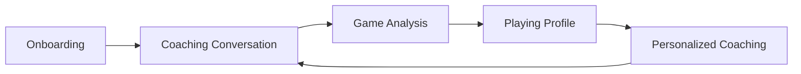

# ChessRun MVP UX

**Status:** Canonical MVP product direction
**Last updated:** 2026-07-09
**Design reference:** `frontend/src/Designs`

## Core Product Definition

ChessRun is an AI chess coach.

The primary interface is conversational. Users do not interact with reports, analytics dashboards, or standalone analysis pages in the MVP. Users interact with coaching conversations generated from game analysis.

ChessRun is not a chess analytics dashboard. It is a coaching system that uses game analysis to personalize conversations.

The core product loop is:

## First-Time User Flow

1. User lands on the ChessRun homepage.
2. User enters their Chess.com or Lichess username.
3. User clicks **Start Coaching** or an equivalent primary CTA.
4. User is taken directly into the AI Coaching Interface.
5. The coach welcomes the user and explains that games can be analyzed to build a personalized coaching profile.
6. User chooses to analyze games.
7. The Analyze Games modal opens.
8. User selects a timeframe.
9. Analysis runs in the background.
10. User remains inside the coaching experience while analysis progresses.
11. Analysis completes.
12. Playing Profile updates automatically.
13. Coach begins personalized coaching conversation.
14. User asks follow-up questions.
15. Coaching continues through persistent chat threads.

Example welcome:

> Welcome. I can review your recent games, identify recurring patterns, and build a coaching profile tailored to your play.

Example post-analysis coach message:

> I've finished reviewing your recent games. One pattern keeps showing up...

## Analyze Games Behavior

Analyze Games is never a standalone page. It is always a modal overlay available from inside the coaching experience.

The modal supports:

- Last 7 Days
- Last 30 Days
- This Month
- Analyze All Games
- Custom Range

Required behavior:

- Click **Analyze Games** to open the modal.
- Click **Cancel** to close the modal.
- Click outside the modal to close it.
- Click **Analyze Games** again to reopen it.
- Analysis runs in the background while the user remains in the coaching workspace.

Desktop:

- The Analyze Games button remains visible in the sidebar.

Mobile:

- Analyze Games remains accessible through the menu or sync action, but conversation stays primary.

## Playing Profile

The former **Player Intelligence Profile** is now **Playing Profile**.

The Playing Profile is collapsible, persistent across coaching sessions, and used as context for coaching conversations. It is not a standalone analytics dashboard.

It should summarize:

- Games Analyzed
- Patterns Identified
- Strongest Area
- Biggest Bottleneck
- Last Analysis Timestamp

The profile should feel like a coach's scouting report, not a statistics dashboard.

## Desktop Experience

Desktop behaves similarly to ChatGPT. The conversation is the primary workspace.

Sidebar contains:

- New Chat
- Conversation History

Bottom sidebar section:

- Analyze Games

Recent coaching conversations persist and remain accessible from the sidebar. Opening a previous conversation restores that coaching context.

## Mobile Experience

Mobile prioritizes conversation. The coach is always the primary focus.

Analyze Games remains accessible but secondary. The Playing Profile is collapsed by default on smaller screens to preserve conversational space.

## Coaching Philosophy

The coach should never dump analysis results. The coach identifies one high-impact improvement opportunity and begins a conversation around it.

Bad:

> You made 42 inaccuracies, 11 mistakes, and 3 blunders.

Good:

> I noticed a recurring theme across your last 200 games. You often reach equal positions out of the opening, but gradually surrender central control in the middlegame.

The coach should then:

- Show examples
- Ask questions
- Explain concepts
- Recommend improvements
- Track progress over time

The experience should feel like a human coach reviewing the user's games, not an engine report.

## Visual Direction

The current design reference is `frontend/src/Designs`, especially the ChessRun coach layouts in `stitch_remix_of_login_page (5)` and `stitch_remix_of_login_page (6)`.

Key UI direction:

- Dark, quiet, utility-first interface.
- Emerald accent used sparingly for primary actions and active states.
- Conversation-centered layout with a focused chat column.
- Sidebar for conversation history and Analyze Games access.
- Playing Profile as a collapsible context panel, not an analytics surface.
- Analyze Games as a modal with direct timeframe options.

## MVP Product Principle

The coaching conversation is the product.

Game analysis exists to improve coaching quality. The Playing Profile exists to provide coaching context. Future product decisions should reinforce the coaching experience rather than expand analytics complexity.

## Future, Not MVP

The following remain valid future directions but are not required in the MVP UX:

- Training mode and drill lifecycle.
- Standalone analytics dashboards.
- Scheduled reports and exports.
- Academy, coach, or enterprise reporting workflows.
- Advanced visualization pages for timing, openings, or patterns.
