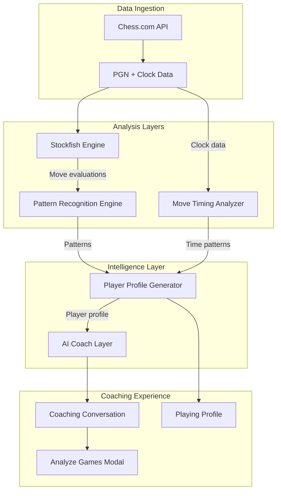
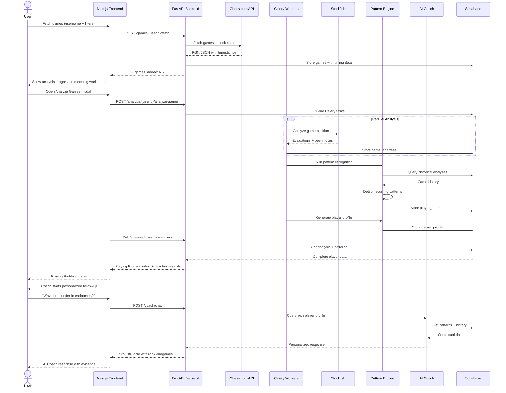
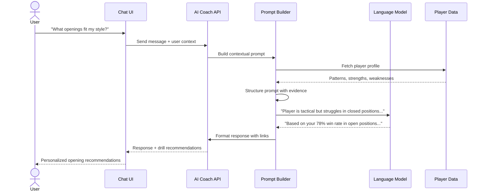

# FRD - ChessRun (Product & Functional Requirements)

## 1. Product Overview

### 1.1 Vision

> **MVP direction:** [`CHESSRUN_MVP_UX.md`](./CHESSRUN_MVP_UX.md) is the canonical product definition for the current launch scope. ChessRun is an AI chess coach whose primary interface is conversation. Dashboard, report, and training-mode concepts in this FRD are future-facing unless explicitly described in the MVP UX document.

ChessRun is an **AI chess coach** that uses game analysis to personalize coaching conversations. Unlike traditional game analyzers that provide one-off engine evaluations or static reports, ChessRun builds a concise Playing Profile from a player's games and uses that context to guide a persistent coaching conversation.

ChessRun is not:
- Just a game analyzer
- Just a Stockfish wrapper  
- A chess analytics dashboard
- A report delivery product

ChessRun is:
- A **personalized AI chess coach** that learns your unique playing style
- A **behavioral pattern recognition system** that identifies recurring tendencies across hundreds of games
- A **conversational coaching system** where players receive contextual, personalized guidance

The key differentiator is **long-term pattern recognition**: The AI learns recurring patterns across a player's games and provides personalized coaching based on those longitudinal insights, not just individual game analysis.

Target users: Intermediate online players (~1000-2200 Elo) seeking personalized, actionable coaching that evolves with their play.

### 1.2 High-Level Capabilities

**Core Platform:**
- Chess.com account linking by username (no OAuth in MVP).
- Game fetching with filters: count, time control, rated/unrated, date range.
- **Chess.com is the external source of truth** for raw game data (PGNs, move history, ratings, timestamps). ChessRun fetches games on-demand or via periodic sync — it does not attempt to permanently archive all historical games.
- **Lightweight game storage** — recently fetched games are temporarily cached (configurable retention window). Stockfish analysis outputs and detected patterns are stored permanently as ChessRun's core long-term value.
- Batch analysis of games using Stockfish via Celery workers.
- Move timing and clock data ingestion for behavioral analysis.
- **Analysis depth advantage**: ChessRun's default free-tier analysis depth may exceed Chess.com's free analysis depth. This is framed not as raw depth but as **deeper analysis + personalized coaching + longitudinal intelligence**.

**Pattern Recognition Engine:**
- Long-term behavioral pattern detection across hundreds of games.
- Recurring mistake identification in similar positions.
- Opening-specific weakness detection.
- Middlegame collapse pattern recognition.
- Recurring tactical miss identification.
- Endgame weakness profiling.
- Player-specific strategic habit detection.
- Time management issue identification.
- Hesitation/overthinking pattern detection.
- Impulsive play pattern recognition.
- Strong recurring pattern identification (not just weaknesses).
- Longitudinal player profile generation.

**AI Coach / Conversational Interface:**
- Natural language Q&A about player patterns and games.
- Personalized improvement recommendations.
- Context-aware coaching explanations.
- Conversational exploration of player strengths and weaknesses.
- Persistent coaching threads where prior context can be restored.
- Pattern-aware starter suggestions and follow-up questions.

**Playing Profile:**
- Collapsible coaching context panel.
- Games analyzed.
- Patterns identified.
- Strongest area.
- Biggest bottleneck.
- Last analysis timestamp.

**Future Training Mode:**
- Pattern-specific drills based on recurring weaknesses.
- Critical moment replay with coaching context.
- Personalized study plans based on pattern analysis.

---

## 2. User Roles & Personas

### 2.1 Roles

- **Player (End User)**
  - Owns a profile (user record).
  - Links a Chess.com username.
  - Fetches games and runs analyses.
  - Consumes recommendations and training drills.

- **Admin / Support**
  - Inspects user stats and logs.
  - Triggers re-analysis.
  - Adjusts system-wide settings (Stockfish depth, limits).

- **System / Background Workers**
  - Celery workers performing heavy engine analysis and generating insights.

### 2.2 Primary User Journeys

- **First-Time Setup**
  - Enters Chess.com or Lichess username.
  - Clicks **Start Coaching**.
  - ChessRun creates or finds the user.
  - User is taken directly into the AI Coaching Interface.
  - Coach welcomes the user and explains that game analysis can build a personalized Playing Profile.
  - User opens the Analyze Games modal, selects a timeframe, and analysis runs in the background while the conversation remains available.
  - When analysis completes, the Playing Profile updates and the coach starts a personalized coaching conversation around one high-impact pattern.

- **Return Visit**
  - Lands directly in the coaching workspace.
  - Can start a new chat or reopen previous coaching conversations from the sidebar.
  - Can reopen Analyze Games from the sidebar or mobile menu.
  - Playing Profile remains persistent and collapsible.

---

## 3. Functional Requirements

### 3.1 Authentication & Identity

- **FR-AUTH-1**: Users authenticate via lightweight account (email + Chess.com username). No password in MVP.
- **FR-AUTH-2**: System uniquely identifies users by lowercase `chesscom_username`.
- **FR-AUTH-3**: On first login:
  - If user exists → "Welcome back".
  - Else → create Supabase `users` row with username, display name, email, timestamps.

### 3.2 Game Fetching

#### 3.2.1 Filters & Options

- **FR-GAMES-1**: User can choose:
  - `game_count` (10, 25, 50, 100, configurable).
  - `time_controls` (rapid, blitz, bullet, daily).
  - `rated_filter` (rated, unrated, both).
  - Optional `start_date`, `end_date`.

#### 3.2.2 Behavior

- **FR-GAMES-2**: On new fetch, app uses **replace all** semantics for that user: remove or logically archive prior games within scope. This is consistent with the lightweight cached game storage model — the user's full game history remains available on Chess.com; ChessRun maintains only the working cache needed for active analysis and coaching.
- **FR-GAMES-3**: "Start Coaching" flow:
  1. Find or create user.
  2. Open the AI Coaching Interface.
  3. Coach offers to analyze games to build a Playing Profile.
  4. User opens the Analyze Games modal and selects a timeframe.
  5. Backend fetches games and queues analysis.
  6. Conversation stays available while progress updates in the coaching workspace.
- **FR-GAMES-4**: Backend ensures idempotent storage (no duplicate games per `user_id` + external game id).

### 3.3 Coaching Workspace - Analyze Games

- **FR-ANALYZE-1**: Analyze Games is always a modal overlay, never a standalone page.
- **FR-ANALYZE-2**: The modal offers:
  - Last 7 Days.
  - Last 30 Days.
  - This Month.
  - Analyze All Games.
  - Custom Range.
- **FR-ANALYZE-3**: Click **Analyze Games** to open the modal. Click **Cancel** or outside the modal to close it. Clicking **Analyze Games** again reopens it.
- **FR-ANALYZE-4**: Desktop keeps Analyze Games visible in the sidebar. Mobile exposes it through a menu or sync action.

### 3.4 Playing Profile

- **FR-PROFILE-1**: Rename **Player Intelligence Profile** to **Playing Profile**.
- **FR-PROFILE-2**: Playing Profile is persistent across coaching sessions and collapsible in the coaching workspace.
- **FR-PROFILE-3**: Playing Profile summarizes:
  - Games Analyzed.
  - Patterns Identified.
  - Strongest Area.
  - Biggest Bottleneck.
  - Last Analysis Timestamp.
- **FR-PROFILE-4**: Playing Profile should read like a coach's scouting report, not a statistics dashboard.

### 3.5 Coaching / Recommendations

- **FR-COACH-1**: Coaching Insights panel lists 3–7 key insights:
  - Category (Opening, Middlegame, Endgame, Tactics, Strategy, Endgame Technique).
  - Headline (e.g., "You struggle to convert winning rook endgames").
  - Description (explanation in plain language).
  - Severity level (low/medium/high).
  - Recommended drill type (e.g., tactics set, endgame drill).
- **FR-COACH-2**: Insights derived from patterns:
  - Repeated blunders in similar positions.
  - High ACPL or low accuracy in specific phases.
  - Particular tactical themes frequently missed.

### 3.6 Analysis Workflow

- **FR-WORKFLOW-1**: When user clicks "Analyze All Games":
  - Frontend calls backend analysis endpoint.
  - Backend queues Celery jobs for unanalyzed games.
  - Frontend shows analyzing state and modal with queued count.
- **FR-WORKFLOW-2**: Frontend periodically polls summary/games status until:
  - All queued games show `is_analyzed = true`, or
  - Timeout / max polling attempts hit.
- **FR-WORKFLOW-3**: On completion:
  - Playing Profile updates automatically.
  - Coach sends a conversational follow-up focused on one high-impact pattern.
  - Conversation remains the primary surface for interpreting results.
- **FR-WORKFLOW-4**: Re-analysis option:
  - "Re-analyze" button for advanced users.
  - Forces backend to recompute analyses even if previously analyzed.

### 3.6.1 Auto-Analysis (Premium Feature)

- **FR-WORKFLOW-5**: Pro/Elite users can enable **automatic background analysis**:
  - System periodically fetches recent games from Chess.com (configurable interval, e.g., daily or weekly).
  - Newly fetched games are automatically queued for Stockfish analysis.
  - Pattern recognition runs automatically after analysis completes.
  - Player profile is updated incrementally.
- **FR-WORKFLOW-6**: Auto-analysis generates scheduled reports:
  - Daily or weekly coaching summary generated automatically.
  - Summary covers: new patterns detected, accuracy trends, opening performance changes.
  - Report delivered as in-app notification and optionally via email.
  - Purpose: drive retention, maintain habit loops, and keep AI memory continuously updated without requiring manual user action.
  - **Non-MVP note:** Scheduled reports are future-facing. The MVP should keep analysis output inside coaching conversations.

### 3.7 Future Training Mode

- **FR-TRAIN-0**: Training mode is not part of the ChessRun MVP. Preserve backend/domain ideas for future planning, but do not block MVP launch on drill UX or training-plan lifecycle.
- **FR-TRAIN-1**: In a future release, user can enter Training Mode from:
  - Game row ("Train this game").
  - Insight card ("Practice rook endgames").
- **FR-TRAIN-2**: Training mode includes:
  - Interactive board.
  - Move list.
  - Engine evaluation bar (optional for MVP).
- **FR-TRAIN-3**: Drill behavior:
  - For critical moments:
    - Board shows position just before user’s mistake.
    - User is prompted to choose the best move.
    - On correct move: show confirmation and explanation, then proceed.
    - On incorrect move: show feedback, engine’s best move, and allow retry.
- **FR-TRAIN-4**: Training stats:
  - Track number of drills attempted and success rate by theme.

### 3.8 Pattern Recognition Engine

The Pattern Recognition Engine is the **intelligence layer** that transforms individual game analyses into personalized coaching insights. It operates on the principle of **longitudinal analysis**—identifying recurring patterns across many games rather than evaluating single positions in isolation.

#### 3.8.1 Pattern Detection Categories

**FR-PATTERN-1: Recurring Positional Mistakes**
- Detect when user repeatedly blunders in similar position types.
- Identify structural weaknesses (e.g., weak squares, pawn structure issues).
- Example: "You have blundered material in 8 out of 15 King's Gambit middlegame positions with this pawn structure."

**FR-PATTERN-2: Opening-Specific Weaknesses**
- Track performance by opening/repertoire line.
- Detect recurring opening mistakes and conceptual gaps.
- Identify "dangerous" openings where user consistently performs poorly.
- Example: "You lose 73% of games when playing the Sicilian Dragon; consider studying this structure or switching to the Najdorf."

**FR-PATTERN-3: Middlegame Collapse Patterns**
- Identify at-risk transition points where user performance drops.
- Detect positional deterioration patterns (e.g., losing coordination, piece activity collapse).
- Example: "You consistently lose positional battles around moves 18-25 when transitioning from opening to middlegame."

**FR-PATTERN-4: Tactical Recurrence**
- Identify frequently missed tactical themes (forks, skewers, pins, discovered attacks).
- Detect "blind spots" to specific tactical patterns.
- Track improvement/deterioration in tactical recognition over time.
- Example: "You've missed knight forks in similar positions 14 times in the last 50 games."

**FR-PATTERN-5: Endgame Weaknesses**
- Detect recurring endgame technique failures (rook endgames, pawn endgames, conversion issues).
- Identify positions where user struggles to convert advantages.
- Track winning position "let-offs."
- Example: "You have drawn 6 winning rook endgames this month; your technique needs attention."

**FR-PATTERN-6: Strategic Habits**
- Identify player "style" preferences through move selection patterns.
- Detect positional vs. tactical tendencies.
- Track performance in open vs. closed positions.
- Example: "You perform significantly better in closed positions (62% win rate) vs. open tactical positions (41% win rate)."

**FR-PATTERN-7: Castling and King Safety Patterns**
- Detect delayed castling patterns and associated risks.
- Identify king safety issues in specific position types.
- Track performance after losing castling rights.
- Example: "Your win rate drops to 28% when you lose castling rights before move 15."

**FR-PATTERN-8: Strong Recurring Patterns (Strengths)**
- Identify positions/types where user consistently excels.
- Detect "signature" moves or strategic approaches.
- Recommend leveraging strengths in repertoire choices.
- Example: "You have a 78% success rate in IQP positions—this should be a core part of your middlegame repertoire."

#### 3.8.2 Pattern Scoring & Severity

**FR-PATTERN-9: Pattern Severity Levels**
- **Critical**: Pattern appears in >30% of relevant games; high impact on results.
- **Significant**: Pattern appears in 15-30% of relevant games; moderate impact.
- **Developing**: Pattern emerging in <15% of games; early warning or nascent strength.
- **Historical**: Pattern detected but showing improvement trend.

**FR-PATTERN-10: Confidence Scoring**
- Each pattern includes confidence score based on:
  - Number of games analyzed (sample size).
  - Statistical significance of the pattern.
  - Recency of games (recent patterns weighted higher).

#### 3.8.3 Longitudinal Player Profile

**FR-PATTERN-11: Player Archetype Generation**
- System generates a "player archetype" summary based on accumulated patterns.
- Combines strengths, weaknesses, and stylistic tendencies.
- Updates continuously as more games are analyzed.
- Examples: "The Tactician with Endgame Blind Spots," "The Solid Builder with Opening Gaps," "The Time Pressure Panicker."

**FR-PATTERN-12: Evolution Tracking**
- Track how patterns change over time (improvement or deterioration).
- Surface "breakthrough" moments when patterns shift.
- Identify persistent vs. resolved weaknesses.

### 3.9 Move Timing & Clock Data Analysis

ChessRun analyzes not just *what* moves were played, but *how* time was used—revealing behavioral patterns invisible to traditional engine analysis.

#### 3.9.1 Time Data Ingestion

**FR-TIMING-1: Clock Data Capture**
- Ingest move timestamps from Chess.com PGNs (when available).
- Calculate think time per move (time delta from previous move).
- Store clock remaining after each move.
- Track time spent by phase (opening, middlegame, endgame).

**FR-TIMING-2: Time Pressure Detection**
- Identify moves played under time pressure (<30 seconds remaining in blitz, <2 minutes in rapid).
- Flag "panic moves" (very quick decisions under severe time pressure).
- Track correlation between time pressure and move quality.

#### 3.9.2 Behavioral Pattern Detection

**FR-TIMING-3: Overthinking Patterns**
- Detect moves with excessive think time followed by blunders.
- Identify "paralysis by analysis" positions.
- Example: "You spent 3+ minutes on 8 positions this month and then blundered in 6 of them—consider setting a time limit for complex positions."

**FR-TIMING-4: Impulsive Play Detection**
- Flag moves played too quickly given position complexity.
- Detect "automatic" moves in critical positions.
- Track blunder rate on sub-5-second moves in non-time-pressure situations.
- Example: "You blundered on 12 moves played in under 5 seconds when you had plenty of time."

**FR-TIMING-5: Time Management Collapse**
- Identify games where user burned excessive time early and collapsed in the endgame.
- Track endgame accuracy correlation with remaining time.
- Detect "time scramble" patterns and associated errors.
- Example: "You consistently reach the endgame with <30 seconds and make 3x more errors in winning positions."

**FR-TIMING-6: Hesitation Patterns**
- Detect recurring hesitation on specific position types (e.g., tactical vs. positional decisions).
- Identify confidence patterns (quick decisive moves vs. uncertain long thinks).
- Track improvement in decision speed over time.

#### 3.9.3 Time-Based Recommendations

**FR-TIMING-7: Personalized Time Management Coaching**
- Recommend time allocation strategies based on user's specific patterns.
- Suggest thinking heuristics for positions where user overthinks.
- Flag opening repertoire lines where user consistently uses excessive time.

### 3.10 AI Coach / Conversational Interface

The AI Coach is the **primary interface** of ChessRun. It is not an add-on, dashboard widget, or report reader. It transforms raw analysis into conversational, personalized guidance.

The coach should never dump analysis results. It should identify one high-impact improvement opportunity and begin a conversation around it.

#### 3.10.1 Conversational Capabilities

**FR-AICOACH-1: Pattern-Based Questions**
Users can ask natural language questions about their patterns:
- "Why do I keep blundering in the middlegame?"
- "What openings fit my style?"
- "Why do I lose winning endgames?"
- "Show me recurring mistakes in blitz."
- "What are my biggest weaknesses?"
- "How has my play changed over the last 3 months?"

**FR-AICOACH-2: Specific Game Questions**
- "Why was move 18 a mistake?"
- "What should I have played instead of Bxf7?"
- "Was I winning at any point in this game?"
- "Why did I spend 5 minutes and still blunder here?"

**FR-AICOACH-3: Comparative Analysis**
- "How does my blitz compare to my rapid?"
- "Do I play better as White or Black?"
- "Am I improving in tactics?"

**FR-AICOACH-4: Improvement Planning**
- "Create a training plan for my endgame weaknesses."
- "What should I study next?"
- "Give me a 2-week improvement plan."
- "Recommend drills for my knight fork problem."

**FR-AICOACH-5: Opening & Repertoire Guidance**
- "What opening should I play against 1.e4?"
- "Is the Sicilian right for me?"
- "What lines should I add to my repertoire?"

#### 3.10.2 AI Coach Intelligence Requirements

**FR-AICOACH-6: Context-Aware Responses**
- AI Coach must reference user's actual patterns and data.
- Responses should include specific examples from user's games.
- Avoid generic advice—always tie to detected patterns.

**FR-AICOACH-7: Multi-Source Intelligence**
AI Coach synthesizes information from:
- Pattern Recognition Engine outputs.
- Stockfish analysis findings.
- Historical game trends.
- Time management patterns.
- Phase-based performance data.

**FR-AICOACH-8: Conversational Memory**
- Maintain context within a conversation session.
- Reference previous questions and answers in the thread.
- Build upon established player profile during conversation.

**FR-AICOACH-9: Actionable Recommendations**
- Every recommendation should be specific and actionable.
- In the MVP, recommendations should stay conversational and may suggest study themes or example positions. Direct training-drill links are future-facing.
- Suggest specific studies, ChessReps lines, or external resources when applicable.
- Prioritize recommendations by impact and feasibility.

#### 3.10.3 Explanation Quality

**FR-AICOACH-10: Human-Readable Explanations**
- Explain ideas in natural, conversational language (not chess notation heavy).
- Use analogies and conceptual explanations where helpful.
- Adapt explanation depth to user skill level.
- Include visual references to positions when relevant.

**FR-AICOACH-11: Evidence-Based Coaching**
- Cite specific evidence from user's games ("In 12 similar positions...").
- Use statistics sparingly to support coaching, not as the main output.
- Reference patterns by confidence level.
- Prefer one clear coaching theme over broad result dumps.

---

## 4. Non-Functional Requirements

### 4.1 Performance

- Single batch analysis of ~25 rapid games should typically complete within **2–5 minutes** under normal load.
- Coaching workspace initial load (conversation shell + Playing Profile summary) should be under **1.5 seconds** P95 on a typical broadband connection.

### 4.2 Scalability

- Design assumes:
  - 10k+ registered users.
  - 1M+ games stored.
  - Dozens of concurrent analysis jobs handled by Celery workers.

### 4.3 Reliability & Resilience

- If Chess.com API is unavailable or slow:
  - Frontend shows human-readable error and suggests retry.
  - Backend should not wedge; timeouts must be enforced.
- If analysis fails for individual games:
  - Mark games as `analysis_failed`.
  - Continue analyzing others.
  - Surface minimal error info in logs, not in user UI.

### 4.4 Security & Privacy

- No user passwords stored (MVP uses username + email only).
- All database connections over TLS (Supabase).
- User PGNs and analysis data are private and not visible to other users.
- API endpoints protected from obvious abuse (rate limiting, payload size limits).

---

## 5. UX & Interaction Notes

### 5.1 Landing Page

- Clear explanation of value prop.
- Simple form with:
  - Chess.com or Lichess username.
- Primary CTA: "Start Coaching".
- On submit, route directly into the AI Coaching Interface.

### 5.2 Coaching Workspace Layout

Desktop behaves similarly to ChatGPT. The conversation is the primary workspace.

Recommended layout:

1. **Sidebar**:
   - New Chat.
   - Conversation History.
   - Analyze Games in the bottom section.
2. **Conversation Workspace**:
   - Persistent chat thread.
   - Coach welcome and pattern-aware follow-ups.
   - Message composer fixed near the bottom.
3. **Playing Profile**:
   - Collapsible context panel.
   - Collapsed by default on smaller screens.
   - Summarizes coaching context rather than detailed analytics.
4. **Analyze Games Modal**:
   - Opens over the coaching workspace.
   - Offers fixed timeframe choices and custom range.
   - Does not take the user away from the conversation.

### 5.3 Empty States

- No games fetched:
  - Coach explains that analyzing games will build a personalized Playing Profile.
  - Show **Analyze Games** as the primary next action inside the coaching workspace.
- No analysis yet:
  - Keep the coach conversational and invite the user to analyze recent games.
  - Avoid empty analytics panels.

---

## 6. High-Level Flow Diagrams

### 6.1 Data Pipeline Architecture

### 6.2 Game Analysis & Pattern Recognition Flow

### 6.3 AI Coach Conversation Flow

---

## 7. Roadmap Considerations (Beyond MVP)

### 7.1 Platform Integrations
- Lichess integration.
- YouTube → PGN extraction.
- PGN upload from external sources.

### 7.2 AI Coach Enhancements
- Voice interface for AI Coach conversations.
- Real-time analysis during games (via browser extension).
- AI-generated video explanations with voice narration.
- Multi-language coaching support.

### 7.3 Pattern Recognition Expansion
- Cross-referential pattern analysis (compare with similar-rated players).
- Opening repertoire optimization based on pattern data.
- Predictive performance modeling.
- Tournament preparation mode (analyze specific opponent patterns).

### 7.4 Training & Curriculum
- Richer training curriculum and spaced repetition.
- AI-generated custom puzzle sets based on exact patterns.
- Opening repertoire builder with pattern-based recommendations.
- Integration with ChessReps for pattern-specific training lines.

### 7.5 Social & Community
- Social / sharing features (share reports, challenge friends).
- Coach-student mode (human coach reviews AI insights).
- Community pattern comparisons ("Players like you improve by...").

### 7.6 Mobile & Accessibility
- Mobile-optimized or native mobile client.
- Offline mode with sync.
- Push notifications for new pattern insights.
- Accessibility improvements (screen reader optimization).
