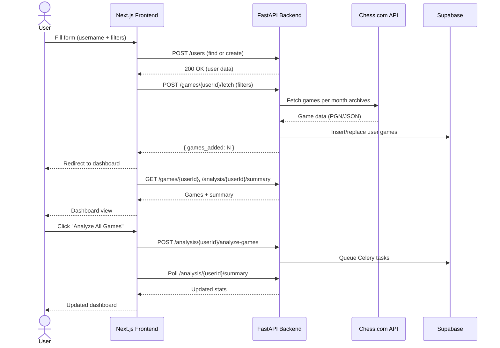

# FRD — IQChess (Product & Functional Requirements)

## 1. Product Overview

### 1.1 Vision

IQChess is a personal chess performance and coaching platform that:

- Pulls a user’s games from Chess.com (and later Lichess, YouTube, PGNs).
- Analyzes them with a strong engine (Stockfish).
- Surfaces actionable insights, not just stats:
  - Key recurring mistakes and blunders.
  - Weaknesses by phase (opening/middlegame/endgame).
  - Concrete training drills and recommendations.
- Provides a clean dashboard with fetched games, analysis summaries, and training mode.

Target users: Intermediate online players (~1000–2200 Elo) who want structured feedback.

### 1.2 High-Level Capabilities

- Chess.com account linking by username (no OAuth in MVP).
- Game fetching with filters: count, time control, rated/unrated, date range.
- Storage of games + analyses in Supabase.
- Batch analysis of games using Stockfish via Celery workers.
- Dashboard:
  - Fetched games list (collapsible).
  - Analysis summary (ACPL, accuracy, blunder/mistake counts).
  - Phase-based performance breakdown.
  - Trend insights & recommendations.
- Training mode for replaying critical moments and doing drills.

---

## 2. User Roles & Personas

### 2.1 Roles

- **Player (End User)**
  - Owns a profile (user record).
  - Links a Chess.com username.
  - Fetches games and runs analyses.
  - Consumes recommendations and training drills.

- **Admin / Support**
  - Inspects user stats and logs.
  - Triggers re-analysis.
  - Adjusts system-wide settings (Stockfish depth, limits).

- **System / Background Workers**
  - Celery workers performing heavy engine analysis and generating insights.

### 2.2 Primary User Journeys

- **First-Time Setup**
  - Enters Chess.com username and email.
  - IQChess creates or finds user.
  - User chooses filters (e.g., last 25 rapid rated games).
  - Games fetched, stored, and visible on dashboard as "Not analyzed".
  - User clicks "Analyze All Games" to start analysis.

- **Return Visit**
  - Lands directly on `/dashboard?username=…`.
  - Sees summary of performance and last analyzed period.
  - Can sync new games, re-analyze, or enter Training Mode.

---

## 3. Functional Requirements

### 3.1 Authentication & Identity

- **FR-AUTH-1**: Users authenticate via lightweight account (email + Chess.com username). No password in MVP.
- **FR-AUTH-2**: System uniquely identifies users by lowercase `chesscom_username`.
- **FR-AUTH-3**: On first login:
  - If user exists → "Welcome back".
  - Else → create Supabase `users` row with username, display name, email, timestamps.

### 3.2 Game Fetching

#### 3.2.1 Filters & Options

- **FR-GAMES-1**: User can choose:
  - `game_count` (10, 25, 50, 100, configurable).
  - `time_controls` (rapid, blitz, bullet, daily).
  - `rated_filter` (rated, unrated, both).
  - Optional `start_date`, `end_date`.

#### 3.2.2 Behavior

- **FR-GAMES-2**: On new fetch, app uses **replace all** semantics for that user: remove or logically archive prior games within scope.
- **FR-GAMES-3**: "Get Started" flow:
  1. Find or create user.
  2. POST to `games/fetch` with filters.
  3. Show progress message (e.g., "Fetching your games…").
  4. On success, toast the number of fetched games.
  5. Redirect to `/dashboard?username={username}`.
- **FR-GAMES-4**: Backend ensures idempotent storage (no duplicate games per `user_id` + external game id).

### 3.3 Dashboard – Fetched Games

- **FR-DASH-GAMES-1**: Dashboard displays **Fetched Games** section:
  - Title: "Fetched Games".
  - Subtext: `{N} games` (N = number of games stored for that user).
- **FR-DASH-GAMES-2**: Each game card shows:
  - Opponent username.
  - Result (Win/Loss/Draw with icon).
  - Time control.
  - Rated/unrated.
  - Date/time.
  - Link to Chess.com game.
  - Badge: `Not analyzed` or `Analyzed`.
- **FR-DASH-GAMES-3**: Section is **collapsible**:
  - Default expanded.
  - Clicking header toggles collapsed/expanded state.
- **FR-DASH-GAMES-4**: Top-right actions:
  - "Analyze All Games" button.
  - Disabled if:
    - Analysis currently running, or
    - All games already analyzed.

### 3.4 Dashboard – Analysis Summary & Insights

- **FR-ANALYSIS-1**: Summary panel shows:
  - Total games analyzed (in last N days or globally, configurable).
  - Overall accuracy metric (0–100).
  - Win/draw/loss distribution.
  - ACPL trend or last-period vs previous-period comparison.
- **FR-ANALYSIS-2**: Phase-based breakdown:
  - Opening, middlegame, endgame scores (0–100 or graded A–E).
  - Phase-level blunders/mistakes/inaccuracies.
- **FR-ANALYSIS-3**: Move-quality chart (pie or stacked bar) summarizing:
  - Best, excellent, good, inaccuracy, mistake, blunder.

### 3.5 Coaching / Recommendations

- **FR-COACH-1**: Coaching Insights panel lists 3–7 key insights:
  - Category (Opening, Middlegame, Endgame, Tactics, Strategy, Endgame Technique).
  - Headline (e.g., "You struggle to convert winning rook endgames").
  - Description (explanation in plain language).
  - Severity level (low/medium/high).
  - Recommended drill type (e.g., tactics set, endgame drill).
- **FR-COACH-2**: Insights derived from patterns:
  - Repeated blunders in similar positions.
  - High ACPL or low accuracy in specific phases.
  - Particular tactical themes frequently missed.

### 3.6 Analysis Workflow

- **FR-WORKFLOW-1**: When user clicks "Analyze All Games":
  - Frontend calls backend analysis endpoint.
  - Backend queues Celery jobs for unanalyzed games.
  - Frontend shows analyzing state and modal with queued count.
- **FR-WORKFLOW-2**: Frontend periodically polls summary/games status until:
  - All queued games show `is_analyzed = true`, or
  - Timeout / max polling attempts hit.
- **FR-WORKFLOW-3**: On completion:
  - Modal closes.
  - Dashboard summary and game list update.
  - Toast notification that analysis finished.
- **FR-WORKFLOW-4**: Re-analysis option:
  - "Re-analyze" button for advanced users.
  - Forces backend to recompute analyses even if previously analyzed.

### 3.7 Training Mode

- **FR-TRAIN-1**: User can enter Training Mode from:
  - Game row ("Train this game").
  - Insight card ("Practice rook endgames").
- **FR-TRAIN-2**: Training mode includes:
  - Interactive board.
  - Move list.
  - Engine evaluation bar (optional for MVP).
- **FR-TRAIN-3**: Drill behavior:
  - For critical moments:
    - Board shows position just before user’s mistake.
    - User is prompted to choose the best move.
    - On correct move: show confirmation and explanation, then proceed.
    - On incorrect move: show feedback, engine’s best move, and allow retry.
- **FR-TRAIN-4**: Training stats:
  - Track number of drills attempted and success rate by theme.

---

## 4. Non-Functional Requirements

### 4.1 Performance

- Single batch analysis of ~25 rapid games should typically complete within **2–5 minutes** under normal load.
- Dashboard load time (summary + games) should be under **1.5 seconds** P95 on a typical broadband connection.

### 4.2 Scalability

- Design assumes:
  - 10k+ registered users.
  - 1M+ games stored.
  - Dozens of concurrent analysis jobs handled by Celery workers.

### 4.3 Reliability & Resilience

- If Chess.com API is unavailable or slow:
  - Frontend shows human-readable error and suggests retry.
  - Backend should not wedge; timeouts must be enforced.
- If analysis fails for individual games:
  - Mark games as `analysis_failed`.
  - Continue analyzing others.
  - Surface minimal error info in logs, not in user UI.

### 4.4 Security & Privacy

- No user passwords stored (MVP uses username + email only).
- All database connections over TLS (Supabase).
- User PGNs and analysis data are private and not visible to other users.
- API endpoints protected from obvious abuse (rate limiting, payload size limits).

---

## 5. UX & Interaction Notes

### 5.1 Landing Page

- Clear explanation of value prop.
- Simple form with:
  - Chess.com username.
  - Email.
  - Filters (count, time control, rated).
- Primary CTA: "Get Started".
- Show status messages inline: "Creating account…", "Fetching your games…", etc.

### 5.2 Dashboard Layout

Recommended main sections in order:

1. **Top Bar**: Greeting and username.
2. **Key Metrics / Performance Cards**:
   - Overall accuracy.
   - ACPL.
   - Win rate.
3. **Move Quality / Phase Charts**.
4. **Coaching Insights**.
5. **Fetched Games (collapsible)**.

### 5.3 Empty States

- No games fetched:
  - Show CTA to go back to landing or "Fetch your first games" button.
- No analysis yet:
  - Show explanation and prominent "Analyze All Games" button.

---

## 6. High-Level Flow Diagram

---

## 7. Roadmap Considerations (Beyond MVP)

- Lichess integration.
- YouTube → PGN extraction.
- Richer training curriculum and spaced repetition.
- Social / sharing features (share reports, challenge friends).
- Mobile-optimized or native mobile client.
