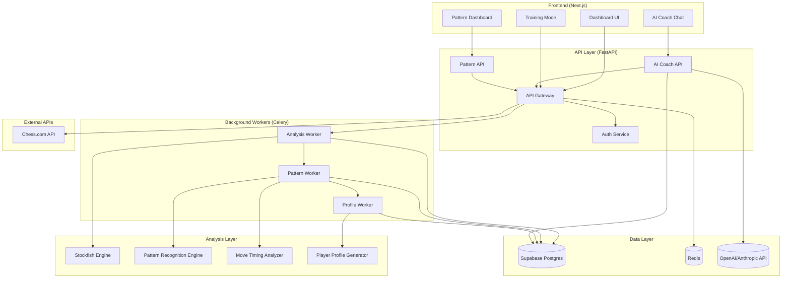
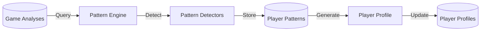
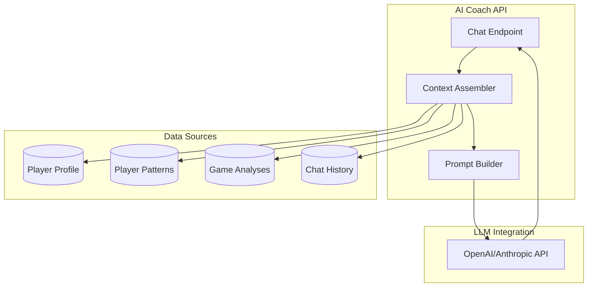
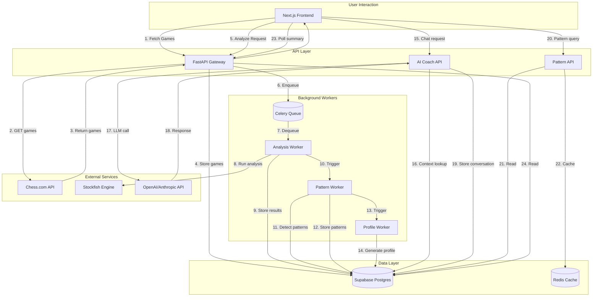

# FRD — ChessIQ (Technical / Engineering)

This document describes the **deep technical design** for ChessIQ: data model, analysis pipelines, AI services, pattern recognition, caching, workers, APIs, frontend components, testing, and failure modes.

**Architecture Philosophy:** ChessIQ uses a layered intelligence architecture that separates engine analysis (Stockfish) from pattern recognition and AI coaching. This enables:
- Reusability of Stockfish analysis for pattern detection
- Scalable pattern computation across large game histories
- Context-aware AI coaching that synthesizes multiple data sources
- Longitudinal player profile generation that improves with more data

---

## 1. Architecture Overview

### 1.1 Stack

**Frontend:**
- Next.js (React, TypeScript), React Query, Axios, TailwindCSS.
- AI Coach chat interface with streaming responses.
- Pattern visualization components.
- Interactive chess board with training mode.

**Backend Services:**
- **API Gateway**: FastAPI, SQLAlchemy, Pydantic v2.
- **Analysis Layer**: Stockfish engine wrapper.
- **Pattern Recognition Engine**: Custom pattern detection service.
- **AI Coach Service**: LLM integration with prompt engineering.
- **Background Workers**: Celery workers for distributed analysis.

**Data & Messaging:**
- **Primary Database**: Supabase Postgres (games, analyses, patterns, profiles).
- **Cache / Queue**: Redis (job queues, rate limiting, session cache).
- **Vector Store**: pgvector extension for pattern similarity search (future).

**External Services:**
- **Chess.com API — external source of truth** for raw game data (PGNs, move history, ratings, timestamps, metadata). ChessIQ fetches games on-demand or via periodic sync; it does not attempt to archive all historical games permanently.
- OpenAI/Anthropic API (AI Coach LLM hosted fallback, Elite tier only).
- Stockfish binary (engine analysis).

### 1.2 High-Level Architecture Diagram



---

## 2. Data Model (Supabase)

### 2.1 `users`

```sql
CREATE TABLE users (
  id SERIAL PRIMARY KEY,
  chesscom_username TEXT NOT NULL UNIQUE,
  display_name TEXT,
  email TEXT,
  total_games INT DEFAULT 0,
  analyzed_games INT DEFAULT 0,
  last_fetch_at TIMESTAMPTZ,
  last_analysis_at TIMESTAMPTZ,
  created_at TIMESTAMPTZ DEFAULT NOW(),
  updated_at TIMESTAMPTZ DEFAULT NOW()
);
CREATE INDEX idx_users_username_lower
  ON users (LOWER(chesscom_username));
```

### 2.2 `games`

**Storage philosophy:** The `games` table is a **lightweight temporary cache**, not a permanent chess archive. Chess.com is the external source of truth for all raw game history. ChessIQ caches recently fetched games (configurable retention window, e.g., last 30–60 days) to avoid redundant API calls and support analysis, coaching context, and auto-analysis workflows. Game analyses and detected patterns — ChessIQ's core intelligence — are stored permanently and never purged.

```sql
CREATE TABLE games (
  id BIGSERIAL PRIMARY KEY,
  user_id INT NOT NULL REFERENCES users(id) ON DELETE CASCADE,
  external_id TEXT NOT NULL,
  pgn TEXT NOT NULL,
  time_class TEXT NOT NULL,
  rated BOOLEAN NOT NULL,
  white_username TEXT NOT NULL,
  black_username TEXT NOT NULL,
  white_result TEXT,
  black_result TEXT,
  end_time TIMESTAMPTZ,
  chesscom_url TEXT,
  is_analyzed BOOLEAN DEFAULT FALSE,
  created_at TIMESTAMPTZ DEFAULT NOW(),
  updated_at TIMESTAMPTZ DEFAULT NOW(),
  UNIQUE (user_id, external_id)
);
CREATE INDEX idx_games_user_time
  ON games (user_id, end_time DESC);
```

### 2.3 `game_analyses`

```sql
CREATE TABLE game_analyses (
  id BIGSERIAL PRIMARY KEY,
  game_id BIGINT NOT NULL REFERENCES games(id) ON DELETE CASCADE,
  user_id INT NOT NULL REFERENCES users(id) ON DELETE CASCADE,
  acpl DOUBLE PRECISION,
  accuracy_score DOUBLE PRECISION,
  eval_opening DOUBLE PRECISION,
  eval_middlegame DOUBLE PRECISION,
  eval_endgame DOUBLE PRECISION,
  blunders INT DEFAULT 0,
  mistakes INT DEFAULT 0,
  inaccuracies INT DEFAULT 0,
  phase_blunders_opening INT DEFAULT 0,
  phase_blunders_middlegame INT DEFAULT 0,
  phase_blunders_endgame INT DEFAULT 0,
  tactical_themes JSONB,
  positional_themes JSONB,
  critical_moments JSONB, -- array of objects
  created_at TIMESTAMPTZ DEFAULT NOW()
);
CREATE INDEX idx_game_analyses_user
  ON game_analyses (user_id, created_at DESC);
```

### 2.4 `user_insights`

```sql
CREATE TABLE user_insights (
  id BIGSERIAL PRIMARY KEY,
  user_id INT NOT NULL REFERENCES users(id) ON DELETE CASCADE,
  period_days INT NOT NULL,
  summary_json JSONB NOT NULL,
  recommendations JSONB NOT NULL,
  created_at TIMESTAMPTZ DEFAULT NOW()
);
CREATE INDEX idx_user_insights_user
  ON user_insights (user_id, created_at DESC);
```

### 2.5 `move_timing_data` (NEW)

Stores clock and timing information for behavioral analysis.

```sql
CREATE TABLE move_timing_data (
  id BIGSERIAL PRIMARY KEY,
  game_id BIGINT NOT NULL REFERENCES games(id) ON DELETE CASCADE,
  user_id INT NOT NULL REFERENCES users(id) ON DELETE CASCADE,
  move_number INT NOT NULL,
  color TEXT NOT NULL, -- 'white' or 'black'
  think_time_seconds FLOAT, -- calculated from clock data
  clock_remaining_seconds FLOAT,
  time_pressure BOOLEAN DEFAULT FALSE,
  is_book_move BOOLEAN DEFAULT FALSE,
  phase TEXT NOT NULL, -- 'opening', 'middlegame', 'endgame'
  created_at TIMESTAMPTZ DEFAULT NOW()
);
CREATE INDEX idx_timing_user_game
  ON move_timing_data (user_id, game_id, move_number);
CREATE INDEX idx_timing_pressure
  ON move_timing_data (user_id, time_pressure) WHERE time_pressure = TRUE;
```

### 2.6 `player_patterns` (NEW)

Stores detected recurring patterns across a player's games.

```sql
CREATE TABLE player_patterns (
  id BIGSERIAL PRIMARY KEY,
  user_id INT NOT NULL REFERENCES users(id) ON DELETE CASCADE,
  pattern_type TEXT NOT NULL, -- 'tactical', 'positional', 'opening', 'endgame', 'time_management', 'castling'
  pattern_subtype TEXT NOT NULL, -- e.g., 'knight_fork', 'rook_endgame', 'sicilian_dragon'
  severity TEXT NOT NULL, -- 'critical', 'significant', 'developing', 'historical'
  confidence_score FLOAT NOT NULL, -- 0.0 to 1.0
  occurrence_count INT NOT NULL, -- how many times seen
  affected_games_count INT NOT NULL, -- how many games affected
  affected_games_ratio FLOAT NOT NULL, -- ratio of affected games
  pattern_description TEXT NOT NULL,
  example_positions JSONB, -- array of {game_id, move_number, fen, explanation}
  first_seen_at TIMESTAMPTZ,
  last_seen_at TIMESTAMPTZ,
  trend_direction TEXT, -- 'improving', 'stable', 'declining'
  is_strength BOOLEAN DEFAULT FALSE, -- TRUE if this is a strength, FALSE if weakness
  recommended_drill_type TEXT,
  created_at TIMESTAMPTZ DEFAULT NOW(),
  updated_at TIMESTAMPTZ DEFAULT NOW(),
  UNIQUE (user_id, pattern_type, pattern_subtype)
);
CREATE INDEX idx_patterns_user
  ON player_patterns (user_id, severity, confidence_score DESC);
CREATE INDEX idx_patterns_type
  ON player_patterns (pattern_type, pattern_subtype);
CREATE INDEX idx_patterns_strength
  ON player_patterns (user_id, is_strength, confidence_score DESC);
```

### 2.7 `player_profiles` (NEW)

Longitudinal player profile that aggregates all patterns and stats.

```sql
CREATE TABLE player_profiles (
  id BIGSERIAL PRIMARY KEY,
  user_id INT NOT NULL UNIQUE REFERENCES users(id) ON DELETE CASCADE,
  archetype TEXT, -- e.g., "The Tactician with Endgame Blind Spots"
  primary_strengths JSONB, -- array of strength pattern IDs
  primary_weaknesses JSONB, -- array of weakness pattern IDs
  style_indicators JSONB, -- {positional_vs_tactical: "tactical", open_vs_closed: "open", ...}
  time_management_profile JSONB, -- {overthink_tendency: 0.7, impulsive_tendency: 0.3, ...}
  phase_performance JSONB, -- {opening: 72, middlegame: 65, endgame: 58}
  opening_repertoire JSONB, -- {successful: [...], problematic: [...]}
  tactical_themes JSONB, -- {missed_forks: 14, missed_pins: 8, ...}
  games_analyzed_count INT DEFAULT 0,
  patterns_detected_count INT DEFAULT 0,
  profile_summary TEXT, -- AI-generated summary
  generated_at TIMESTAMPTZ DEFAULT NOW(),
  updated_at TIMESTAMPTZ DEFAULT NOW()
);
CREATE INDEX idx_profile_user
  ON player_profiles (user_id, updated_at DESC);
```

### 2.8 `coach_conversations` (NEW)

Stores AI Coach conversation history.

```sql
CREATE TABLE coach_conversations (
  id BIGSERIAL PRIMARY KEY,
  user_id INT NOT NULL REFERENCES users(id) ON DELETE CASCADE,
  session_id UUID DEFAULT gen_random_uuid(),
  message_role TEXT NOT NULL, -- 'user', 'assistant', 'system'
  message_content TEXT NOT NULL,
  message_type TEXT, -- 'pattern_question', 'game_question', 'improvement_plan', 'general'
  referenced_patterns JSONB, -- array of pattern IDs referenced
  referenced_games JSONB, -- array of game IDs referenced
  prompt_tokens INT,
  completion_tokens INT,
  model_used TEXT,
  created_at TIMESTAMPTZ DEFAULT NOW()
);
CREATE INDEX idx_conversations_user
  ON coach_conversations (user_id, session_id, created_at DESC);
CREATE INDEX idx_conversations_session
  ON coach_conversations (session_id, created_at);
```

### 2.9 `pattern_examples` (NEW)

Stores specific game positions that exemplify detected patterns.

```sql
CREATE TABLE pattern_examples (
  id BIGSERIAL PRIMARY KEY,
  pattern_id BIGINT NOT NULL REFERENCES player_patterns(id) ON DELETE CASCADE,
  game_id BIGINT NOT NULL REFERENCES games(id) ON DELETE CASCADE,
  move_number INT NOT NULL,
  fen_before TEXT NOT NULL,
  fen_after TEXT,
  user_move TEXT,
  best_move TEXT,
  user_eval FLOAT,
  best_eval FLOAT,
  eval_delta FLOAT,
  context_description TEXT,
  created_at TIMESTAMPTZ DEFAULT NOW()
);
CREATE INDEX idx_examples_pattern
  ON pattern_examples (pattern_id, created_at DESC);
```

---

## 3. Backend Configuration & DB Connectivity

### 3.1 Settings

`app/core/config.py` (simplified):

```python
class Settings(BaseSettings):
    PROJECT_NAME: str = "IQChess"

    # Security
    SECRET_KEY: str
    JWT_SECRET_KEY: str = ""
    JWT_ALGORITHM: str = "HS256"
    ACCESS_TOKEN_EXPIRE_MINUTES: int = 60 * 24 * 8

    # Supabase / Postgres
    DATABASE_URL: str
    SQLALCHEMY_DATABASE_URI: str
    POSTGRES_SERVER: str = "db.kkgdxjypcvvrnqtocazc.supabase.co"
    POSTGRES_USER: str = "postgres"
    POSTGRES_PASSWORD: str
    POSTGRES_DB: str = "postgres"
    POSTGRES_PORT: int = 5432

    # Supabase API Keys
    SUPABASE_URL: str
    SUPABASE_ANON_KEY: str
    SUPABASE_SERVICE_ROLE_KEY: str

    # Redis
    REDIS_HOST: str = "localhost"
    REDIS_PORT: int = 6379
    REDIS_DB: int = 0
    REDIS_URL: str = f"redis://{REDIS_HOST}:{REDIS_PORT}/{REDIS_DB}"

    # Stockfish
    STOCKFISH_PATH: str = "/usr/games/stockfish"
    STOCKFISH_DEPTH: int = 15
    STOCKFISH_TIME: float = 1.0

    model_config = {
        "case_sensitive": True,
        "env_file": "../.env",
        "env_file_encoding": "utf-8",
    }
```

### 3.2 Database Engine

`app/core/database.py`:

```python
from sqlalchemy import create_engine
from sqlalchemy.orm import sessionmaker
from sqlalchemy.pool import StaticPool

from .config import settings

# Primary database URL
DATABASE_URL = settings.SQLALCHEMY_DATABASE_URI or settings.DATABASE_URL

if not DATABASE_URL:
    # Development fallback (rarely used once Supabase is configured)
    DATABASE_URL = "sqlite:///:memory:"
    engine = create_engine(
        DATABASE_URL,
        connect_args={"check_same_thread": False},
        poolclass=StaticPool,
    )
else:
    engine = create_engine(
        DATABASE_URL,
        pool_pre_ping=True,
    )

SessionLocal = sessionmaker(autocommit=False, autoflush=False, bind=engine)
```

---

## 4. PGN + Stockfish Analysis Pipeline

### 4.1 Overview

Pipeline executed by Celery worker per game:

1. Load `games.pgn`.
2. Parse PGN into move list using `python-chess`.
3. For each position before a move:
   - Evaluate using Stockfish (depth or time-based).
   - Determine best move and evaluation.
   - Compare user move vs engine best; compute evaluation delta.
4. Classify move quality (good/inaccuracy/mistake/blunder).
5. Aggregate stats per game and by phase.
6. Store results in `game_analyses` and mark game `is_analyzed = true`.

### 4.2 Detailed Steps

#### 4.2.1 PGN Parsing

- Use `chess.pgn.read_game()` to read PGN from text.
- Iterate moves:

```python
import chess
import chess.pgn

game = chess.pgn.read_game(io.StringIO(pgn_text))
board = game.board()

for move_number, move in enumerate(game.mainline_moves(), start=1):
    fen_before = board.fen()
    board.push(move)
    fen_after = board.fen()
    # Store fen_before, fen_after, move SAN/uci, etc.
```

#### 4.2.2 Engine Evaluation

- Wrap Stockfish with `python-chess` engine or direct UCI wrapper.
- For each `fen_before`:

```python
with chess.engine.SimpleEngine.popen_uci([settings.STOCKFISH_PATH]) as engine:
    engine.configure({"Threads": 2, "Hash": 128})

    info = engine.analyse(board, limit=chess.engine.Limit(depth=settings.STOCKFISH_DEPTH))
    score = info["score"].pov(board.turn)
    best_move = info.get("pv", [None])[0]
```

- Convert `score` to centipawns; handle mate scores.

#### 4.2.3 Move Quality Classification

Thresholds (configurable):

- `blunder`: eval_delta ≥ 200 cp or losing forced mate.
- `mistake`: eval_delta ≥ 100 cp.
- `inaccuracy`: eval_delta ≥ 50 cp.
- `good`: otherwise.

Where `eval_delta = eval_after_best - eval_after_user` from engine POV.

Store for each critical move:

```json
{
  "move_number": 23,
  "fen_before": "...",
  "user_move": "Qh5",
  "best_move": "Qd4",
  "error_type": "blunder",
  "eval_delta": 250
}
```

#### 4.2.4 ACPL & Accuracy

- **ACPL** = average of `abs(eval_after_user - eval_before)` across all user moves.
- **Accuracy** (0–100) = mapping from ACPL to accuracy. Example piecewise mapping:

```text
ACPL < 20  -> 95–100
20–50      -> 80–95
50–100     -> 60–80
>100       -> <60
```

Store in `game_analyses.acpl` and `game_analyses.accuracy_score`.

#### 4.2.5 Phase-Based Metrics

Define phases:

- Opening: moves 1–12.
- Middlegame: moves 13–30.
- Endgame: moves >30 or automatically when material is sufficiently reduced.

Per phase, compute:

- `phase_acpl`.
- `phase_blunders`, `phase_mistakes`, `phase_inaccuracies`.
- Map each phase ACPL to a 0–100 score (same as overall accuracy mapping).

---

## 5. Game Fetching & Caching

### 5.1 Chess.com Fetch Strategy

- Endpoint: `https://api.chess.com/pub/player/{username}/games/{YYYY}/{MM}`.
- Flow:
  - Determine which months to inspect based on date range and desired `game_count`.
  - Fetch in reverse chronological order until N games collected or date range exhausted.

### 5.2 Caching Layer (Redis)

- Keys:
  - `chesscom:archives:{username}:{year}:{month}` → archived JSON/PGN (TTL 1h).
  - `chesscom:rate:{username}` → integer counter of requests per minute.

- On backend fetch:
  1. Check rate key; if exceeds threshold, abort with 429-like error.
  2. Check archive key; if present, use cached data.
  3. Else call Chess.com, then cache result.

### 5.3 Replace-All Semantics

Current design: **Replace all** for user scope on new fetch.

Algorithm:

1. Start DB transaction.
2. Delete `game_analyses` for `user_id`.
3. Delete `games` for `user_id`.
4. Insert fetched games.
5. Update `users.total_games` and `users.last_fetch_at`.
6. Commit.

This avoids complex deduping at the cost of analysis reset (aligned with current product decision).

---

## 6. Analysis Orchestration (Celery + Redis)

### 6.1 Celery Configuration

`app/workers/celery_app.py` (conceptual):

```python
from celery import Celery
from app.core.config import settings

celery_app = Celery(
    "iqchess",
    broker=settings.REDIS_URL,
    backend=settings.REDIS_URL,
)

celery_app.conf.task_routes = {
    "app.workers.tasks.analyze_game": {"queue": "analysis"},
    "app.workers.tasks.aggregate_user_insights": {"queue": "insights"},
}
```

Worker command:

```bash
celery -A app.workers.celery_app worker -Q analysis,insights -l info
```

### 6.2 Tasks

#### 6.2.1 `analyze_game(game_id: int, user_id: int)`

Steps:

1. Load game from DB.
2. Run PGN + Stockfish pipeline.
3. Write `game_analyses` entry.
4. Set `games.is_analyzed = true`.
5. Increment `users.analyzed_games`.

Error handling:

- Retry on transient DB or engine errors (max 3 times, exponential backoff).
- On persistent failure, log details and set `games.is_analyzed = false`, `analysis_failed = true` (optional column).

#### 6.2.2 `aggregate_user_insights(user_id: int, days: int)`

Steps:

1. Query recent `game_analyses` for given period.
2. Aggregate metrics (ACPL, accuracy, phase scores, theme counts).
3. Generate recommendation objects (see Recommendation Logic below).
4. Write `user_insights` row.

### 6.3 Redis Usage Beyond Celery

- Rate limiting for Chess.com.
- Caching of:
  - Latest analysis summary per user (`cache:summary:{user_id}`), TTL 5–15 minutes.
  - Player profile cache (`cache:profile:{user_id}`), TTL 30 minutes.
  - Pattern detection results (`cache:patterns:{user_id}`), TTL 1 hour.
- Chat session state management.
- Rate limiting for AI Coach API calls.

---

## 7. Pattern Recognition Engine (NEW)

The Pattern Recognition Engine is a specialized service layer that analyzes `game_analyses` across a player's history to detect recurring patterns, tendencies, and behavioral traits.

### 7.1 Architecture



### 7.2 Pattern Detection Pipeline

#### 7.2.1 Trigger Conditions

- **After Analysis Completion**: When `analyze_game` task completes, trigger pattern detection for that user.
- **Scheduled Re-scan**: Daily/weekly batch re-scan for pattern evolution tracking.
- **On-Demand**: User can request pattern re-calculation from dashboard.

#### 7.2.2 Detection Categories & Algorithms

**Tactical Pattern Detection:**

```python
class TacticalPatternDetector:
    def detect(self, user_analyses: List[GameAnalysis]) -> List[Pattern]:
        patterns = []
        
        # Group blunders by tactical theme
        theme_counts = defaultdict(list)
        for analysis in user_analyses:
            for moment in analysis.critical_moments:
                if moment.error_type in ['blunder', 'mistake']:
                    theme = self.classify_tactical_theme(moment)
                    if theme:
                        theme_counts[theme].append(moment)
        
        # Identify recurring themes
        for theme, occurrences in theme_counts.items():
            if len(occurrences) >= MIN_PATTERN_THRESHOLD:
                confidence = self.calculate_confidence(occurrences, len(user_analyses))
                patterns.append(Pattern(
                    type='tactical',
                    subtype=theme,
                    occurrences=len(occurrences),
                    confidence=confidence,
                    examples=occurrences[:5]
                ))
        
        return patterns
```

**Positional Pattern Detection:**

```python
class PositionalPatternDetector:
    def detect(self, user_analyses: List[GameAnalysis]) -> List[Pattern]:
        patterns = []
        
        # Analyze by position type (open/closed, IQP, etc.)
        position_performance = defaultdict(lambda: {'wins': 0, 'losses': 0, 'acpl': []})
        
        for analysis in user_analyses:
            pos_type = self.classify_position_type(analysis)
            game_result = analysis.game.result
            
            position_performance[pos_type]['wins'] += game_result == 'win'
            position_performance[pos_type]['losses'] += game_result == 'loss'
            position_performance[pos_type]['acpl'].append(analysis.acpl)
        
        # Detect position-specific weaknesses
        for pos_type, stats in position_performance.items():
            win_rate = stats['wins'] / (stats['wins'] + stats['losses'] + 0.001)
            avg_acpl = mean(stats['acpl'])
            
            if win_rate < 0.4 and len(stats['acpl']) >= MIN_GAMES:
                patterns.append(Pattern(
                    type='positional',
                    subtype=f'struggles_in_{pos_type}',
                    win_rate=win_rate,
                    avg_acpl=avg_acpl
                ))
        
        return patterns
```

**Opening-Specific Detection:**

```python
class OpeningPatternDetector:
    def detect(self, user_analyses: List[GameAnalysis]) -> List[Pattern]:
        patterns = []
        
        # Group by opening (ECO code)
        opening_performance = defaultdict(lambda: {'games': [], 'results': []})
        
        for analysis in user_analyses:
            eco = analysis.opening_eco
            opening_performance[eco]['games'].append(analysis)
            opening_performance[eco]['results'].append(analysis.game.result)
        
        # Identify problematic openings
        for eco, data in opening_performance.items():
            games = data['games']
            results = data['results']
            
            if len(games) >= MIN_OPENING_GAMES:
                win_rate = results.count('win') / len(results)
                avg_acpl = mean([g.acpl for g in games])
                
                if win_rate < 0.35:
                    patterns.append(Pattern(
                        type='opening',
                        subtype=eco,
                        win_rate=win_rate,
                        games_analyzed=len(games),
                        is_strength=False
                    ))
                elif win_rate > 0.7:
                    patterns.append(Pattern(
                        type='opening',
                        subtype=eco,
                        win_rate=win_rate,
                        games_analyzed=len(games),
                        is_strength=True
                    ))
        
        return patterns
```

### 7.3 Pattern Scoring Algorithm

```python
def calculate_pattern_confidence(
    occurrences: int,
    total_games: int,
    recency_weight: float = 0.8,
    last_seen_days: int = None
) -> float:
    """
    Calculate confidence score for a detected pattern.
    
    Factors:
    - Sample size (more games = higher confidence)
    - Recency (recent patterns weighted higher)
    - Consistency (less variance = higher confidence)
    """
    # Base confidence from sample size
    sample_confidence = min(occurrences / 10, 1.0)  # Cap at 10+ occurrences
    
    # Prevalence ratio
    prevalence = occurrences / total_games
    prevalence_score = min(prevalence * 3, 1.0)  # 33%+ = max score
    
    # Recency decay
    recency_multiplier = 1.0
    if last_seen_days:
        if last_seen_days > 90:
            recency_multiplier = 0.5
        elif last_seen_days > 30:
            recency_multiplier = 0.8
    
    # Combined score
    confidence = (sample_confidence * 0.4 + prevalence_score * 0.6) * recency_multiplier
    
    return round(confidence, 2)
```

### 7.4 Celery Task: Pattern Detection

```python
@app.task(bind=True, max_retries=3)
def detect_patterns_for_user(self, user_id: int):
    """
    Detect all pattern types for a user after analysis completion.
    """
    try:
        # Fetch recent analyses
        analyses = get_user_analyses(user_id, days=90)
        
        if len(analyses) < 5:
            logger.info(f"Insufficient games for pattern detection: user {user_id}")
            return
        
        # Run all detectors
        detectors = [
            TacticalPatternDetector(),
            PositionalPatternDetector(),
            OpeningPatternDetector(),
            EndgamePatternDetector(),
            CastlingPatternDetector()
        ]
        
        all_patterns = []
        for detector in detectors:
            patterns = detector.detect(analyses)
            all_patterns.extend(patterns)
        
        # Store patterns
        store_patterns(user_id, all_patterns)
        
        # Update player profile
        generate_player_profile.delay(user_id)
        
    except Exception as exc:
        logger.error(f"Pattern detection failed for user {user_id}: {exc}")
        raise self.retry(exc=exc, countdown=60)
```

---

## 8. Move Timing & Behavioral Analysis (NEW)

### 8.1 Time Data Extraction

```python
class MoveTimingExtractor:
    def extract_from_pgn(self, pgn: str, user_color: str) -> List[MoveTiming]:
        """
        Extract timing data from PGN with clock annotations.
        """
        game = chess.pgn.read_game(io.StringIO(pgn))
        timings = []
        
        prev_clock = None
        for move_number, node in enumerate(game.mainline(), start=1):
            clock_str = node.clock()
            
            if clock_str is not None:
                clock_remaining = self.parse_clock(clock_str)
                
                # Calculate think time
                if prev_clock is not None:
                    think_time = prev_clock - clock_remaining
                else:
                    think_time = None
                
                # Determine phase
                phase = self.determine_phase(move_number, node.board())
                
                # Check time pressure
                time_pressure = self.is_time_pressure(clock_remaining, game.time_control)
                
                timings.append(MoveTiming(
                    move_number=move_number,
                    think_time_seconds=think_time,
                    clock_remaining_seconds=clock_remaining,
                    time_pressure=time_pressure,
                    phase=phase
                ))
                
                prev_clock = clock_remaining
        
        return timings
```

### 8.2 Behavioral Pattern Detection

```python
class TimingPatternDetector:
    def detect(self, user_timings: List[MoveTiming]) -> TimingPatterns:
        patterns = TimingPatterns()
        
        # Overthinking detection
        long_thinks = [t for t in user_timings if t.think_time_seconds > 120]
        patterns.overthink_tendency = len(long_thinks) / len(user_timings)
        
        # Impulsive play detection
        quick_moves = [t for t in user_timings 
                      if t.think_time_seconds < 5 and not t.is_book_move]
        patterns.impulsive_tendency = len(quick_moves) / len(user_timings)
        
        # Time pressure collapse
        pressure_moves = [t for t in user_timings if t.time_pressure]
        patterns.time_pressure_ratio = len(pressure_moves) / len(user_timings)
        
        # Phase-based time distribution
        phase_times = defaultdict(list)
        for t in user_timings:
            phase_times[t.phase].append(t.think_time_seconds)
        
        patterns.phase_time_distribution = {
            phase: mean(times) for phase, times in phase_times.items()
        }
        
        return patterns
```

---

## 9. AI Coach Service (NEW)

The AI Coach Service provides conversational, personalized chess coaching by synthesizing data from the Pattern Recognition Engine, Stockfish analysis, and player history.

### 9.1 Architecture



### 9.2 Context Assembly Pipeline

```python
class CoachContextAssembler:
    def assemble_context(
        self,
        user_id: int,
        user_message: str,
        conversation_history: List[Message]
    ) -> CoachContext:
        """
        Assemble all relevant context for AI Coach response.
        """
        context = CoachContext()
        
        # 1. Player Profile
        context.player_profile = self.db.get_player_profile(user_id)
        
        # 2. Relevant Patterns (filter based on query)
        all_patterns = self.db.get_player_patterns(user_id)
        context.relevant_patterns = self.filter_patterns_by_query(
            all_patterns, user_message
        )
        
        # 3. Recent Games (if game-specific query)
        if self.is_game_specific_query(user_message):
            context.recent_games = self.db.get_recent_analyses(user_id, limit=10)
        
        # 4. Conversation History (last N messages)
        context.conversation_history = conversation_history[-5:]
        
        # 5. Query Classification
        context.query_type = self.classify_query(user_message)
        
        return context
```

### 9.3 Prompt Engineering

```python
class CoachPromptBuilder:
    def build_prompt(self, context: CoachContext) -> str:
        """
        Build structured prompt for LLM with all relevant context.
        """
        system_prompt = """You are ChessIQ, an expert chess coach AI. Your role is to provide personalized, evidence-based coaching.

Guidelines:
- Always reference the player's actual data and patterns
- Be encouraging but honest about weaknesses
- Provide specific, actionable recommendations
- Use conversational, natural language (not heavy notation)
- Include concrete examples from the player's games when relevant
- Suggest specific drills or studies when appropriate
"""

        # Build context section
        context_parts = [system_prompt]
        
        # Player archetype
        context_parts.append(f"\n## Player Profile\n")
        context_parts.append(f"Archetype: {context.player_profile.archetype}")
        context_parts.append(f"Primary Strengths: {', '.join(context.player_profile.primary_strengths)}")
        context_parts.append(f"Primary Weaknesses: {', '.join(context.player_profile.primary_weaknesses)}")
        
        # Relevant patterns
        if context.relevant_patterns:
            context_parts.append(f"\n## Relevant Patterns\n")
            for pattern in context.relevant_patterns[:3]:
                context_parts.append(
                    f"- {pattern.pattern_type}: {pattern.description} "
                    f"(seen in {pattern.affected_games_count} games, "
                    f"{pattern.confidence_score:.0%} confidence)"
                )
        
        # Add conversation history
        if context.conversation_history:
            context_parts.append(f"\n## Conversation History\n")
            for msg in context.conversation_history:
                role = "User" if msg.role == 'user' else "Coach"
                context_parts.append(f"{role}: {msg.content}")
        
        # Current question
        context_parts.append(f"\n## Current Question\n")
        context_parts.append(f"User: {context.user_message}")
        context_parts.append(f"\nCoach: ")
        
        return "\n".join(context_parts)
```

### 9.4 API Endpoints

```python
@router.post("/coach/chat")
async def chat_with_coach(
    request: CoachChatRequest,
    current_user: User = Depends(get_current_user),
    db: Session = Depends(get_db)
):
    """
    Main AI Coach chat endpoint.
    """
    # Assemble context
    assembler = CoachContextAssembler(db)
    context = assembler.assemble_context(
        user_id=current_user.id,
        user_message=request.message,
        conversation_history=request.session_id
    )
    
    # Build prompt
    prompt_builder = CoachPromptBuilder()
    prompt = prompt_builder.build_prompt(context)
    
    # Call LLM
    llm_response = await openai_client.chat.completions.create(
        model="gpt-4",
        messages=[
            {"role": "system", "content": prompt},
            {"role": "user", "content": request.message}
        ],
        temperature=0.7,
        max_tokens=1000
    )
    
    response_text = llm_response.choices[0].message.content
    
    # Store conversation
    store_conversation(
        user_id=current_user.id,
        session_id=request.session_id,
        message=request.message,
        response=response_text,
        referenced_patterns=[p.id for p in context.relevant_patterns]
    )
    
    return CoachChatResponse(
        message=response_text,
        referenced_patterns=context.relevant_patterns,
        suggested_drills=self.extract_drill_recommendations(response_text)
    )
```

### 9.5 Streaming Support (Optional Enhancement)

```python
@router.post("/coach/chat/stream")
async def chat_with_coach_stream(
    request: CoachChatRequest,
    current_user: User = Depends(get_current_user)
):
    """
    Streaming AI Coach endpoint for real-time response.
    """
    async def generate_stream():
        context = await assemble_context_async(current_user.id, request.message)
        prompt = build_prompt(context)
        
        stream = await openai_client.chat.completions.create(
            model="gpt-4",
            messages=[{"role": "user", "content": prompt}],
            stream=True
        )
        
        async for chunk in stream:
            if chunk.choices[0].delta.content:
                yield f"data: {chunk.choices[0].delta.content}\n\n"
        
        yield "data: [DONE]\n\n"
    
    return StreamingResponse(
        generate_stream(),
        media_type="text/event-stream"
    )
```

---

## 10. Updated Recommendation Logic

### 10.1 Inputs

- Set of `game_analyses` for `user_id` over last N days.
- `player_patterns` with confidence scores and severity levels.
- `player_profiles` with archetype and style indicators.
- `move_timing_data` for behavioral analysis.

**Aggregated Metrics:**
- Overall ACPL, accuracy, phase scores.
- Pattern severity and confidence distribution.
- Time management behavioral indicators.
- Trend direction (improving/stable/declining).

### 10.2 Pattern-Based Recommendation Generation

Recommendations are now generated primarily from detected patterns in `player_patterns`, not just raw game statistics.

**Priority Levels:**
1. **Critical Patterns** (severity = 'critical') → High-priority recommendations
2. **Significant Patterns** (severity = 'significant') → Medium-priority recommendations
3. **Strength Building** (is_strength = true) → Leverage and expand strengths

```python
def build_recommendations_from_patterns(
    patterns: List[PlayerPattern],
    profile: PlayerProfile
) -> List[Recommendation]:
    recs = []
    
    # Sort by severity and confidence
    sorted_patterns = sorted(
        patterns,
        key=lambda p: (p.severity != 'critical', -p.confidence_score)
    )
    
    for pattern in sorted_patterns[:7]:  # Top 7 patterns
        if pattern.is_strength:
            rec = Recommendation(
                category=f"Leverage Your {pattern.pattern_type.title()} Strength",
                title=f"You're strong at {pattern.pattern_subtype}",
                description=pattern.description,
                severity="positive",
                recommendation_type="strength_building",
                drill_type=pattern.recommended_drill_type,
                affected_games=pattern.affected_games_count,
                confidence=pattern.confidence_score
            )
        else:
            rec = Recommendation(
                category=pattern.pattern_type.title(),
                title=f"Work on {pattern.pattern_subtype}",
                description=pattern.description,
                severity=pattern.severity,
                recommendation_type="weakness_correction",
                drill_type=pattern.recommended_drill_type,
                example_positions=pattern.example_positions[:3],
                confidence=pattern.confidence_score
            )
        
        recs.append(rec)
    
    return recs
```

### 10.3 Time-Based Recommendations

```python
def build_time_management_recommendations(
    timing_patterns: TimingPatterns
) -> List[Recommendation]:
    recs = []
    
    if timing_patterns.overthink_tendency > 0.3:
        recs.append(Recommendation(
            category="Time Management",
            title="Overthinking is hurting your play",
            description=f"You spend 2+ minutes on {timing_patterns.overthink_tendency:.0%} of moves, "
                       f"but your accuracy doesn't improve with extra time. "
                       f"Practice setting a 1-minute limit for non-critical positions.",
            severity="medium",
            recommendation_type="time_management",
            drill_type="timed_decision_practice"
        ))
    
    if timing_patterns.impulsive_tendency > 0.4:
        recs.append(Recommendation(
            category="Time Management",
            title="You're playing too quickly",
            description=f"{timing_patterns.impulsive_tendency:.0%} of your moves are played in under 5 seconds. "
                       f"Force yourself to spend at least 15 seconds on every move.",
            severity="medium",
            recommendation_type="time_management",
            drill_type="slow_play_training"
        ))
    
    return recs
```

---

## 11. Frontend Architecture (Next.js)

### 11.1 Data Layer

- `frontend/src/services/api.ts` defines:
  - `users.getByUsername(username)`
  - `users.create(payload)`
  - `games.fetchRecent(userId, filters)`
  - `games.getForUser(userId, { limit })`
  - `analysis.analyzeGames(userId, { days, forceReanalysis })`
  - `analysis.getSummary(userId, days)`
  - `insights.getRecommendations(userId)`
  - `patterns.getPlayerPatterns(userId)` - Fetch detected patterns
  - `patterns.getPlayerProfile(userId)` - Fetch longitudinal profile
  - `coach.sendMessage(userId, message, sessionId)` - AI Coach chat
  - `coach.getConversationHistory(userId, sessionId)` - Chat history
  - `timing.getTimeAnalysis(userId)` - Time management insights

- Uses Axios instance configured to proxy `/api` → backend.

### 11.2 Key Pages & Components

#### 11.2.1 `pages/index.tsx`

- Handles:
  - Login/create user.
  - Filter selection.
  - Game fetch and redirect to dashboard.
- Main states:
  - `loading` (boolean).
  - `pollingStatus` (string; "Creating account…", "Fetching your games…").

#### 11.2.2 `pages/dashboard.tsx`

- Uses React Query hooks for:
  - `user` data (`api.users.getByUsername`).
  - `analysisSummary` (`api.analysis.getSummary`).
  - `playerPatterns` (`api.patterns.getPlayerPatterns`).
  - `playerProfile` (`api.patterns.getPlayerProfile`).
  - `recommendations` (`api.insights.getRecommendations`).
  - `games` (`api.games.getForUser`).
  - `timingAnalysis` (`api.timing.getTimeAnalysis`).

- UI regions:
  - **AI Coach Card**: Quick access to AI Coach with suggested questions.
  - **Pattern Summary Card**: Top 3 detected patterns (strengths/weaknesses).
  - **Player Archetype**: Visual display of chess persona.
  - **Performance cards**: ACPL, accuracy, phase scores.
  - **Phase & move-quality charts**.
  - **Coaching insights** with pattern-based drill links.
  - **Fetched Games section**:
    - Collapsible (state `gamesCollapsed`).
    - "Analyze All Games" button: calls `handleAnalyzeGames(false)`.

#### 11.2.3 `pages/patterns.tsx` (NEW)

- **Pattern Dashboard**: Comprehensive pattern visualization.
- **Components:**
  - `PatternList`: Filterable list of all detected patterns.
  - `PatternCard`: Individual pattern display with:
    - Severity badge (critical/significant/developing).
    - Confidence score progress bar.
    - Example positions from games.
    - Trend indicator (improving/stable/declining).
    - Drill recommendation link.
  - `PatternFilterBar`: Filter by type, severity, strength/weakness.
  - `PatternDetailModal`: Full pattern details with example games.
- **React Query hooks**:
  - `playerPatterns` with filtering.
  - `patternExamples` for detailed positions.

#### 11.2.4 `pages/coach.tsx` (NEW)

- **AI Coach Chat Interface**: Conversational chess coaching.
- **Components:**
  - `ChatInterface`: Main chat container.
  - `MessageBubble`: User/Coach message display.
  - `SuggestionChips`: Quick question suggestions based on patterns.
  - `PatternReferenceCard`: Inline pattern reference in chat.
  - `DrillSuggestionCard`: Inline drill recommendations.
- **Features:**
  - Session persistence (resume previous conversation).
  - Pattern-aware suggestions ("Ask about your knight fork issues").
  - Contextual game references.
  - Optional streaming responses.

#### 11.2.5 `pages/timing.tsx` (NEW)

- **Time Management Dashboard**: Behavioral analysis visualization.
- **Components:**
  - `TimeDistributionChart`: Think time by phase.
  - `TimePressureMap`: Heatmap of moves under time pressure.
  - `ThinkTimeScatterPlot`: Think time vs. accuracy correlation.
  - `BehavioralInsightsCard`: Overthinking/impulsive tendencies.
  - `TimeRecommendationList`: Personalized time management tips.

### 11.3 Component Library

#### 11.3.1 `PatternCard` (NEW)

```typescript
interface PatternCardProps {
  pattern: PlayerPattern;
  onViewDetails: () => void;
  onStartDrill: () => void;
}

// Displays pattern with visual indicators:
// - Color-coded severity badge
// - Confidence score (0-100%)
// - Occurrence count and game ratio
// - Mini FEN preview of example position
// - Trend arrow (improving/up/down)
```

#### 11.3.2 `CoachChat` (NEW)

```typescript
interface CoachChatProps {
  userId: number;
  sessionId?: string;
  initialSuggestions?: string[];
}

// Features:
// - Message threading with history
// - Markdown rendering for coach responses
// - Pattern citation links
// - Loading states with typing indicator
// - Error handling with retry
```

#### 11.3.3 `PlayerArchetypeBadge` (NEW)

```typescript
interface PlayerArchetypeBadgeProps {
  archetype: string;
  strengths: string[];
  weaknesses: string[];
}

// Visual representation of player persona:
// - Icon based on archetype
// - Strength/weakness summary
// - Style indicator bars (tactical/positional, open/closed, etc.)
```

#### 11.3.4 `InteractiveBoard` (Training Mode)

- Enhanced with pattern-specific training:
  - Input: PGN or list of SAN/UCI moves.
  - Critical moments from backend with pattern tags.
  - Pattern context overlay ("This is a knight fork opportunity").
  - Move validation against best engine move.
  - Hints based on pattern type.

---

## 12. API Specification

### 12.1 Pattern Recognition APIs

#### GET `/api/v1/patterns/{user_id}`

Fetch all detected patterns for a user.

**Query Parameters:**
- `type` (optional): Filter by pattern type ('tactical', 'positional', 'opening', 'endgame', 'time_management')
- `severity` (optional): Filter by severity ('critical', 'significant', 'developing')
- `is_strength` (optional): 'true' or 'false'
- `limit` (optional): Max patterns to return (default: 20)

**Response:**
```json
{
  "user_id": 123,
  "total_patterns": 15,
  "patterns": [
    {
      "id": 456,
      "pattern_type": "tactical",
      "pattern_subtype": "missed_knight_forks",
      "severity": "critical",
      "confidence_score": 0.87,
      "occurrence_count": 12,
      "affected_games_count": 8,
      "affected_games_ratio": 0.42,
      "pattern_description": "Missed knight fork opportunities in tactical positions",
      "trend_direction": "stable",
      "is_strength": false,
      "recommended_drill_type": "knight_fork_tactics",
      "example_positions": [
        {
          "game_id": 789,
          "move_number": 24,
          "fen": "rnbqkb1r/pppppppp/5n2/8/4P3/8/PPPP1PPP/RNBQKBNR w KQkq - 0 5",
          "explanation": "Knight fork on d5 would win material"
        }
      ],
      "first_seen_at": "2024-12-15T10:00:00Z",
      "last_seen_at": "2025-01-10T14:30:00Z"
    }
  ]
}
```

#### GET `/api/v1/patterns/{user_id}/profile`

Fetch longitudinal player profile.

**Response:**
```json
{
  "user_id": 123,
  "archetype": "The Tactician with Endgame Blind Spots",
  "primary_strengths": ["tactical_vision", "attacking_play"],
  "primary_weaknesses": ["endgame_technique", "pawn_endgames"],
  "style_indicators": {
    "positional_vs_tactical": "tactical",
    "open_vs_closed": "open",
    "aggressive_vs_conservative": "aggressive",
    "materialistic_vs_initiative": "initiative"
  },
  "time_management_profile": {
    "overthink_tendency": 0.25,
    "impulsive_tendency": 0.15,
    "time_pressure_ratio": 0.30,
    "phase_time_distribution": {
      "opening": 8.5,
      "middlegame": 45.2,
      "endgame": 12.1
    }
  },
  "phase_performance": {
    "opening": 72,
    "middlegame": 78,
    "endgame": 58
  },
  "opening_repertoire": {
    "successful": ["Sicilian Defense", "Ruy Lopez"],
    "problematic": ["French Defense"]
  },
  "tactical_themes": {
    "missed_forks": 12,
    "missed_pins": 8,
    "successful_forks": 24,
    "successful_pins": 31
  },
  "games_analyzed_count": 156,
  "patterns_detected_count": 15,
  "profile_summary": "You're a strong tactical player who thrives in open positions with attacking chances. However, your endgame technique needs significant work - you convert only 45% of winning endgames. Focus on rook and pawn endings.",
  "generated_at": "2025-01-12T08:00:00Z",
  "updated_at": "2025-01-12T08:00:00Z"
}
```

### 12.2 AI Coach APIs

#### POST `/api/v1/coach/chat`

Send message to AI Coach.

**Request:**
```json
{
  "message": "Why do I keep missing knight forks?",
  "session_id": "uuid-session-123"
}
```

**Response:**
```json
{
  "message": "Based on your game history, you've missed 12 knight fork opportunities in your last 30 games - this is a critical pattern affecting 40% of your games. Knight forks often occur when your opponent's king and a major piece (rook or queen) are on the same diagonal. The fork square is typically protected by your knight's L-shape movement...",
  "referenced_patterns": [
    {
      "id": 456,
      "type": "tactical",
      "description": "Missed knight fork opportunities"
    }
  ],
  "suggested_drills": [
    {
      "type": "knight_fork_tactics",
      "description": "Practice recognizing knight fork patterns",
      "estimated_time": "15 minutes"
    }
  ],
  "session_id": "uuid-session-123"
}
```

#### GET `/api/v1/coach/history/{session_id}`

Fetch conversation history.

**Response:**
```json
{
  "session_id": "uuid-session-123",
  "messages": [
    {
      "role": "user",
      "content": "Why do I keep missing knight forks?",
      "timestamp": "2025-01-12T10:00:00Z"
    },
    {
      "role": "assistant",
      "content": "Based on your game history, you've missed 12 knight fork opportunities...",
      "timestamp": "2025-01-12T10:00:02Z",
      "referenced_patterns": [456]
    }
  ]
}
```

#### GET `/api/v1/coach/suggestions`

Get pattern-aware question suggestions.

**Response:**
```json
{
  "suggestions": [
    {
      "type": "pattern_based",
      "text": "Why do I keep missing knight forks?",
      "pattern_id": 456
    },
    {
      "type": "opening",
      "text": "How can I improve my French Defense?",
      "pattern_id": 789
    },
    {
      "type": "general",
      "text": "What should I focus on to improve?"
    }
  ]
}
```

### 12.3 Move Timing APIs

#### GET `/api/v1/timing/{user_id}`

Fetch time management analysis.

**Response:**
```json
{
  "user_id": 123,
  "analysis_period_days": 90,
  "total_games": 45,
  "timing_patterns": {
    "overthink_tendency": 0.25,
    "impulsive_tendency": 0.15,
    "time_pressure_ratio": 0.30,
    "avg_think_time_by_phase": {
      "opening": 8.5,
      "middlegame": 45.2,
      "endgame": 12.1
    }
  },
  "think_time_accuracy_correlation": {
    "under_10_seconds": 0.58,
    "10_to_30_seconds": 0.72,
    "30_to_60_seconds": 0.78,
    "over_60_seconds": 0.74
  },
  "critical_moments_analysis": {
    "time_pressure_blunders": 8,
    "slow_think_but_blundered": 3,
    "quick_but_accurate": 24
  }
}
```

---

## 13. Testing Strategy

### 13.1 Backend

- **Unit tests**:
  - PGN parsing and move classification.
  - ACPL and accuracy calculations.
  - Phase segmentation.
- **API tests** (pytest + httpx):
  - User creation and fetching.
  - Games fetch with mocked Chess.com responses.
  - Analysis endpoints with mocked Stockfish engine.
- **Integration tests**:
  - End-to-end path: fetch games → enqueue analysis → produce summary.

### 13.2 Frontend

- **Unit/Component tests** (Jest + React Testing Library):
  - Dashboard charts render with mocked data.
  - Fetched Games list collapses/expands.
  - Analyze button states (default/disabled/analyzing).
- **E2E tests** (Playwright/Cypress, optional):
  - User flows: landing → fetch games → dashboard.

---

## 14. Failure Modes & Handling

### 14.1 Malformed PGNs

- On parse failure:
  - Log error with game id and snippet.
  - Skip analysis for that game; mark `invalid_pgn` (optional column).
  - Do not break batch analysis.

### 14.2 Invalid Video URLs (YouTube → PGN feature, future)

- Validate URL format.
- If unsupported domain or parsing service error → return 400 with message.
- Frontend shows specific error toast.

### 14.3 External Rate Limits

- Chess.com returns HTTP 429 / throttling:
  - Detect and set Redis cooldown for that username.
  - Return 503/429-style error to frontend with friendly message.

### 14.4 Supabase / DB Issues

- On connection errors:
  - Retry connection with exponential backoff.
  - Log and alert.
  - Return 503 to client with message: "Service temporarily unavailable. Please retry in a few minutes."

### 14.5 LLM Service Failures (NEW)

**Scenario:** OpenAI/Anthropic API is down or rate-limited.

- **Detection:** HTTP 429/500 from LLM provider.
- **Handling:**
  - Return cached fallback response if available.
  - Show user-friendly message: "AI Coach is temporarily unavailable. Your pattern data is still accessible in the Patterns dashboard."
  - Queue conversation for later processing if user wants to retry.
  - Implement exponential backoff for retries.

### 14.6 Pattern Detection Failures (NEW)

**Scenario:** Pattern detection fails for a user after game analysis.

- **Detection:** Celery task failure after max retries.
- **Handling:**
  - Log pattern detection failure.
  - Still show Stockfish analysis results to user.
  - Schedule retry for pattern detection after 1 hour.
  - If persistent failure, alert engineering team.

### 14.7 End-to-End Analysis Data Flow (Updated)



---

## 15. Summary

This technical FRD defines the complete architecture for ChessIQ as an AI-powered personalized chess coaching platform:

### Core Innovation: Layered Intelligence Architecture
1. **Stockfish Analysis Layer** - Position-by-position engine evaluation
2. **Pattern Recognition Engine** - Longitudinal pattern detection across game history
3. **AI Coach Service** - Conversational synthesis with context-aware prompting

### Key Technical Components

**Data Layer:**
- Extended Supabase schema with 5 new tables: `move_timing_data`, `player_patterns`, `player_profiles`, `coach_conversations`, `pattern_examples`
- JSONB columns for flexible pattern and profile storage
- Optimized indexes for pattern queries and time-series data

**Analysis Pipeline:**
- Multi-stage Celery workflow: Stockfish → Patterns → Profile → AI Coach
- Asynchronous pattern detection with confidence scoring
- Real-time profile generation and caching

**AI Integration:**
- Context assembly pipeline for personalized coaching
- Prompt engineering with player data injection
- Conversation history and session management
- Optional streaming responses for real-time chat

**API Layer:**
- Pattern recognition APIs with filtering
- AI Coach chat with pattern citations
- Time management analysis endpoints
- Comprehensive API specifications with examples

**Frontend Architecture:**
- New pages: `/patterns`, `/coach`, `/timing`
- Component library: `PatternCard`, `CoachChat`, `PlayerArchetypeBadge`
- React Query hooks for all new data sources
- Enhanced dashboard with AI Coach card and pattern summary

### Scalability & Reliability
- Redis caching for profiles (30 min TTL)
- Exponential backoff for external APIs
- Failure handling for LLM and pattern detection services
- Rate limiting on all external calls
- Comprehensive testing strategy

This architecture enables ChessIQ to provide sophisticated, personalized chess coaching at scale while maintaining technical feasibility and extensibility.
