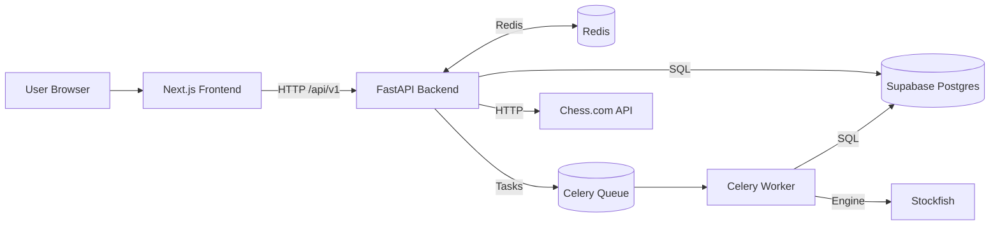
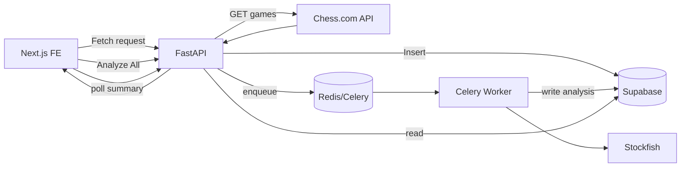

# FRD — IQChess (Technical / Engineering)

This document describes the **deep technical design** for IQChess: data model, analysis pipelines, caching, workers, APIs, frontend components, testing, and failure modes.

---

## 1. Architecture Overview

### 1.1 Stack

- **Frontend**: Next.js (React, TypeScript), React Query, Axios, TailwindCSS.
- **Backend**: FastAPI, SQLAlchemy, Pydantic v2, Celery, Redis, Stockfish.
- **Database**: Supabase Postgres.
- **Cache / Queue**: Redis.
- **Background Workers**: Celery worker container/process.

### 1.2 High-Level Architecture Diagram



---

## 2. Data Model (Supabase)

### 2.1 `users`

```sql
CREATE TABLE users (
  id SERIAL PRIMARY KEY,
  chesscom_username TEXT NOT NULL UNIQUE,
  display_name TEXT,
  email TEXT,
  total_games INT DEFAULT 0,
  analyzed_games INT DEFAULT 0,
  last_fetch_at TIMESTAMPTZ,
  last_analysis_at TIMESTAMPTZ,
  created_at TIMESTAMPTZ DEFAULT NOW(),
  updated_at TIMESTAMPTZ DEFAULT NOW()
);
CREATE INDEX idx_users_username_lower
  ON users (LOWER(chesscom_username));
```

### 2.2 `games`

```sql
CREATE TABLE games (
  id BIGSERIAL PRIMARY KEY,
  user_id INT NOT NULL REFERENCES users(id) ON DELETE CASCADE,
  external_id TEXT NOT NULL,
  pgn TEXT NOT NULL,
  time_class TEXT NOT NULL,
  rated BOOLEAN NOT NULL,
  white_username TEXT NOT NULL,
  black_username TEXT NOT NULL,
  white_result TEXT,
  black_result TEXT,
  end_time TIMESTAMPTZ,
  chesscom_url TEXT,
  is_analyzed BOOLEAN DEFAULT FALSE,
  created_at TIMESTAMPTZ DEFAULT NOW(),
  updated_at TIMESTAMPTZ DEFAULT NOW(),
  UNIQUE (user_id, external_id)
);
CREATE INDEX idx_games_user_time
  ON games (user_id, end_time DESC);
```

### 2.3 `game_analyses`

```sql
CREATE TABLE game_analyses (
  id BIGSERIAL PRIMARY KEY,
  game_id BIGINT NOT NULL REFERENCES games(id) ON DELETE CASCADE,
  user_id INT NOT NULL REFERENCES users(id) ON DELETE CASCADE,
  acpl DOUBLE PRECISION,
  accuracy_score DOUBLE PRECISION,
  eval_opening DOUBLE PRECISION,
  eval_middlegame DOUBLE PRECISION,
  eval_endgame DOUBLE PRECISION,
  blunders INT DEFAULT 0,
  mistakes INT DEFAULT 0,
  inaccuracies INT DEFAULT 0,
  phase_blunders_opening INT DEFAULT 0,
  phase_blunders_middlegame INT DEFAULT 0,
  phase_blunders_endgame INT DEFAULT 0,
  tactical_themes JSONB,
  positional_themes JSONB,
  critical_moments JSONB, -- array of objects
  created_at TIMESTAMPTZ DEFAULT NOW()
);
CREATE INDEX idx_game_analyses_user
  ON game_analyses (user_id, created_at DESC);
```

### 2.4 `user_insights`

```sql
CREATE TABLE user_insights (
  id BIGSERIAL PRIMARY KEY,
  user_id INT NOT NULL REFERENCES users(id) ON DELETE CASCADE,
  period_days INT NOT NULL,
  summary_json JSONB NOT NULL,
  recommendations JSONB NOT NULL,
  created_at TIMESTAMPTZ DEFAULT NOW()
);
CREATE INDEX idx_user_insights_user
  ON user_insights (user_id, created_at DESC);
```

---

## 3. Backend Configuration & DB Connectivity

### 3.1 Settings

`app/core/config.py` (simplified):

```python
class Settings(BaseSettings):
    PROJECT_NAME: str = "IQChess"

    # Security
    SECRET_KEY: str
    JWT_SECRET_KEY: str = ""
    JWT_ALGORITHM: str = "HS256"
    ACCESS_TOKEN_EXPIRE_MINUTES: int = 60 * 24 * 8

    # Supabase / Postgres
    DATABASE_URL: str
    SQLALCHEMY_DATABASE_URI: str
    POSTGRES_SERVER: str = "db.kkgdxjypcvvrnqtocazc.supabase.co"
    POSTGRES_USER: str = "postgres"
    POSTGRES_PASSWORD: str
    POSTGRES_DB: str = "postgres"
    POSTGRES_PORT: int = 5432

    # Supabase API Keys
    SUPABASE_URL: str
    SUPABASE_ANON_KEY: str
    SUPABASE_SERVICE_ROLE_KEY: str

    # Redis
    REDIS_HOST: str = "localhost"
    REDIS_PORT: int = 6379
    REDIS_DB: int = 0
    REDIS_URL: str = f"redis://{REDIS_HOST}:{REDIS_PORT}/{REDIS_DB}"

    # Stockfish
    STOCKFISH_PATH: str = "/usr/games/stockfish"
    STOCKFISH_DEPTH: int = 15
    STOCKFISH_TIME: float = 1.0

    model_config = {
        "case_sensitive": True,
        "env_file": "../.env",
        "env_file_encoding": "utf-8",
    }
```

### 3.2 Database Engine

`app/core/database.py`:

```python
from sqlalchemy import create_engine
from sqlalchemy.orm import sessionmaker
from sqlalchemy.pool import StaticPool

from .config import settings

# Primary database URL
DATABASE_URL = settings.SQLALCHEMY_DATABASE_URI or settings.DATABASE_URL

if not DATABASE_URL:
    # Development fallback (rarely used once Supabase is configured)
    DATABASE_URL = "sqlite:///:memory:"
    engine = create_engine(
        DATABASE_URL,
        connect_args={"check_same_thread": False},
        poolclass=StaticPool,
    )
else:
    engine = create_engine(
        DATABASE_URL,
        pool_pre_ping=True,
    )

SessionLocal = sessionmaker(autocommit=False, autoflush=False, bind=engine)
```

---

## 4. PGN + Stockfish Analysis Pipeline

### 4.1 Overview

Pipeline executed by Celery worker per game:

1. Load `games.pgn`.
2. Parse PGN into move list using `python-chess`.
3. For each position before a move:
   - Evaluate using Stockfish (depth or time-based).
   - Determine best move and evaluation.
   - Compare user move vs engine best; compute evaluation delta.
4. Classify move quality (good/inaccuracy/mistake/blunder).
5. Aggregate stats per game and by phase.
6. Store results in `game_analyses` and mark game `is_analyzed = true`.

### 4.2 Detailed Steps

#### 4.2.1 PGN Parsing

- Use `chess.pgn.read_game()` to read PGN from text.
- Iterate moves:

```python
import chess
import chess.pgn

game = chess.pgn.read_game(io.StringIO(pgn_text))
board = game.board()

for move_number, move in enumerate(game.mainline_moves(), start=1):
    fen_before = board.fen()
    board.push(move)
    fen_after = board.fen()
    # Store fen_before, fen_after, move SAN/uci, etc.
```

#### 4.2.2 Engine Evaluation

- Wrap Stockfish with `python-chess` engine or direct UCI wrapper.
- For each `fen_before`:

```python
with chess.engine.SimpleEngine.popen_uci([settings.STOCKFISH_PATH]) as engine:
    engine.configure({"Threads": 2, "Hash": 128})

    info = engine.analyse(board, limit=chess.engine.Limit(depth=settings.STOCKFISH_DEPTH))
    score = info["score"].pov(board.turn)
    best_move = info.get("pv", [None])[0]
```

- Convert `score` to centipawns; handle mate scores.

#### 4.2.3 Move Quality Classification

Thresholds (configurable):

- `blunder`: eval_delta ≥ 200 cp or losing forced mate.
- `mistake`: eval_delta ≥ 100 cp.
- `inaccuracy`: eval_delta ≥ 50 cp.
- `good`: otherwise.

Where `eval_delta = eval_after_best - eval_after_user` from engine POV.

Store for each critical move:

```json
{
  "move_number": 23,
  "fen_before": "...",
  "user_move": "Qh5",
  "best_move": "Qd4",
  "error_type": "blunder",
  "eval_delta": 250
}
```

#### 4.2.4 ACPL & Accuracy

- **ACPL** = average of `abs(eval_after_user - eval_before)` across all user moves.
- **Accuracy** (0–100) = mapping from ACPL to accuracy. Example piecewise mapping:

```text
ACPL < 20  -> 95–100
20–50      -> 80–95
50–100     -> 60–80
>100       -> <60
```

Store in `game_analyses.acpl` and `game_analyses.accuracy_score`.

#### 4.2.5 Phase-Based Metrics

Define phases:

- Opening: moves 1–12.
- Middlegame: moves 13–30.
- Endgame: moves >30 or automatically when material is sufficiently reduced.

Per phase, compute:

- `phase_acpl`.
- `phase_blunders`, `phase_mistakes`, `phase_inaccuracies`.
- Map each phase ACPL to a 0–100 score (same as overall accuracy mapping).

---

## 5. Game Fetching & Caching

### 5.1 Chess.com Fetch Strategy

- Endpoint: `https://api.chess.com/pub/player/{username}/games/{YYYY}/{MM}`.
- Flow:
  - Determine which months to inspect based on date range and desired `game_count`.
  - Fetch in reverse chronological order until N games collected or date range exhausted.

### 5.2 Caching Layer (Redis)

- Keys:
  - `chesscom:archives:{username}:{year}:{month}` → archived JSON/PGN (TTL 1h).
  - `chesscom:rate:{username}` → integer counter of requests per minute.

- On backend fetch:
  1. Check rate key; if exceeds threshold, abort with 429-like error.
  2. Check archive key; if present, use cached data.
  3. Else call Chess.com, then cache result.

### 5.3 Replace-All Semantics

Current design: **Replace all** for user scope on new fetch.

Algorithm:

1. Start DB transaction.
2. Delete `game_analyses` for `user_id`.
3. Delete `games` for `user_id`.
4. Insert fetched games.
5. Update `users.total_games` and `users.last_fetch_at`.
6. Commit.

This avoids complex deduping at the cost of analysis reset (aligned with current product decision).

---

## 6. Analysis Orchestration (Celery + Redis)

### 6.1 Celery Configuration

`app/workers/celery_app.py` (conceptual):

```python
from celery import Celery
from app.core.config import settings

celery_app = Celery(
    "iqchess",
    broker=settings.REDIS_URL,
    backend=settings.REDIS_URL,
)

celery_app.conf.task_routes = {
    "app.workers.tasks.analyze_game": {"queue": "analysis"},
    "app.workers.tasks.aggregate_user_insights": {"queue": "insights"},
}
```

Worker command:

```bash
celery -A app.workers.celery_app worker -Q analysis,insights -l info
```

### 6.2 Tasks

#### 6.2.1 `analyze_game(game_id: int, user_id: int)`

Steps:

1. Load game from DB.
2. Run PGN + Stockfish pipeline.
3. Write `game_analyses` entry.
4. Set `games.is_analyzed = true`.
5. Increment `users.analyzed_games`.

Error handling:

- Retry on transient DB or engine errors (max 3 times, exponential backoff).
- On persistent failure, log details and set `games.is_analyzed = false`, `analysis_failed = true` (optional column).

#### 6.2.2 `aggregate_user_insights(user_id: int, days: int)`

Steps:

1. Query recent `game_analyses` for given period.
2. Aggregate metrics (ACPL, accuracy, phase scores, theme counts).
3. Generate recommendation objects (see Recommendation Logic below).
4. Write `user_insights` row.

### 6.3 Redis Usage Beyond Celery

- Rate limiting for Chess.com.
- Caching of
  - latest analysis summary per user (`cache:summary:{user_id}`), TTL 5–15 minutes.

---

## 7. Recommendation Logic

### 7.1 Inputs

- Set of `game_analyses` for `user_id` over last N days.
- Aggregated:
  - Overall ACPL, accuracy.
  - Phase scores.
  - Tally of blunders/mistakes by phase.
  - Tally of `tactical_themes` and `positional_themes`.

### 7.2 Pattern Rules (Examples)

- If `phase_blunders_endgame` > threshold and accuracy_endgame < 60 →
  - Create recommendation: "Endgame technique – practice basic king and pawn, rook endgames".

- If many mistakes from `tactical_themes.fork` and `tactical_themes.skewer` →
  - Create recommendation: "Tactics – forks & skewers" with link to drill type.

- If poor opening score but good middlegame/endgame →
  - Suggest focusing on opening repertoire and memorizing key lines.

### 7.3 Implementation Sketch

```python
def build_recommendations(analyses: list[GameAnalysis]) -> list[Recommendation]:
    agg = aggregate_stats(analyses)
    recs: list[Recommendation] = []

    if agg["phase_scores"]["endgame"] < 60 and agg["phase_blunders_endgame"] > 5:
        recs.append(Recommendation(
            category="Endgame",
            title="Endgame technique needs work",
            description="You frequently lose won endgames; practice basic rook and pawn endings.",
            severity="high",
            drill_type="endgame_rook_pawn",
            params={}
        ))

    # More rules...
    return recs
```

---

## 8. Frontend Architecture (Next.js)

### 8.1 Data Layer

- `frontend/src/services/api.ts` defines:
  - `users.getByUsername(username)`
  - `users.create(payload)`
  - `games.fetchRecent(userId, filters)`
  - `games.getForUser(userId, { limit })`
  - `analysis.analyzeGames(userId, { days, forceReanalysis })`
  - `analysis.getSummary(userId, days)`
  - `insights.getRecommendations(userId)`

- Uses Axios instance configured to proxy `/api` → backend.

### 8.2 Key Pages & Components

#### 8.2.1 `pages/index.tsx`

- Handles:
  - Login/create user.
  - Filter selection.
  - Game fetch and redirect to dashboard.
- Main states:
  - `loading` (boolean).
  - `pollingStatus` (string; "Creating account…", "Fetching your games…").

#### 8.2.2 `pages/dashboard.tsx`

- Uses React Query hooks for:
  - `user` data (`api.users.getByUsername`).
  - `analysisSummary` (`api.analysis.getSummary`).
  - `recommendations` (`api.insights.getRecommendations`).
  - `games` (`api.games.getForUser`).
- UI regions:
  - Performance cards.
  - Phase & move-quality charts.
  - Coaching insights.
  - Fetched Games section:
    - Collapsible (state `gamesCollapsed`).
    - "Analyze All Games" button: calls `handleAnalyzeGames(false)`.

### 8.3 Interactive Board (Training Mode)

- Component: `InteractiveBoard` (future module).
- Inputs:
  - PGN or list of SAN/uci moves.
  - Critical moments from backend.
- Behavior:
  - Maintains `currentMoveIndex` & FEN.
  - In training mode, intercepts user moves and compares to expected best move.

---

## 9. Testing Strategy

### 9.1 Backend

- **Unit tests**:
  - PGN parsing and move classification.
  - ACPL and accuracy calculations.
  - Phase segmentation.
- **API tests** (pytest + httpx):
  - User creation and fetching.
  - Games fetch with mocked Chess.com responses.
  - Analysis endpoints with mocked Stockfish engine.
- **Integration tests**:
  - End-to-end path: fetch games → enqueue analysis → produce summary.

### 9.2 Frontend

- **Unit/Component tests** (Jest + React Testing Library):
  - Dashboard charts render with mocked data.
  - Fetched Games list collapses/expands.
  - Analyze button states (default/disabled/analyzing).
- **E2E tests** (Playwright/Cypress, optional):
  - User flows: landing → fetch games → dashboard.

---

## 10. Failure Modes & Handling

### 10.1 Malformed PGNs

- On parse failure:
  - Log error with game id and snippet.
  - Skip analysis for that game; mark `invalid_pgn` (optional column).
  - Do not break batch analysis.

### 10.2 Invalid Video URLs (YouTube → PGN feature, future)

- Validate URL format.
- If unsupported domain or parsing service error → return 400 with message.
- Frontend shows specific error toast.

### 10.3 External Rate Limits

- Chess.com returns HTTP 429 / throttling:
  - Detect and set Redis cooldown for that username.
  - Return 503/429-style error to frontend with friendly message.

### 10.4 Supabase / DB Issues

- On connection errors:
  - Use SQLAlchemy `pool_pre_ping` to detect stale connections.
  - Return 503 from API with generic "Service temporarily unavailable" message.

### 10.5 Engine Failures

- If Stockfish binary missing or crashes:
  - Fail analysis gracefully.
  - Mark all pending tasks as failed with meaningful log entry.
  - Optionally expose in admin diagnostics.

---

## 11. Performance Constraints

- **Engine configuration**:
  - Depth 15 or ~0.7–1.0s per move by default.
  - Concurrency controlled via Celery worker count and `Threads` option.
- **Batch analysis**:
  - Default max: 50 games per batch.
  - Backpressure: if queue length exceeds threshold, temporarily refuse new big batches.

---

## 12. Diagrams

### 12.1 End-to-End Analysis Data Flow



---

## 13. Summary

This technical FRD defines:

- Supabase schema for users, games, analyses, and insights.
- PGN + Stockfish analysis pipeline, including metrics and thresholds.
- Game-fetching and caching behavior with Redis-based rate limiting.
- Celery worker architecture for running heavy analysis jobs.
- API specifications for users, games, analysis, and recommendations.
- Frontend data flow and key components.
- Testing and failure-mode strategies.

These details should be sufficient for backend/frontend/AI engineers to build, extend, and scale IQChess in an enterprise-grade environment.
