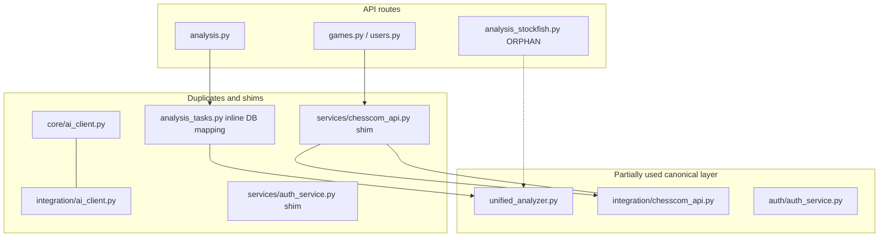
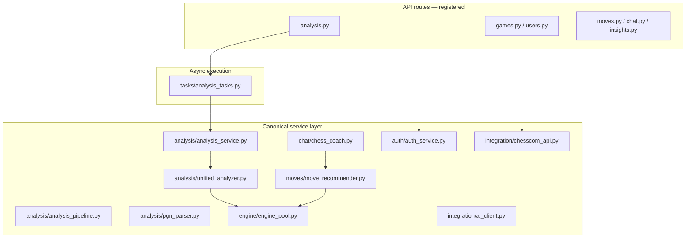

# Backend Consolidation Report

**Date:** 2026-05-26  
**Scope:** Backend architecture consolidation — remove duplicates, orphaned routes, and compatibility shims.  
**Out of scope:** New features, frontend changes, pattern recognition.

---

## Executive summary

ChessIQ’s backend had parallel implementations of the AI client, game analyzer, and analysis API, plus thin re-export shims that obscured canonical import paths. This pass **deletes dead code**, **routes all consumers to canonical services**, and **extracts analysis persistence into a single service** used by Celery tasks.

Analysis behaviour, API routes registered in `__main__.py`, Celery queue integration, and Stockfish engine pool usage are **unchanged** from a caller perspective.

---

## Before / after dependency flow

### Before (fragmented)



### After (consolidated)



---

## Removed duplicates

| Removed | Lines | Reason | Canonical replacement |
|---------|------:|--------|------------------------|
| `backend/app/core/ai_client.py` | ~292 | Identical `AIClient` to integration copy | `services/integration/ai_client.py` |
| `backend/app/services/auth_service.py` | 2 | Re-export shim | `services/auth/auth_service.py` |
| `backend/app/services/chesscom_api.py` | 2 | Re-export shim | `services/integration/chesscom_api.py` |
| `backend/app/api/analysis_stockfish.py` | ~420 | Orphan route file (never registered) | `api/analysis.py` + Celery tasks |

**Previously removed (Stockfish consolidation, same initiative):**

| Removed | Replacement |
|---------|-------------|
| `services/chess_analyzer.py` | `analysis/unified_analyzer.py` |
| `services/chess_analysis.py` | `analysis/unified_analyzer.py` |
| `services/analysis/engine_service.py` | `engine/engine_pool.py` |

---

## Canonical services (post-consolidation)

| Domain | Canonical module | Responsibility |
|--------|------------------|----------------|
| **Game analysis** | `services/analysis/unified_analyzer.py` | Stockfish move-by-move analysis via engine pool |
| **Analysis orchestration** | `services/analysis/analysis_service.py` | Run analyzer + persist `GameAnalysis` rows |
| **Classification helpers** | `services/analysis/analysis_pipeline.py` | ACPL → label mapping (used by tests/helpers) |
| **PGN utilities** | `services/analysis/pgn_parser.py` | Parse/extract moves from PGN |
| **Stockfish access** | `services/engine/engine_pool.py` | Only engine constructor |
| **Move recommendations** | `services/moves/move_recommender.py` | Position analysis for `/moves` and chat |
| **AI coach (LLM)** | `services/chat/chess_coach.py` | Intent routing; future LLM via injected client |
| **LLM providers** | `services/integration/ai_client.py` | OpenAI/OpenRouter wrapper (`get_ai_client()`) |
| **Chess.com API** | `services/integration/chesscom_api.py` | External game/profile fetch + Redis cache |
| **Auth** | `services/auth/auth_service.py` | Supabase JWT verification + user resolution |
| **Async analysis queue** | `tasks/analysis_tasks.py` | Thin Celery wrapper → `analysis_service` |

---

## Deleted / orphaned systems

| System | Status | Notes |
|--------|--------|-------|
| `api/analysis_stockfish.py` | **Deleted** | Duplicate of `analysis.py` with sync `BackgroundTasks` path; never wired in `__main__.py` |
| `core/ai_client.py` | **Deleted** | Violated FP-6 (duplicate AI client) |
| Root-level service shims | **Deleted** | Routes/tests now import canonical paths |
| Sync in-request Stockfish analysis in routes | **Already removed** | `analysis.py` returns 503 if Celery unavailable |

---

## Import standardization

| Before | After |
|--------|-------|
| `from ..services.chesscom_api import chesscom_api` | `from ..services.integration.chesscom_api import chesscom_api` |
| `from app.services.auth_service import auth_service` | `from app.services.auth.auth_service import auth_service` |
| Inline analyzer + DB mapping in `analysis_tasks.py` | `from app.services.analysis.analysis_service import ...` |
| `from ..services.analysis.unified_analyzer import ...` in routes (unused) | Removed from `analysis.py` |

Package `__init__.py` files now export explicit `__all__` lists:

- `services/analysis/__init__.py`
- `services/integration/__init__.py`
- `services/auth/__init__.py`

---

## Analysis pipeline (canonical)

```text
POST /api/v1/analysis/{user_id}/analyze/{game_id}
  → analyze_game_task.delay(game_id, user_id)          [Celery]
    → analysis_service.analyze_game_for_user()         [async]
      → UnifiedChessAnalyzer.analyze_game()          [engine pool]
    → analysis_service.persist_game_analysis()         [SQLAlchemy]
  → GameAnalysis row + game.is_analyzed = True
```

Batch path: `analyze_batch_games_task` → fans out to `analyze_game_task` (unchanged contract).

---

## Architecture improvements

1. **Single AI client** — `integration/ai_client.py` is the only `AIClient` implementation (FP-6 compliant).
2. **Single analyzer** — `UnifiedChessAnalyzer` is the only full-game analyzer; no parallel `ChessAnalyzer` / `ChessAnalysisService`.
3. **Service-layer persistence** — DB mapping logic lives in `analysis_service.py`, not duplicated across tasks and orphaned routes.
4. **No orphaned routers** — only routers in `__main__.py` are part of the supported API surface.
5. **Celery stays thin** — tasks handle retries/logging; business logic is testable in services.
6. **Engine pool preserved** — all Stockfish access still flows through `get_pooled_engine()` (see `docs/architecture/stockfish-architecture.md`).

---

## Preserved (intentionally)

| Item | Why kept |
|------|----------|
| `POST /users/` create-user endpoint | Still called by `frontend/src/lib/api.ts` (`createUser`) — behaviour delegates to link-chesscom flow |
| `AnalysisPipeline` / `PGNParser` | Used by tests and helper logic; not duplicate analyzers |
| Tier / AI-enhanced mode flags in `analysis.py` | API contract unchanged; Celery still runs Stockfish analysis |
| `ChessCoach` without wired `get_ai_client()` yet | Coach uses Stockfish via `MoveRecommender`; LLM wiring is a separate feature |

---

## Verification

```powershell
# Import smoke (from backend/)
python -c "from app.tasks.analysis_tasks import analyze_game_task; from app.services.integration.ai_client import get_ai_client; print('ok')"

# Architecture greps (requires ripgrep)
./scripts/review-loops/check-duplicates.ps1
./scripts/review-loops/check-stockfish-violations.ps1
```

Expected:

- No `backend/app/core/ai_client.py`
- No `backend/app/services/auth_service.py` or `chesscom_api.py` shims
- No `backend/app/api/analysis_stockfish.py`
- `StockfishEngine(` only in `engine_pool.py`

---

## Remaining risks / follow-ups

| Risk | Severity | Mitigation |
|------|----------|------------|
| Frontend still has legacy `createUser` POST `/users/` | Low | Endpoint preserved; prefer `/users/me/link-chesscom` in future frontend cleanup |
| `ChessCoach` does not yet call `get_ai_client()` | Low | Documented; wire when LLM coaching feature is active |
| `check-duplicates.ps1` DP-10 list references deleted shim paths | None | Script passes when files absent |
| Audit docs under `docs/audit/` describe pre-consolidation state | Info | This report supersedes for consolidation scope |

---

## Related documents

- [`../architecture/stockfish-architecture.md`](../architecture/stockfish-architecture.md)
- [`stockfish-consolidation-report.md`](./stockfish-consolidation-report.md)
- [`../architecture/repository-invariants.md`](../architecture/repository-invariants.md)
