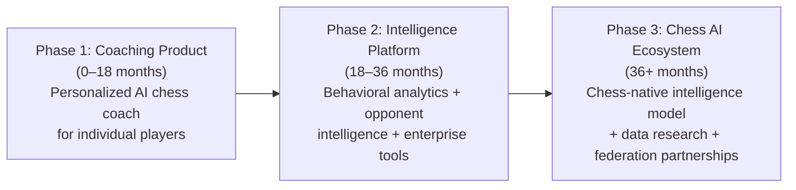
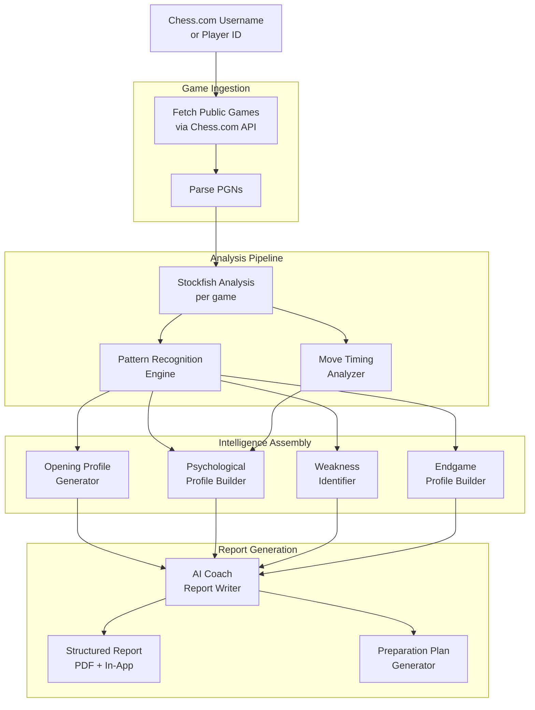
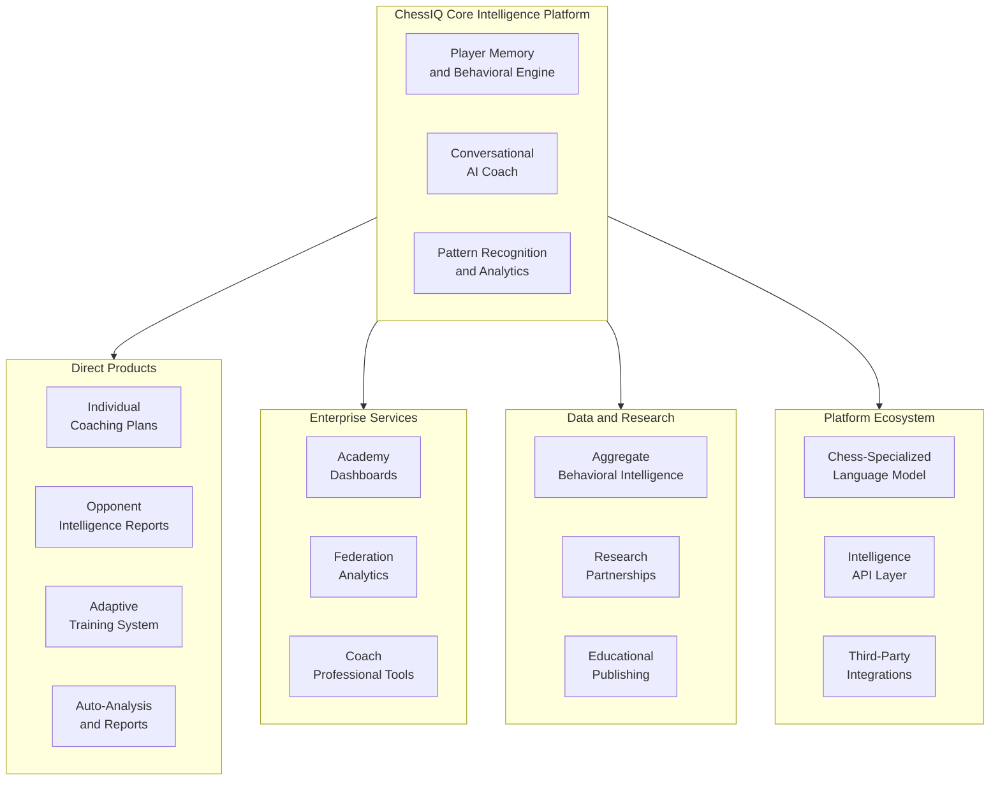
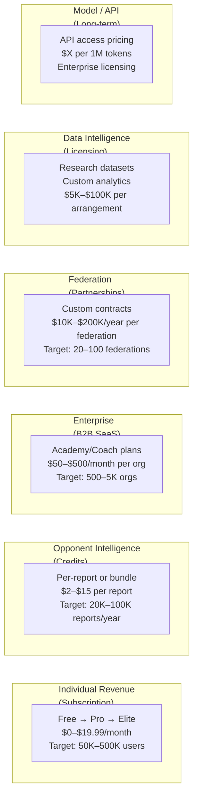

# ChessIQ — Future Services, Intelligence Expansion, and Long-Term Revenue Opportunities

**Version:** 1.0  
**Status:** Strategic Vision / Long-Range Planning  
**Audience:** Founders, Investors, Strategic Planning, Product Leadership  

---

## Executive Summary

ChessIQ launches as a personalized AI chess coaching platform. But the intelligence infrastructure it builds — longitudinal behavioral pattern recognition, structured game analytics, persistent player memory, and conversational AI grounded in chess expertise — has a surface area that extends far beyond individual coaching.

Every user interaction generates structured behavioral data: how players think under pressure, which tactical patterns they miss repeatedly, how their style evolves over months, where their decisions break down in complex positions. Aggregated carefully and analyzed at scale, this data becomes a uniquely valuable asset — one that has applications in coaching education, competitive preparation, federation analytics, research, and eventually, a foundational chess intelligence ecosystem.

This document maps that expansion: what it looks like technically, who pays for it, how it phases over time, and what ChessIQ can ultimately become.

**Core thesis:** ChessIQ is not building a chess app with AI features. It is building the behavioral memory and intelligence infrastructure for chess improvement — a platform that compounds in value the more it is used, across every user and every game.

---

## 1. Platform Evolution: From Coaching App to Chess Intelligence Ecosystem

### 1.1 The Three Phases of ChessIQ's Platform Identity

ChessIQ's long-term trajectory moves through three clearly distinct phases:

**Phase 1 — Coaching Product:**  
The product as described in the FRDs. Individual users link Chess.com, get Stockfish analysis, conversational coaching, and behavioral pattern insights. Revenue from subscription tiers.

**Phase 2 — Intelligence Platform:**  
The coaching infrastructure becomes a platform. Opponent intelligence reports, enterprise academy dashboards, aggregate behavioral analytics, and advanced training systems emerge as distinct product lines. The user base generates data that makes the platform smarter for everyone.

**Phase 3 — Chess AI Ecosystem:**  
ChessIQ's accumulated training data, fine-tuned coaching models, and behavioral intelligence position it as the foundational infrastructure layer for chess improvement at scale. Federation partnerships, research collaborations, and potentially a chess-native language model make ChessIQ the intelligence layer underneath other chess tools and services.

### 1.2 What Makes This Trajectory Credible

This is not speculative product expansion. It follows directly from what ChessIQ builds in Phase 1:

| Phase 1 Asset | Phase 2/3 Application |
|---------------|----------------------|
| Longitudinal player pattern database | Regional behavioral intelligence, research datasets |
| Opponent game history + tendency analysis | Pre-game opponent intelligence reports |
| Fine-tuned chess coaching LLM | Chess-specialized language model foundation |
| Structured Stockfish + behavioral pipeline | Enterprise academy and federation analytics |
| Per-game timing and decision data | Psychological coaching, tournament prep systems |
| Conversational coaching history | Training corpora for chess-native model fine-tuning |

The expansion is not a pivot. It is the natural monetization of infrastructure already built.

---

## 2. Regional and Global Chess Behavioral Intelligence

### 2.1 The Opportunity

ChessIQ accumulates something no other chess platform currently monetizes systematically: **structured behavioral chess data at scale** — not just win/loss records, but *how* players at specific rating bands, time controls, and regions make decisions, collapse under pressure, and develop over time.

At sufficient user scale, this data enables a new category of product: **aggregate chess behavioral intelligence** — insights about populations of players, not individuals.

### 2.2 What This Data Looks Like

As ChessIQ's user base grows across geographies and rating bands, it accumulates:

**By Rating Band:**
- Which tactical themes 1200-1400 players miss most frequently
- How decision quality degrades under time pressure at each rating band
- At what rating bands do positional concepts outperform tactical aggression
- Which endgame technique failures correlate with plateau periods

**By Geography / Region:**
- Opening preferences and popularity trends by country
- Regional stylistic tendencies (tactical vs. positional prevalence)
- Time management behavioral differences across regions
- Where aggressive gambits are overplayed vs. where positional play dominates

**By Time Control:**
- How blitz and rapid behavioral patterns differ at equivalent ratings
- Time-pressure collapse rates by rating and time control
- Which opening systems perform differently in blitz vs. classical play

**By Behavioral Archetype:**
- How "tactical" player archetypes evolve over time
- Common transition patterns: how positional players develop tactical vision
- Plateau behavior: what behavioral patterns correlate with improvement stagnation

**Example Insights:**
> "Intermediate players (1400–1600) in North America show a 31% higher rate of overextending in aggressive Sicilian sidelines compared to European equivalents, but demonstrate stronger rook endgame conversion rates."

> "Rapid players globally show a 2.4× higher blunder rate in time pressure below 30 seconds compared to blitz players at equivalent ratings, suggesting rapid players have less clock management training."

> "Players rated 1600–1800 who show opening preparation strength but endgame weakness are the most predictable improvement segment — 73% show measurable accuracy improvement within 90 days of targeted endgame drill programs."

### 2.3 How This Data Generates Value

**Research Applications:**
- Chess education researchers studying learning progression
- Cognitive science applications: chess as a model for decision-making under pressure
- Sports psychology: behavioral patterns in competitive chess
- Academic publications on chess learning methodology

**Federation Applications:**
- National federations understanding their junior player base strengths and weaknesses
- Coaching curriculum design based on regional aggregate pattern data
- Resource allocation: where coaching investment yields the highest improvement rate
- National team preparation: understanding the stylistic trends of opposing federations

**Coaching and Academy Applications:**
- Academies benchmarking their students against regional peers
- Coaches identifying curriculum gaps based on cohort-level data
- Training program effectiveness measurement

**Commercial Applications:**
- Licensing anonymized aggregate datasets to chess publishers
- Partnership with FIDE or national federations for curriculum development
- Research partnerships with universities studying decision-making

### 2.4 Privacy Architecture for Aggregate Intelligence

Aggregate behavioral intelligence must be built on a rigorous privacy-first foundation:

| Principle | Implementation |
|-----------|---------------|
| **Anonymization** | All aggregate datasets strip user identities; no individual is identifiable from aggregate reports |
| **Minimum cohort size** | No aggregate insight is published unless derived from a minimum cohort (e.g., N > 500 users per segment) |
| **Consent layering** | Users explicitly consent to anonymized data contribution during onboarding; opt-out available at any time |
| **No reverse engineering** | Aggregate datasets are structured to prevent individual identification, even through intersection attacks |
| **Audit logging** | All data access for research or partnership purposes is logged and auditable |

---

## 3. Tournament Opponent Intelligence

### 3.1 The Opportunity

Serious chess players — from club competitors to tournament regulars to professional players — spend time researching opponents before important games. This process is currently manual, time-consuming, and incomplete: downloading PGNs from Chess.com or databases, running analysis locally, and trying to identify patterns without systematic tooling.

ChessIQ can automate and productize this research: **pre-game opponent intelligence reports**.

### 3.2 What an Opponent Intelligence Report Contains

For any Chess.com user whose games are publicly available, ChessIQ can generate a structured intelligence report:

**Opening Profile:**
- Preferred openings as White and Black (by frequency and success rate)
- Known preparation depth per line (estimated from time spent in opening phase)
- Weakest secondary openings (lines with significantly lower accuracy or win rate)
- Opening novelties or transpositional tendencies
- "Dangerous lines" the opponent has prepared deeply

**Tactical and Positional Profile:**
- Tactical themes most frequently exploited by the opponent
- Tactical patterns the opponent misses or struggles against
- Positional preference profile: open vs. closed, pawn structure tendencies
- Piece activity profile: active rook play, knight outpost utilization, bishop pair exploitation

**Timing and Psychological Profile:**
- Average time consumption per phase (opening, middlegame, endgame)
- Time pressure behavior: does accuracy degrade significantly under 60 seconds?
- Clock management style: quick in book, slow in calculation positions
- Consistency under extended time pressure
- Collapse patterns: which game situations correlate with poor decisions

**Endgame Profile:**
- Success rate in different endgame types (rook, queen, pawn, bishop vs. knight)
- Conversion rate from winning endgame positions
- Defensive technique in inferior endgames

**Coaching Application of Opponent Reports:**
- Identify the specific opening lines that give the opponent the most trouble
- Identify positions where the opponent is most likely to make time pressure mistakes
- Generate a preparation plan targeting the opponent's structural weaknesses

### 3.3 Target Users and Monetization

| User Type | Use Case | Willingness to Pay |
|-----------|----------|-------------------|
| **Tournament players** | Pre-round preparation at club and open tournaments | High — coaching value equivalent to hours of manual research |
| **Professional players** | Deep preparation for rated opponents | Very high — equivalent to hiring an assistant for game preparation |
| **Coaches** | Pre-tournament student preparation, opponent scouting | High — time saving and analysis quality |
| **Chess academies** | Team tournament preparation, systematic opponent study | High — institutional procurement |
| **Chess streamers / content creators** | Content generation (opponent analysis videos, match previews) | Medium-high — content differentiation |

**Pricing Model Options:**
- Per-report credits (Free: 1 report/month, Pro: 5 reports/month, Elite: unlimited)
- Tournament pack: bulk credits for tournament weekends
- Academy plan: bulk reports for cohorts of students at managed tournaments

### 3.4 Technical Architecture

Opponent intelligence reports build directly on ChessIQ's existing analysis pipeline:

**Important consideration:** Opponent reports are generated only for publicly available game data. ChessIQ respects Chess.com's API terms and does not surface private game data. Users who opt out of Chess.com's public game sharing are not included in opponent reports.

---

## 4. Chess-Specialized Language Model

### 4.1 The Long-Term Opportunity

General-purpose language models (GPT-4, Claude, Llama) are capable chess explainers when given structured context. But they are not chess-native: they have no persistent understanding of game phases, tactical patterns, coaching progression, or chess-specific language at an architectural level.

ChessIQ's long-term trajectory — if executed deliberately — positions it to build something no one else currently has: **a conversational intelligence model that is natively chess-specialized**.

This is not a near-term claim. It is a multi-year architectural ambition with a credible pathway.

### 4.2 The Pathway: From Fine-Tuning to Chess-Native Intelligence

**Stage 1 (Current — MVP):** General instruction-tuned model (Llama 3 8B) with chess-aware prompting and structured context injection from Stockfish + pattern database. The model is a capable explainer because context is rich and structured — not because the model understands chess.

**Stage 2 (12–24 months):** Domain-adapted fine-tuning on ChessIQ's accumulated coaching conversations, pattern explanations, and structured game analyses. The model begins to develop chess-idiomatic language and coaching patterns. Performance improves on explanation quality, recommendation accuracy, and coaching continuity.

**Stage 3 (24–48 months):** If ChessIQ's user base is large enough, the coaching corpus — millions of structured coaching interactions, with feedback signals from user satisfaction and improvement metrics — becomes a proprietary training dataset. Combined with RLHF tuned specifically on coaching quality, the resulting model has meaningfully different chess coaching capability than any general model.

**Stage 4 (48+ months):** At sufficient scale, ChessIQ could pursue development or partnership on a chess-native base model: a model pre-trained or heavily adapted on chess-specific corpora (PGNs, chess books, coaching literature, pattern databases, tactical puzzles, game commentary). This model would represent a qualitatively different capability: **chess-native reasoning**, not just chess-informed explanation.

### 4.3 What a Chess-Native Model Enables

A deeply chess-specialized model goes beyond general instruction-tuning in specific, measurable ways:

| Capability | General LLM (GPT-4) | Chess-Specialized Model |
|------------|---------------------|------------------------|
| **Tactical explanation** | Accurate when given context | Accurate with less context; chess patterns are internalized |
| **Opening theory coaching** | Can explain with enough prompting | Understands move-order nuance, transpositional ideas, strategic themes natively |
| **Psychological coaching** | Generic coaching language | Chess-specific psychological patterns (clock anxiety, conversion hesitation, hyperaccelerative play) |
| **Longitudinal coaching continuity** | Context-window dependent | Can track improvement arcs, recognize plateau patterns, adapt pedagogy |
| **Tournament preparation** | Generic advice possible | Understands opponent archetypes, preparation priorities, and position-specific psychological factors |
| **Educational curriculum design** | Reasonable with enough prompting | Can generate pedagogically sequenced chess curricula based on individual profile |

### 4.4 Strategic Value of a Chess-Native Model

If ChessIQ successfully develops a chess-specialized intelligence model, it becomes a platform asset, not just a product feature:

- **License the model** to chess academies, publishers, and content platforms
- **API access** for third-party chess apps to integrate coaching intelligence
- **Embed the model** in chess game platforms (Chess.com integration, Lichess plugins)
- **Federation partnerships**: national training programs powered by the model
- **Educational publishing**: structured chess curricula generated and personalized by the model

**Positioning:** ChessIQ would be the first company to have a production-grade, validated, chess-specialized coaching intelligence model built on real coaching interactions and improvement feedback — not just a general model prompted to play chess.

### 4.5 What This Is NOT

To be clear about scope:

- This is **not** an attempt to replace Stockfish. Stockfish remains the authoritative chess calculation engine.
- This is **not** a chess-playing model. The model does not calculate moves.
- This is **not** an AGI claim. It is a domain-specialized coaching intelligence — a model that is very good at one specific, bounded task.
- The pathway is **long-term and capital-dependent**. Stage 3 and 4 require meaningful data scale and ML infrastructure investment.

---

## 5. Advanced Training Systems

### 5.1 From Insight to Systematic Improvement

ChessIQ's current coaching layer identifies patterns and generates recommendations. The natural evolution is to close the loop: not just tell users what to fix, but actively train them to fix it through structured, adaptive learning systems.

### 5.2 Adaptive Drill Generation

Current training mode offers drill replay of analyzed critical moments. The evolved version is an **adaptive training system** that generates original drills targeted at a player's specific weaknesses:

**Weakness-Targeted Puzzle Generation:**
- ChessIQ identifies that a player misses knight fork opportunities in 15-move middlegame positions
- The system generates (or curates from existing datasets) a targeted set of positions featuring exactly this pattern at the appropriate difficulty for that player's rating
- Drill difficulty scales adaptively based on performance — easier if the player fails repeatedly, harder as mastery improves
- Progress is tracked and fed back into the pattern database, updating the player's tactical profile

**Structural Weakness Drills:**
- If a player consistently collapses in rook endgames, the system generates a sequence of rook endgame positions at increasing difficulty
- Positions are selected or generated to target the specific structural sub-weakness (e.g., passive king placement rather than generic rook endgame)

**Technical Implementation:**
The drill generation system builds on the pattern database and existing Stockfish evaluation pipeline. Position selection can draw from curated databases (lichess puzzles, TCEC positions) filtered by pattern type and difficulty. For more targeted content, Stockfish can generate positions with specific structural characteristics.

### 5.3 AI Sparring System

**Concept:** An AI opponent that plays to a player's specific weaknesses — not a strong chess engine, but a pedagogically designed sparring partner.

**How it works:**
- ChessIQ's pattern database identifies the player's key weaknesses
- The AI sparring engine adjusts its play to create the specific positions and pressure points the player struggles with
- After each sparring game, the coaching layer analyzes the performance and identifies whether the player is improving in the targeted areas

**Example:**
> "Your sparring partner today will play a strong Ruy Lopez and steer toward rook endgames where you'll need to practice your king activation. The AI will not exploit your other weaknesses — today's focus is endgame technique."

This is a qualitatively different training experience from playing against Stockfish at a fixed strength — it is *pedagogically designed* sparring.

### 5.4 Personalized Opening Repertoire Builder

**Concept:** Based on a player's style profile, win/loss data by opening, and tactical/positional tendencies, ChessIQ builds a recommended opening repertoire — and then teaches it.

**Repertoire recommendation logic:**
- Player with strong tactical instincts and aggressive tendencies → King's Indian Attack, Sicilian Najdorf
- Player with strong positional foundation but weak in open complications → Queen's Gambit, Catalan
- Player with endgame strength → Exchange variations, structural simplification lines

**Repertoire learning module:**
- Flash-card style move-order learning
- Interactive board practice against common responses
- Coverage tracking: which lines has the player learned vs. which remain untested
- Update alerts when new novelties or popular sidelines emerge in the player's rating range

### 5.5 Tournament Preparation System

For players preparing for specific tournaments or opponents:

- **Opponent preparation pack:** Combine the opponent intelligence report (Section 3) with a targeted training plan
- **Time control optimization:** Identify which types of positions the player should steer toward given their time management profile vs. the opponent's
- **Psychological preparation notes:** Based on pattern data, identify the game situations where the player tends to perform best under pressure
- **Physical/session structure:** Recommended study sessions leading up to the event, sequenced by priority

### 5.6 Emotional and Timing Coaching

Chess is as much a psychological game as a technical one. ChessIQ's timing data creates the foundation for a category of coaching that is currently very hard to systematize:

**Clock Anxiety Detection:**
- Players who consume disproportionate time in certain position types regardless of complexity
- Players whose accuracy degrades non-linearly as time drops below certain thresholds
- Players who consistently blunder in time pressure vs. players who maintain accuracy

**Tilt Pattern Recognition:**
- Accuracy trends after blundering: do players recover or continue to deteriorate?
- Game-to-game carry-over: does a loss pattern affect subsequent game quality in the same session?
- Emotional regulation proxies: impulsive move patterns (very short think times) following missed opportunities

**Coaching interventions:**
- Specific time management training: practice games with enforced time constraints
- Psychological coaching language targeted at identified stress patterns
- Recommended game session length based on observed performance degradation curves

---

## 6. Enterprise and Organization Intelligence

### 6.1 The Enterprise Opportunity

Individual subscription revenue scales linearly with users. Enterprise sales can scale non-linearly: a single chess academy might represent 50–200 student accounts, and a national federation might represent thousands.

The enterprise opportunity requires adapting ChessIQ's individual coaching infrastructure into **organizational intelligence tools**: analytics for coaches, academies, and institutions rather than (or in addition to) individual players.

### 6.2 Chess Academy Platform

**Target customer:** Chess academies managing 20–500 students across skill levels and age groups.

**Product:** Academy Dashboard — a dedicated multi-user platform where coaches and academy administrators can view, analyze, and manage cohorts of students.

**Core features:**

| Feature | Description | Value |
|---------|-------------|-------|
| **Cohort Pattern Dashboard** | Aggregate pattern data across all students | Identify curriculum gaps; most students miss knight forks → adjust curriculum |
| **Individual Progress Tracking** | Per-student improvement curves over time | Coach accountability; demonstrate ROI to parents |
| **Cohort Benchmarking** | Compare cohort performance against regional peers | Positioning for academy marketing |
| **Coach Assignment** | Assign specific students to specific coaches with shared analytics | Facilitate human coach + AI coach collaboration |
| **Curriculum Intelligence** | AI-generated curriculum recommendations based on cohort weaknesses | Evidence-based teaching, not intuition |
| **Tournament Team Preparation** | Bulk opponent intelligence reports for team tournaments | Systematic team preparation |

**Pricing model:**
- Per-seat pricing: $X/student/month with volume discounts
- Academy administrator license: included per plan
- Add-on: tournament preparation packs, cohort analysis reports

### 6.3 Coach Professional Tools

**Target customer:** Independent chess coaches working with individual students.

**Problem:** Independent coaches spend significant time on analysis, reporting, and homework design. ChessIQ can automate the analytical and reporting layer, freeing coaches to focus on instruction.

**Product:** Coach Pro — a professional tier designed for coaches managing a roster of students.

**Features:**
- Student roster management with shared analytics access (student consents)
- Automated student progress reports (weekly/monthly, printable)
- Homework generation: AI-generated drill sets targeted at individual student weaknesses
- Session notes with AI-assisted coaching observations
- Progress tracking vs. coach-set goals

**Monetization:**
- Coach Pro plan: $X/month, includes up to N student accounts
- Students linked to a coach get discounted individual plans

### 6.4 Federation and National Organization Partnerships

**Target customers:** National chess federations, regional chess unions.

**What they need:**
- Data on player development across their junior base
- Training program effectiveness measurement
- National team preparation tools
- Curriculum development intelligence

**What ChessIQ offers:**
- Federation analytics dashboard: aggregate behavioral data for registered players
- Training program outcome tracking: do players in Program A improve faster than Program B?
- National style profiling: what are the systemic strengths and weaknesses of this federation's player base?
- Junior talent identification: which players show the pattern signatures of strong future development?

**Partnership model:**
- Custom enterprise agreements with federations
- Data sharing arrangement: federation provides access to their official game database; ChessIQ provides analytics infrastructure
- Co-development of national curriculum tools

### 6.5 Esports and Content Creator Tools

**Target customers:** Chess streamers, content creators, esports organizations.

**Problems:**
- Streamers need compelling content: pre-match analysis, opponent breakdowns, dramatic pattern revelations
- Esports organizations need systematic player development and matchup analysis
- Content creators need data-driven narratives

**ChessIQ offering:**
- Streamer Intelligence Pack: opponent analysis reports formatted for on-stream presentation
- Player career analytics: timeline of a player's style evolution (compelling narrative for content)
- Live game coaching overlay: analysis data formatted for broadcast context
- Matchup analysis: head-to-head behavioral data when both players are in the ChessIQ database

---

## 7. Data Intelligence and Research Partnerships

### 7.1 The Data Asset

As ChessIQ scales, it accumulates a dataset that is genuinely novel in the chess world: **structured behavioral coaching data linked to improvement outcomes**. This is different from raw game databases (which Chess.com and lichess already provide at massive scale). ChessIQ's data contains:

- Behavioral pattern classifications linked to specific games
- Improvement trajectories measured over months
- Coaching interaction outcomes (did a recommendation actually help?)
- Timing and psychological behavioral data
- Style evolution and archetype transition data

This dataset has potential value beyond ChessIQ's own products.

### 7.2 Research Partnership Opportunities

**Cognitive science and decision-making research:**
Chess is a widely used model system for studying human decision-making, pattern recognition, expertise development, and performance under pressure. ChessIQ's behavioral dataset — especially timing data, decision quality under time pressure, and improvement trajectories — is relevant to:

- Studies on how expertise develops in complex domains
- Research on decision-making under time and cognitive constraints
- Investigations into the relationship between pattern recognition and skill acquisition
- Analysis of how learning acceleration correlates with specific training interventions

**Educational research:**
- How do different coaching approaches affect skill improvement rates?
- Does targeted weakness training outperform generalized practice?
- What behavioral indicators predict rapid improvement vs. plateau?
- How does personalized coaching compare to curriculum-based instruction?

**Chess-specific research:**
- Opening evolution analysis: how do new theoretical developments propagate through different rating bands?
- Style convergence: do players at equivalent ratings increasingly converge toward similar stylistic profiles?
- Tactical vision development curves: at what rating thresholds do specific tactical patterns become consistently recognized?

### 7.3 Monetization of Data Intelligence

ChessIQ can generate revenue from its data asset through carefully structured commercial arrangements:

| Revenue Stream | Model | Notes |
|---------------|-------|-------|
| **Research dataset licensing** | One-time or annual licensing fees | Anonymized, aggregated datasets; no individual data |
| **Custom analytics reports** | Project-based consulting | Federation or publisher commissions specific research questions |
| **Academic partnerships** | Grant co-applicant or data contributor | Non-monetary, but builds reputation and validation |
| **Publisher partnerships** | Revenue share on ChessIQ-powered educational content | Chess book or curriculum publishers using ChessIQ's behavioral data |

### 7.4 Privacy and Ethics Framework

Data intelligence opportunities must be built on a rigorous, explicit ethical and privacy architecture. This is non-negotiable for both regulatory compliance and user trust.

**Principles:**

**Informed Consent:**
- Users are explicitly informed during onboarding that their anonymized game and behavioral data may contribute to aggregate research and intelligence products
- Granular consent options: users can consent to aggregate analytics while opting out of any commercial data licensing
- Consent can be withdrawn at any time; data is removed from future aggregate calculations

**Anonymization Standards:**
- All research datasets are k-anonymized (minimum k=500 per cohort segment)
- No individual player is identifiable from any exported dataset
- User IDs in research datasets are replaced with one-way hashed tokens
- Location data is coarsened to country or region level only

**Data Minimization:**
- Only data required for the specific research or intelligence purpose is exported
- Raw PGNs are never exported; only structured behavioral summaries and aggregated metrics

**Audit and Governance:**
- All commercial data arrangements are reviewed by a designated privacy officer
- Data access logs are maintained and available to users upon request
- Third-party audits of anonymization quality on an annual basis

**Regulatory compliance:**
- GDPR (EU users) — explicit consent, right to erasure, data portability
- CCPA (US users) — opt-out of data sale, transparency
- COPPA consideration — junior players (under 13) excluded from any commercial data arrangements

---

## 8. Long-Term Platform Vision

### 8.1 The Memory Layer for Chess Improvement

The most durable long-term position for ChessIQ is not as a product with features, but as **the intelligence infrastructure that underlies chess improvement**.

Just as Spotify became the memory layer for music listening — accumulating taste data and behavioral patterns that make its recommendations irreplaceable — ChessIQ can become the behavioral memory layer for chess improvement. The more a player uses ChessIQ, the more irreplaceable it becomes: years of coaching history, pattern evolution, improvement tracking, and conversational coaching context that no other platform holds.

This creates a compounding switching cost that is genuinely difficult to replicate:

| Data Accumulated | Compounding Value |
|-----------------|-------------------|
| Detected patterns over 100+ analyzed games | Deep, specific understanding of that player's chess mind |
| 12 months of improvement trajectory | Evidence-based coaching that references the player's own history |
| Coaching conversation history | Continuity — the AI coach remembers prior advice, avoids repetition |
| Style evolution data | Understanding not just where the player is, but how they've evolved |
| Strength/weakness trajectory | Context that makes future coaching faster, more targeted |

**After 12 months of use, ChessIQ knows more about a player's chess behavior than any human coach who hasn't studied that player's games systematically.** That is the durable differentiation.

### 8.2 A Conversational Chess Intelligence System

The long-term conversational experience ChessIQ is building is not a chatbot with chess knowledge. It is a **persistent conversational coaching relationship** — one that:

- Remembers everything previously discussed and analyzed
- Tracks whether prior recommendations were acted on
- Notices when improvement is happening and when plateaus occur
- Proactively surfaces relevant patterns when new games are analyzed
- Adapts its coaching style to what has worked for that player historically
- Connects current struggles to historical patterns the player may not consciously remember

This is closer to the relationship between a serious student and a long-term personal coach than to a chatbot interaction. The AI coach is not responding to queries in isolation — it is maintaining a long-term coaching relationship with a growing understanding of that specific player.

### 8.3 The Chess Intelligence Ecosystem

At full scale, ChessIQ's platform becomes the connective tissue between multiple chess improvement contexts:

In this architecture, ChessIQ's core intelligence layer powers multiple product surfaces and external integrations. Third-party chess platforms can access coaching intelligence via API. Publishers can license curricula generated by the platform. Federations can embed ChessIQ's analytics. The intelligence layer compounds in value because every surface area contributes more training data.

### 8.4 What ChessIQ Is Becoming

ChessIQ's long-term identity is best captured as:

**A persistent AI chess intelligence platform** that serves as:
- The behavioral memory for individual chess improvement
- The analytical intelligence layer for chess organizations
- The data foundation for chess education research
- Eventually, the model infrastructure underlying chess coaching at scale

This is a fundamentally different business than a chess app. It is a **compound intelligence asset** that increases in value the more it is used, by more users, over longer periods of time.

---

## 9. Revenue Opportunity Sizing

### 9.1 Revenue Surface Area

ChessIQ's expanded product surface creates multiple independent revenue streams:

### 9.2 Revenue Opportunity Sizing by Stream

| Revenue Stream | Near-Term (Y1–2) | Mid-Term (Y2–4) | Long-Term (Y4+) |
|---------------|-----------------|-----------------|-----------------|
| **Individual subscriptions** | $500K–$2M ARR | $5M–$20M ARR | $20M–$100M ARR |
| **Opponent intelligence** | Minimal (feature gate) | $200K–$1M ARR | $1M–$5M ARR |
| **Academy / Coach Pro** | Pilot programs | $500K–$2M ARR | $5M–$20M ARR |
| **Federation partnerships** | 2–5 pilot federations | $500K–$2M ARR | $2M–$10M ARR |
| **Data intelligence licensing** | Exploratory | $100K–$500K | $500K–$3M ARR |
| **Model / API licensing** | N/A | Pilot | $5M–$50M ARR |

**Total addressable revenue (long-term):** $30M–$180M+ ARR, depending on market penetration and execution across all streams.

**Note:** These figures are directional estimates, not financial projections. They are intended to illustrate the scale of the opportunity, not to serve as financial guidance.

### 9.3 Strategic Priority Sequencing

Not all revenue streams should be pursued simultaneously. The correct sequencing:

**Year 1–2:** Focus entirely on individual subscription product. Build user base, accumulate behavioral data, validate product-market fit. Introduce academy pilot programs with select partners to validate enterprise motion.

**Year 2–3:** Launch opponent intelligence reports as an upsell. Formalize first federation partnerships. Begin building Coach Pro tools. The data asset starts becoming valuable enough for exploratory research partnerships.

**Year 3–4:** Scale enterprise motion. Launch academy platform fully. Begin model fine-tuning program. Explore first data licensing arrangements (non-commercial research partnerships as proof of concept).

**Year 4+:** Evaluate chess-specialized model development based on data scale and competitive landscape. Pursue API licensing if model quality and differentiation are sufficient. Expand federation partnerships globally.

---

## 10. Strategic Considerations and Risk Factors

### 10.1 Competitive Risks

| Risk | Description | Mitigation |
|------|-------------|------------|
| **Chess.com expands coaching** | Chess.com builds a competing coaching AI with first-party game access | ChessIQ's longitudinal behavioral memory and personalization depth are not replicable quickly; proprietary coaching corpus is the moat |
| **General LLM commoditization** | GPT-5 / Claude 4 becomes good enough at chess coaching without specialization | ChessIQ's value is not in LLM capability alone — it is in the behavioral data, pattern database, and long-term player memory that powers the LLM |
| **Stockfish alternatives** | Better open-source engines emerge | ChessIQ is engine-agnostic; switching the analysis engine does not affect the intelligence layer |
| **Data privacy regulation** | Stricter data regulations limit aggregate intelligence products | Privacy-first architecture and consent system are built defensively from day one |

### 10.2 Execution Risks

| Risk | Description | Mitigation |
|------|-------------|------------|
| **Data scale dependency** | Many of these opportunities require significant user scale to be viable | Phase expansion carefully; don't build enterprise tools before individual product is validated |
| **Model quality ceiling** | Fine-tuned coaching models may not achieve sufficient quality differentiation | Maintain structured context injection as the primary quality driver; model fine-tuning improves gradually |
| **Enterprise sales complexity** | Academy and federation sales are longer cycles with more stakeholders | Build enterprise motion with a dedicated sales function; start with product-led self-service for small academies |
| **Privacy trust erosion** | Any data breach or misuse could destroy the trust required for data intelligence products | Defense-in-depth security; public privacy architecture documentation; independent audits |

### 10.3 Strategic Principles for Expansion

1. **Product quality first.** No expansion should happen before the core coaching product is compelling. A weak individual product makes every other expansion opportunity smaller.

2. **Data accumulation is the strategy.** Every user, every game, every coaching interaction makes the platform more valuable. Growth is not just a revenue target — it is the mechanism by which ChessIQ builds its moat.

3. **Privacy is foundational, not compliance.** The entire data intelligence strategy depends on user trust. Privacy architecture must be built before it is needed, not retroactively.

4. **Expand the surface area of the intelligence, not the surface area of the UI.** ChessIQ should resist building too many product surfaces too quickly. The intelligence layer should power fewer, more polished surfaces rather than many underdeveloped ones.

5. **Chess.com is a partner, not a competitor.** ChessIQ's dependency on Chess.com for game data makes a collaborative posture preferable. Potential for formal partnership, white-label analytics, or integration agreements — not adversarial competition.

---

## 11. Summary: What ChessIQ Is Building

ChessIQ begins by solving a specific problem for a specific user: helping intermediate chess players understand and fix their recurring mistakes through personalized AI coaching.

But the infrastructure it builds to solve that problem — behavioral pattern recognition at scale, persistent player memory, structured chess analytics, conversational AI grounded in chess expertise — is the foundation for a much larger platform.

The long-term opportunity is not "a better chess analyzer" or "a chess chatbot." It is:

**The behavioral intelligence layer for chess improvement** — a platform that knows more about how chess players think, improve, struggle, and develop than any tool that has existed before.

Every game analyzed, every coaching session conducted, every pattern identified makes that intelligence layer deeper and more valuable. The platform compounds. The moat widens.

The product starts as a coaching tool. The business becomes a chess intelligence platform. The long-term asset is a proprietary behavioral dataset and specialized model infrastructure that positions ChessIQ as the definitive AI infrastructure for chess development at every level of the game.

That is the opportunity this document describes. It is ambitious. It is technically grounded. And it is built on infrastructure that ChessIQ is constructing from day one.

---

**Document Version:** 1.0  
**Last Updated:** 2025-01-12  
**Next Review:** 2025-07-12  
