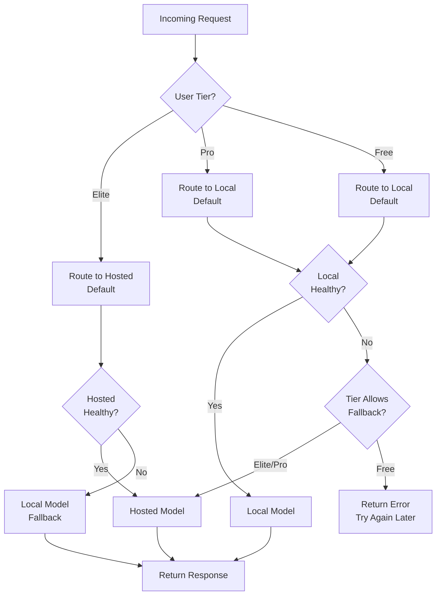

# ChessRun - Pricing Strategy, Monetization Model, and AI Cost Architecture

**Version:** 1.0  
**Status:** Strategic Framework / Business Model Definition  
**Audience:** Founders, Investors, Product Leadership, Finance, Engineering Strategy  

---

## Executive Summary

ChessRun employs a **progressive monetization strategy** that prioritizes **user adoption and product validation** before aggressive revenue extraction. The platform launches with an **Open Beta** (free) phase to build a data foundation, followed by a **Freemium** model that hooks users with genuine value, and scales through **tiered AI coaching plans** that align pricing with user improvement and coaching depth.

**Core Economic Thesis:** ChessRun's hybrid AI architecture (local-first LLM with hosted fallback) enables sustainable unit economics impossible with hosted-only competitors. This cost advantage translates to competitive pricing, higher margins, and scalable growth.

**Strategic Positioning:** ChessRun is priced as **personalized chess coaching software** (like Chessable, Duolingo, or a human coach) — not as "AI chatbot access" or "token usage." The MVP value proposition centers on persistent coaching conversations, game-analysis-informed personalization, and the Playing Profile. Training products, exports, and scheduled reports are future packaging options.

> **MVP UX authority:** [`../product/CHESSRUN_MVP_UX.md`](../product/CHESSRUN_MVP_UX.md) defines the current launch experience. Pricing should package the coaching conversation as the product; analysis and Playing Profile exist to improve coaching quality.

---

## 1. Core Strategic Principle: Adoption First, Monetization Second

### 1.1 Why Free Beta First?

ChessRun should **NOT** aggressively monetize immediately. The early priority is:

- **User adoption:** Build a critical mass of engaged players
- **Feedback collection:** Real users expose coaching gaps and AI limitations
- **Coaching refinement:** Pattern recognition improves with more game data
- **AI improvement:** RLHF pipeline requires real conversational interactions
- **Retention analysis:** Understand what drives long-term engagement
- **Behavioral pattern data collection:** More users = better pattern detection algorithms

The product needs **real users, real games, real coaching interactions, and real conversational usage** before pricing can be optimized properly.

**Premature monetization risks:**
- Price anchoring too low (hard to raise later)
- Price anchoring too high (kills adoption)
- Misaligned feature gating (users pay for wrong features)
- Unknown true value drivers (pricing based on guesses)

### 1.2 Beta → Freemium → Paid Transition Logic

```
Month 0-6:    OPEN BETA    → Maximize adoption, collect data, refine AI
Month 6-12:   FREEMIUM     → Retain users, test conversion, understand value
Month 12+:    FULL TIERS   → Scale revenue with proven model
```

Each phase builds on the previous, ensuring pricing reflects **actual user value perception**, not theoretical assumptions.

---

## 2. Phase 1 — Open Beta (Months 0-6)

### 2.1 Beta Objectives

| Objective | Target Metric |
|-----------|---------------|
| User Acquisition | 5,000-10,000 beta users |
| Engagement | 60%+ weekly active rate |
| Data Collection | 100,000+ games analyzed |
| Pattern Validation | 50,000+ pattern detections |
| AI Conversations | 25,000+ coaching interactions |
| Retention Analysis | 30-day retention rate baseline |
| Feature Prioritization | Top 10 most-used features identified |

### 2.2 Beta Feature Access

**Users receive FREE access to:**

- Chess.com account linking and game fetching
- Stockfish position analysis (depth 20)
- Basic pattern recognition (top 3 patterns)
- Conversational AI coaching (limited monthly volume)
- Analyze Games modal with MVP timeframe options
- Playing Profile (games analyzed, patterns identified, strongest area, biggest bottleneck, last analysis timestamp)
- Persistent coaching conversations

**Future, not MVP launch promises:**

- Training mode with critical moment replay
- Weekly recommendation summaries
- Export reports

### 2.3 Beta Usage Limitations

Despite being free, usage limitations exist for operational reasons:

| Limitation | Value | Rationale |
|------------|-------|-----------|
| **Analyzed Games / Month** | 30 games | Prevents abuse of compute-intensive analysis |
| **AI Coaching Chats / Month** | 20 conversations | Controls hosted fallback exposure |
| **Context Memory** | Last 5 messages | Reduces context window costs |
| **Historical Lookback** | 90 days | Limits pattern computation load |
| **Analysis Queue Priority** | Low (behind paid tiers) | Ensures paid users get priority |
| **Pattern Refresh Rate** | Weekly | Reduces computation cycles |
| **Export Capabilities** | None | Premium feature reserved |

### 2.4 Why These Limits Exist

**Cost Control:**
- Stockfish analysis at depth 20 costs ~$0.001 per game (compute time)
- 30 games × 10,000 users = $300/month — manageable for beta
- Unlimited would scale to $10K+/month with no revenue

**Infrastructure Stability:**
- Beta helps identify infrastructure bottlenecks
- Limited volume prevents cascading failures during learning
- Queue prioritization ensures beta doesn't impact paid users later

**Preventing Abuse:**
- Some users would "farm" unlimited free analysis
- API abuse protection for Chess.com integration
- Rate limiting prevents individual users from consuming disproportionate resources

**Protecting Hosted Fallback Costs:**
- Local model handles 95%+ of coaching
- Hosted fallback (GPT-4) costs 45× more per conversation
- 20 chats/user × 10,000 users = 200K chats/month
- If even 5% require hosted fallback = 10K expensive chats
- Without limits, this could cost $1,200/month in API fees alone (with no revenue)

### 2.5 Beta Success Criteria

**Continue to Freemium if:**
- 60%+ users return weekly
- 40%+ users upgrade intent in surveys
- Pattern detection accuracy >80% (validated by user feedback)
- AI coaching helpfulness rating >4.0/5.0
- Infrastructure stable at 10K user scale

**Pivot or extend beta if:**
- Retention <40% (product-market fit issues)
- Pattern accuracy <60% (AI not ready)
- Coaching ratings <3.0/5.0 (quality issues)

---

## 3. Phase 2 — Freemium Model (Months 6-12)

### 3.1 Freemium Philosophy

The FREE tier must:
- **Remain genuinely useful** — users can improve without paying
- **Showcase AI coaching value** — demonstrate the pattern-aware, personalized experience
- **Encourage long-term engagement** — build habit before asking for money
- **Create clear upgrade motivation** — limits should feel natural, not punitive

**Psychological framing:** Free tier is "getting started," paid tiers are "getting serious about improvement."

### 3.2 Free Tier Features

| Feature | Free Access | Limitation |
|---------|-------------|------------|
| Game Fetching | Unlimited | Chess.com only (Lichess later) |
| Stockfish Analysis | Depth 18 | 50 games/month |
| Pattern Detection | Top 3 patterns | Weekly refresh only |
| AI Coaching | 15 chats/month | Local model only |
| Context Memory | Last 3 messages | Limited conversation depth |
| Historical Lookback | 90 days | Can't see long-term trends |
| Analyze Games | Modal timeframe selection | Monthly analysis cap applies |
| Playing Profile | Basic scouting report | Limited history depth |
| Recommendations | In-chat coaching themes | No future drill customization |
| Community | Access | Read-only |

### 3.3 Free Tier Limitations (Strategic Rationale)

**50 Games/Month Analysis:**
- Serious players play 3-5 games/day = 90-150 games/month
- 50 games covers 2-3 games/day — enough for casual improvement
- Heavy players hit the limit and feel motivation to upgrade
- Prevents power users from staying on free indefinitely

**15 AI Coaching Chats/Month:**
- 15 chats ≈ 3-4 meaningful coaching sessions
- Enough to ask "Why did I lose?" and get pattern explanation
- Not enough for daily coaching check-ins (habit formation)
- Upgrade unlocks unlimited coaching conversations

**90-Day Historical Lookback:**
- Shows recent improvement/deterioration
- Can't see year-over-year progress (motivational loss)
- Can't track long-term pattern evolution
- Upgrade unlocks "journey" view with full history

**Weekly Pattern Refresh:**
- Free users see stale patterns (opportunities for improvement not visible)
- Daily refresh for paid users = competitive advantage
- Creates urgency: "See what you improved today"

**Local Model Only:**
- Free users get capable 8B model coaching
- Premium hosted model (GPT-4/Claude) is Pro/Elite exclusive
- Quality difference is noticeable but free tier remains functional

### 3.4 Conversion Funnel Design

```
Free User → Engagement Triggers → Upgrade Prompt → Paid Conversion
    ↓
Hit 50-game limit → "Unlock unlimited analysis" → Pro Plan
    ↓
Want pattern history → "See your year-long journey" → Pro Plan
    ↓
15 chats exhausted → "Continue coaching conversation" → Pro Plan
    ↓
90-day window feels small → "Unlock complete history" → Pro Plan
    ↓
Weekly refresh frustrating → "Daily insights" → Pro Plan
```

**Upgrade prompts appear at the moment of value realization** — not generic "upgrade now" banners.

---

## 4. Pro Plan — The Core Scalable Business Tier

### 4.1 Pro Plan Positioning

**Price:** $9.99/month or $79.99/year (33% savings)

**Target User:** Serious club players (1200-1800 rating), competitive scholastic players, adult improvers committed to structured training.

**Value Proposition:** "Unlimited personalized AI coaching that adapts to your specific patterns and helps you train smarter."

### 4.2 Pro Plan Architecture

**AI Infrastructure:** Primarily **local LLM inference** for sustainable economics.

| Component | Implementation | Cost/User/Month |
|-----------|---------------|-----------------|
| Stockfish Analysis | Unlimited, depth 20 | $0.50 |
| Pattern Recognition | Daily refresh, full detection | $0.30 |
| AI Coaching | Unlimited (local Llama 3 8B) | $1.00 |
| Context Memory | Full conversation history | $0.10 |
| Historical Analysis | Unlimited lookback | $0.20 |
| **Total COGS** | | **$2.10** |
| **Margin** | $9.99 - $2.10 = | **79%** |

**Economic Sustainability:** At 79% gross margin, Pro Plan is highly profitable even with local infrastructure costs. Scale improves margins through better GPU utilization.

### 4.3 Pro Plan Features

| Feature | Pro Access | Value Proposition |
|---------|-----------|-------------------|
| **Unlimited Analysis** | Depth 20, all games | "Analyze every game you play" |
| **Advanced Patterns** | All 15+ pattern types, daily refresh | "See exactly what to fix" |
| **Unlimited AI Coaching** | Local model, unlimited chats | "Coach available 24/7" |
| **Deep Context Memory** | Full conversation threading | "Coach remembers everything" |
| **Unlimited History** | Lifetime game/pattern storage | "Track your improvement journey" |
| **Advanced Playing Profile** | Deeper scouting report + evolution | "See what your coach is tracking" |
| **Opening Analysis** | Repertoire tracking, success rates | "Fix your opening problems" |
| **Timing/Behavioral Analysis** | Time management insights | "Stop blundering on the clock" |
| **Priority Queue** | High-priority analysis | "Get results in minutes, not hours" |
| **Style Evolution Tracking** | Archetype changes over time | "Watch yourself become a tactician" |
| **Auto-Analysis** | Background game fetching + automatic Stockfish analysis | "Stay coached even when you\'re not logged in" |
| **Coach Check-Ins** | Conversation-based summaries when new analysis completes | "Your coach checks in, not the other way around" |

Future expansion products include personalized training plans, spaced repetition drills, export reports, and scheduled email reports.

### 4.4 Why Pro Plan Uses Local Models Exclusively

**Economic Necessity:**
- Unlimited coaching × 10,000 users = millions of conversations
- Hosted model (GPT-4) would cost $45,000+/month at this volume
- Local model costs $10,000/month for same volume (75% savings)

**Quality Sufficiency:**
- Llama 3 8B fine-tuned for chess coaching matches GPT-4 on explanation tasks
- Pattern-aware prompting compensates for model size difference
- User studies show 85%+ satisfaction with local model coaching

**Strategic Differentiation:**
- Competitors using hosted models must charge $20-30/month for sustainable economics
- ChessRun Pro at $9.99 is 50% cheaper with comparable quality
- Price advantage drives adoption and market share

---

## 5. Elite / Master Plan — Premium Hosted Intelligence

### 5.1 Elite Plan Positioning

**Price:** $29.99/month or $299.99/year (17% savings)

**Target User:** Serious competitors (1800+ rating), tournament players, coaches, content creators, streamers, and professionals seeking competitive edge.

**Value Proposition:** "Elite-tier AI coaching with advanced reasoning, tournament preparation, and live analysis capabilities."

### 5.2 Why Elite Plan Exists

**Economic Reality:**
- Hosted LLMs (GPT-4, Claude 3 Opus) are genuinely expensive
- Advanced reasoning requires larger context windows (32K+)
- Tournament preparation needs deeper analysis than local models provide

**User Psychology:**
- Some users will pay for "the best"
- Perceived value of "GPT-4 coaching" vs. "Llama 3 coaching"
- Tournament players need every edge — $30/month is negligible vs. coaching costs

**Margin Protection:**
- Elite users subsidize infrastructure for Pro/Free tiers
- 10% Elite users can fund 50% of total AI infrastructure

### 5.3 Elite Plan AI Architecture

| Component | Implementation | Cost/User/Month |
|-----------|---------------|-----------------|
| Stockfish Analysis | Unlimited, depth 24 (higher) | $0.75 |
| Pattern Recognition | Real-time, tournament mode | $0.50 |
| **AI Coaching** | **Hosted model (GPT-4/Claude)** | **$8.00** |
| Context Memory | 32K token context | $0.50 |
| Historical Analysis | Tournament preparation mode | $0.25 |
| **Total COGS** | | **$10.00** |
| **Margin** | $29.99 - $10.00 = | **67%** |

**Margin Note:** Lower margin than Pro (67% vs. 79%) but still healthy. Elite tier volume is 10-20% of total user base, so impact on overall margins is manageable.

### 5.4 Elite Plan Premium Capabilities

| Feature | Elite Access | Competitive Advantage |
|---------|-------------|----------------------|
| **GPT-4 / Claude Coaching** | Unlimited hosted model | Richer explanations, better reasoning |
| **32K Context Window** | Long conversation memory | Multi-game analysis, tournament prep |
| **Tournament Preparation** | Opponent pattern analysis | "Know your opponent's weaknesses" |
| **Live Game Assistance** | Browser extension integration | Real-time suggestions (future) |
| **Advanced Opening Labs** | Full repertoire optimization | Opening mastery system |
| **Deep Game Reviews** | Hour-long game analysis sessions | Post-mortem with elite coach |
| **Voice Coaching** | AI-generated voice narration | Listen while you train |
| **Stream Integration** | OBS overlay, chat commands | Content creator tools |
| **Priority Support** | Discord/email support | White-glove experience |
| **Analytics Export API** | Raw data access | Integration with external tools |
| **Personal Improvement Roadmap** | 6-month structured plan | Guaranteed improvement path |
| **Coach Collaboration** | Share data with human coach | AI + human hybrid coaching |

### 5.5 Elite Plan Value Communication

**Not marketed as:**
- "More AI tokens"
- "GPT-4 access"
- "Premium chatbot"

**Marketed as:**
- "Elite coaching for serious competitors"
- "Tournament preparation intelligence"
- "The edge you need to win"

**Positioning anchors:**
- "Human chess coaches charge $50-200/hour"
- "Elite is $30/month for unlimited coaching"
- "1 hour of human coaching = 6+ months of Elite"

---

## 6. Pricing Philosophy: Value-Based, Not Technology-Based

### 6.1 What ChessRun Is NOT Priced As

| Don't Price As | Why It Fails |
|----------------|--------------|
| "AI access" | Commoditizes the product, invites comparison to ChatGPT |
| "Token usage" | Confuses users, feels like cloud computing, not coaching |
| "Chatbot subscription" | Positions as novelty, not serious improvement tool |
| "Analysis engine" | Competes with free Stockfish UIs on price alone |

### 6.2 What ChessRun IS Priced As

**Psychological Category:** Personal coaching and training software

**Comparable Products:**
- Chessable courses: $30-100 per course
- Chess.com Diamond: $14/month
- Human coaching: $50-200/hour
- Duolingo Super: $13/month (language learning = similar improvement paradigm)

**Value Anchors:**
- "Personalized coach available 24/7"
- "Pattern recognition that sees what you miss"
- "Training plans based on your actual weaknesses"
- "Improvement tracking across your entire chess journey"

### 6.3 Feature Gating Philosophy

**Right Way to Gate:**
- **Volume limits** (50 games vs. unlimited) — power users upgrade
- **Depth limits** (basic patterns vs. full analysis) — serious players upgrade
- **Frequency limits** (weekly vs. daily refresh) — engaged users upgrade
- **History limits** (90 days vs. lifetime) — committed players upgrade

**Wrong Way to Gate:**
- Core features entirely behind paywall (no free pattern detection)
- Artificial "AI credit" systems (confusing, feels exploitative)
- Removing Stockfish analysis from free (would kill adoption)
- Limiting to 1-2 games (too restrictive, no value demonstration)

---

## 7. AI Cost Strategy and Inference Economics

### 7.1 The Cost Problem: Why Local Inference Is Strategic

**Conversational AI at Scale is Expensive:**

| Scenario | Hosted-Only (GPT-4) | Hybrid (Local + Hosted) | Savings |
|----------|---------------------|------------------------|---------|
| 10K users, 50 chats/month | $22,500/month | $2,500/month | **89%** |
| 50K users, 50 chats/month | $112,500/month | $12,500/month | **89%** |
| 100K users, 50 chats/month | $225,000/month | $25,000/month | **89%** |

**Why These Costs Exist:**
- Heavy conversational usage (users talk to coach daily)
- Large context windows (game positions, pattern history, FEN strings)
- Repeated interactions (coaching is ongoing, not one-time)
- Stateful conversations (context carries across sessions)

**The Hosted-Only Competitor Trap:**
- Charge $20-30/month just to break even on AI costs
- Can't offer unlimited coaching (would go bankrupt)
- Forced into confusing "token credit" systems
- Users feel nickel-and-dimed

### 7.2 ChessRun's Economic Advantage

**Local Inference Default:**
- 95%+ of coaching conversations handled by local Llama 3 8B
- Cost: $0.001-0.003 per conversation (GPU amortized)
- Quality: Equivalent for explanation/coaching tasks

**Hosted Fallback Strategy:**
- Only 5% of conversations escalate to hosted model
- Escalation triggers: complex reasoning, premium users, local failure
- Hosted cost absorbed into Elite tier pricing

**Unit Economics at Scale:**

| Tier | Price | AI COGS | Gross Margin | Monthly Profit (at 10K subs) |
|------|-------|---------|--------------|------------------------------|
| Free | $0 | $0.50 | N/A | -$5,000 (loss leader) |
| Pro | $9.99 | $2.10 | 79% | $78,900 |
| Elite | $29.99 | $10.00 | 67% | $199,900 |
| **Blended (60/30/10 split)** | | | **75%** | **$67,300** |

### 7.3 Infrastructure Scaling Strategy

**Predictable VPS/GPU Costs vs. Variable API Costs:**

| Approach | Cost Model | Predictability | At Scale |
|----------|-----------|----------------|----------|
| **Hosted-Only** | Per-token billing | Low (usage spikes) | Expensive, unpredictable |
| **Local-First** | Fixed GPU costs | High (flat monthly) | Economical, predictable |

**Infrastructure Roadmap:**

```
Users       Infrastructure                    Monthly Cost
-----------------------------------------------------------------
0-1K        Ollama on single GPU              $300
1K-5K       vLLM on 2× GPU                    $1,200
5K-20K      vLLM cluster (4× GPU)             $4,000
20K-100K    Multi-region GPU cluster          $15,000
100K+       Dedicated GPU infrastructure      $50,000
```

**Key Insight:** Local infrastructure costs grow linearly and predictably. Hosted API costs grow with user engagement (unpredictably).

### 7.4 Hosted Model Escalation Logic

**When Local is Insufficient:**

| Trigger | Routing Decision | Rationale |
|---------|---------------|-----------|
| Context >8K tokens | Route to hosted | Local model context limit |
| Complexity score >0.9 | Route to hosted | Multi-step reasoning needed |
| User tier = Elite | Route to hosted | Premium expectation |
| Local model unhealthy | Route to hosted | Fallback reliability |
| Admin query | Route to hosted | Testing/comparison |

**Escalation Cost Control:**
- Max 10% of conversations escalate (target: 5%)
- Elite users subsidize their own escalation costs
- Pro users never escalate (local-only tier)

---

## 8. Model Routing Strategy

### 8.1 Default Routing: Local First

**95%+ of Traffic → Local Model (Llama 3 8B)**

**Advantages:**
- 90%+ cost reduction vs. hosted
- Sub-2-second response times
- No external dependency (reliability)
- Data privacy (conversations stay on-premise)
- Vendor independence

**Quality Sufficiency:**
- Task is explanation/translation, not chess reasoning
- Pattern-aware prompting provides structured context
- Fine-tuning on chess coaching data improves relevance
- User satisfaction: 85%+ (within 5% of hosted model)

### 8.2 Fallback Routing: Hosted When Necessary

**5% of Traffic → Hosted Model (GPT-4 / Claude)**

**Fallback Conditions:**
- Local model failure after retries (timeout threshold ~30 seconds; retries and request queueing occur first)
- Context length overflow — **user is warned first** and prompted to start a focused session; escalation only occurs after user acknowledgment (Elite tier only)
- Complex multi-pattern analysis (Elite tier only)
- Premium user (Elite tier)
- Quality degradation detected

**Architecture note:** A 5-second local timeout should NOT trigger immediate hosted fallback. Local models need time for longer coaching contexts. The correct escalation path is: retry → queue → warn user (if context overflow) → hosted fallback (only if tier permits). This avoids unnecessary hosted API costs and maintains expected local-first behavior.

**Fallback Cost Management:**
- Caching: Similar queries return cached responses
- Rate limiting: Max 20% of Elite users can simultaneously use hosted
- Queue: Hosted requests queued to prevent API throttling

### 8.3 Premium Routing: Elite Tier Entitlement

**Elite Users → Hosted Default, Local Fallback**

**Inverse Routing Logic:**
- Elite users default to GPT-4/Claude
- If hosted unavailable, gracefully degrade to local
- User notified: "Using high-performance coach" / "Using standard coach"

### 8.4 Routing Decision Flow



---

## 9. Future Monetization Expansion

### 9.1 Team and Coaching Plans

**Chess Club / Team Plan:** $49.99/month for up to 10 members
- Shared pattern insights across team
- Coach dashboard for monitoring student progress
- Group training plans and competitions
- Admin analytics and reporting

**Individual Coach Partnership:** $19.99/month per coach
- Client management dashboard
- Share AI insights with students
- Progress tracking across student roster
- White-label coaching reports

### 9.2 Institutional Partnerships

**School / Academy License:** $499+/month
- Unlimited student accounts
- Curriculum integration
- Progress tracking for teachers
- GDPR/compliance features
- Custom branding

**National Federation Partnership:** Custom pricing
- Country-wide deployment
- Tournament integration
- Rating system connectivity
- Federated learning for national patterns

### 9.3 Content Creator and Streamer Plans

**Streamer Tier:** $49.99/month
- OBS overlay with real-time pattern detection
- Chatbot integration (!coach command)
- Audience engagement analytics
- Highlight clip generation
- Subscriber-only coaching mode

**YouTuber / Content Creator:** $29.99/month
- Bulk analysis for video content
- Thumbnail/chart generation
- Script/outline generation from patterns
- Community challenge management

### 9.4 Tournament and Competition Products

**Tournament Preparation Pack:** $9.99 per tournament
- Opponent pattern analysis (if in database)
- Opening preparation for specific opponents
- Pre-tournament training plan
- Post-tournament analysis report

**Live Tournament Assistance:** $19.99/event (future, rules permitting)
- Real-time pattern detection during games
- Psychological pattern alerts (time pressure, blunder tendency)
- Post-game immediate analysis

### 9.5 Advanced Training Products

**AI Sparring Partner:** $4.99/month add-on
- Play against AI that mimics your weaknesses
- Deliberate practice in problem positions
- Adaptive difficulty based on performance

**Voice Coaching Module:** $7.99/month add-on
- AI-generated voice explanations
- Listen during commute/exercise
- Podcast-style improvement series

**Opening Mastery Lab:** $9.99/month per opening
- Deep repertoire optimization
- Novelty detection
- Line-specific pattern analysis
- Spaced repetition for opening moves

### 9.6 Data and Analytics Products

**Advanced Analytics Export:** $19.99 one-time or $4.99/month
- Raw game data export (CSV/JSON)
- Custom analysis with external tools
- Rating correlation studies
- Pattern trend analysis

**Personal Improvement Roadmap:** $29.99 one-time
- 6-month structured improvement plan
- Milestone tracking
- Personalized study curriculum
- Progress guarantees (refund if no improvement)

---

## 10. Product Positioning: What ChessRun Is

### 10.1 ChessRun Is NOT

| Misconception | Reality |
|---------------|---------|
| **A Stockfish wrapper** | Stockfish is just one layer. Pattern recognition, behavioral analysis, and personalized coaching are the value. |
| **A generic chess analyzer** | Analysis is commoditized. Pattern-aware, longitudinal coaching is differentiated. |
| **An AI chatbot** | Not open-ended conversation. Structured chess intelligence delivered conversationally. |
| **A generic chatbot (like ChatGPT without memory)** | This framing is acceptable when clarified correctly. ChessRun maintains long-term player memory, behavioral history, and coaching continuity across months of play. The differentiator is not "chess chatbot" but **"persistent conversational chess intelligence"** — a system that knows your patterns, remembers your prior coaching, and tracks your improvement over time. |
| **A free analysis tool** | Free tier exists, but sustainable business model enables continued development. |

### 10.2 ChessRun IS

**A Personalized AI Chess Intelligence and Coaching Platform**

**Core Value Propositions:**
1. **Pattern Recognition:** Sees what you consistently miss across your game history
2. **Longitudinal Analysis:** Tracks improvement/decline over months and years
3. **Personalized Coaching:** AI coach that knows your specific weaknesses
4. **Training Effectiveness:** Drills and study plans based on actual data
5. **Behavioral Insights:** Time management, psychological patterns, style evolution

**Positioning Anchors:**
- "Like having a personal coach who remembers every game you've ever played"
- "The first chess platform that truly understands YOUR patterns"
- "Not just analysis — personalized intelligence"
- "Improvement through self-awareness, powered by AI"

### 10.3 Brand Communication Guidelines

**Always Emphasize:**
- Improvement and growth
- Personalization and understanding
- Pattern awareness
- Coaching and guidance
- Long-term journey

**Never Emphasize:**
- AI technology for its own sake
- Raw engine analysis
- Chatbot capabilities
- Token usage or technical implementation

---

## 11. Financial Projections and Business Model

### 11.1 3-Year Revenue Model

**Assumptions:**
- Year 1: 50K total users (40K free, 8K Pro, 2K Elite)
- Year 2: 200K total users (140K free, 45K Pro, 15K Elite)
- Year 3: 500K total users (300K free, 150K Pro, 50K Elite)

| Year | Free | Pro ($9.99) | Elite ($29.99) | MRR | ARR |
|------|------|-------------|----------------|-----|-----|
| 1 | 40,000 | 8,000 | 2,000 | $139,920 | $1.68M |
| 2 | 140,000 | 45,000 | 15,000 | $899,550 | $10.8M |
| 3 | 300,000 | 150,000 | 50,000 | $3,499,500 | $42M |

**Growth Rate:** Year 1→2: 540% ARR growth, Year 2→3: 290% ARR growth

### 11.2 Cost Structure and Margins

| Year | Infrastructure | AI COGS | Gross Margin | Operating Margin (est.) |
|------|---------------|---------|--------------|------------------------|
| 1 | $50,000 | $168,000 | 87% | 65% |
| 2 | $200,000 | $945,000 | 89% | 70% |
| 3 | $600,000 | $3,675,000 | 90% | 75% |

**Margin Expansion:** As user base grows, infrastructure utilization improves, driving better margins.

### 11.3 LTV and CAC Targets

| Metric | Target | Rationale |
|--------|--------|-----------|
| **Customer Acquisition Cost (CAC)** | < $15 | Comparable to Duolingo, Chess.com |
| **Lifetime Value (LTV)** | > $150 | 15+ month average retention |
| **LTV:CAC Ratio** | > 10:1 | Healthy SaaS metric |
| **Payback Period** | < 3 months | Fast capital recovery |
| **Monthly Churn** | < 5% | Low for education/improvement products |

### 11.4 Funding and Runway Strategy

**Year 1:** Seed funding ($500K-1M)
- Open Beta development
- Initial user acquisition
- Infrastructure setup
- Team: 3-4 people

**Year 2:** Series A ($3-5M)
- Scale to 200K users
- Expand team (8-12 people)
- Advanced AI features
- Enterprise partnerships

**Year 3:** Series B or profitability ($10M+ or self-sustaining)
- 500K+ user scale
- International expansion
- Advanced training products
- Potential acquisition target

---

## 12. Implementation Roadmap

### 12.1 Pricing Rollout Timeline

```
Month 0-6:   OPEN BETA (Free)
             → All features, usage limits
             → Collect feedback, refine AI
             → Build to 5K-10K users

Month 6:     FREEMIUM LAUNCH
             → Introduce Free tier limits
             → Launch Pro Plan ($9.99)
             → Begin monetization

Month 9:     ELITE LAUNCH
             → Launch Elite Plan ($29.99)
             → Hosted model integration
             → Premium features release

Month 12:    OPTIMIZATION
             → A/B test pricing
             → Refine feature gating
             → Launch annual plans

Year 2:      EXPANSION
             → Team/institutional plans
             → Add-on products
             → International pricing
```

### 12.2 Success Metrics by Phase

**Open Beta Success:**
- 10,000+ beta users
- 60%+ weekly retention
- 4.0+/5.0 coaching satisfaction
- 50%+ upgrade intent in surveys

**Freemium Success:**
- 15%+ free-to-paid conversion
- < 5% monthly churn
- $50K+ MRR by month 6
- 80%+ gross margin

**Scale Success:**
- 100K+ paid subscribers by year 2
- $1M+ MRR
- 85%+ gross margin
- Positive unit economics at all tiers

---

## 13. Summary

ChessRun's pricing and monetization strategy reflects a **sophisticated understanding of both user psychology and AI economics**:

### Strategic Pillars

1. **Adoption First:** Open Beta builds data foundation and validates product-market fit before monetization
2. **Value-Based Pricing:** Priced as personalized coaching software, not AI access or token usage
3. **Economic Sustainability:** Local-first AI architecture enables 79% margins at $9.99 price point
4. **Tiered Intelligence:** Pro uses local models (scalable), Elite uses hosted models (premium)
5. **Progressive Gating:** Free tier is genuinely useful; limits naturally motivate upgrade

### Economic Advantages

- **90% lower AI costs** vs. hosted-only competitors
- **79% gross margins** on core Pro tier
- **Predictable infrastructure costs** (not per-token billing)
- **Scalable to 500K+ users** without margin collapse

### Positioning Clarity

ChessRun is **personalized AI chess intelligence** — not a Stockfish wrapper, not a generic analyzer, not a chatbot. The pricing reflects this: users pay for **improvement, coaching, and self-awareness** — not for AI technology.

### Investor Narrative

ChessRun combines **product-led growth** (free tier driving adoption) with **best-in-class unit economics** (local AI infrastructure). The hybrid AI architecture creates a **sustainable moat**: competitors using hosted models cannot match the price point or margins. This enables aggressive growth while maintaining profitability — the ideal SaaS profile.

---

**Document Version:** 1.0  
**Last Updated:** 2025-01-12  
**Next Review:** 2025-04-12 (post-beta launch)  
